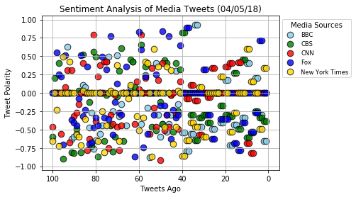

# Observable Trends on Newsfeed

We are using Python with jupyter notebook to perform sentiment analysis of the Twitter activity of various news outlets, and to present findings visually. The final output provides a visualized summary of the sentiments expressed in Tweets sent out by the following news organizations: BBC, CBS, CNN, Fox, and New York times.

It shows a cursory look at the world mood according to the Twitter profiles of news agencies. In essence, the script allows one to quickly perform a sentiment analysis on the most recent tweets of any given Twitter accounts and plot the results. This is pulling the last 100 tweets. 

## Libraries used: 

Notable libraries used to complete this application include:
1. Matplotlib
2. Pandas
3. Tweepy 
4. VADER Sentiment Analysis 
5. Seaborn

## Findings and Observable Trends 

1. The first scatterplot is showing Tweet ploarity for tweet history **

  *a) It is clearly seen that theree is more tweets with negative polaruty than psotive polarity. You can also noticed that many of the NY times agency tweets are right at 0, which shows the general usage of more neutral langauge than words that induce a more postive or negative sentiment on the vader score. 

  *b) Tweets from the BBC news source seems to have more tweets with negative than psotive sentiment. Also, if you look at Tweet history, in the last 20 -40 tweets, you see more lying tweents with tweet polarity of 0 or negative than postive. 

2. The second figure shows a bar plot of average media sentiment for the different news agency **

  *c) It is clearly seen that with this cursory view, the Tweet polarity if all on an average with a negative sentiment across all news agencies with BBC having the highest - This may probably be due to mroe discussion on the former Russian spy nerve agent attack and other more intense topics being covered by the news agency at this point. 

