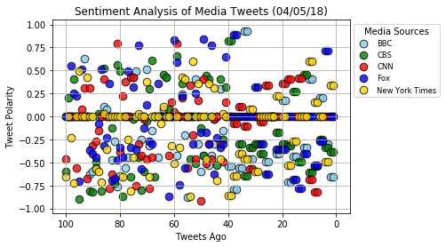
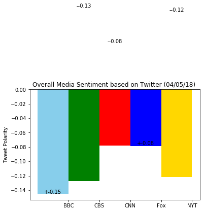

## NewsMood.py 
----
The below code is used to create a Python script to perform sentiment analysis of the Twitter activity of various news oulets, and to present findings visually.

The final output provides a visualized summary of the sentiments expressed in Tweets sent out by the following news organizations: BBC, CBS, CNN, Fox, and New York times.

It shows a cursory look at the world mood according to the Twitter profiles of news agencies. In essence, the script allows one to quickly perform a sentiment analysis on the most recent tweets of any given Twitter accounts and plot the results. 

Notable libraries used to complete this application include: 
a) Matplotlib
b) Pandas
c) Tweepy
d) VADER Sentiment Analysis and 
e) Seaborn.


```python
# Dependencies
%matplotlib inline
import numpy as np
import pandas as pd
import matplotlib.pyplot as plt
import json
import tweepy
import time
import seaborn as sns

# Initialize Sentiment Analyzer 
from textblob import TextBlob
from vaderSentiment.vaderSentiment import SentimentIntensityAnalyzer
analyzer = SentimentIntensityAnalyzer()

# Twitter API Keys
consumer_key =  "gmNxN1oGO0x7hZ2S3aZleASHp" #"jCuMds8hkjry8JV8JDEuDVH9o"
consumer_secret =  "KHZh1DlxV95aeOHWRvF4c4xNfBrVyk1Hg1hhMyZTP0hxIM8Nk0" #"psgKB7nb05kZqoD2ZFPrG78OqbObHySWUEhcLFcZ03qVMlsCwp"
access_token = "106801026-nj9pKRBBbDBCfgC5LJIe0iLDfcCMTyaQ3pT7v0Vt" #"814999527451148288-PVho6BBmmcQbSVKOHBt3E5jbPJM6Krl"
access_token_secret = "TJG5kuuafGXG7GMAuHMoGx2ynMRUcr2A6SEgsg0hwvXvl" #"a30jMaE70P2kefPFOzrfGTlA06okUcifkjJB9g2JWq4Ih"
```


```python
# Setup Tweepy API Authentication
auth = tweepy.OAuthHandler(consumer_key, consumer_secret)
auth.set_access_token(access_token, access_token_secret)
api = tweepy.API(auth, parser=tweepy.parsers.JSONParser())

# Select News Sources (Twitter Accounts)
news_source = ["FoxNews", "CNN", "BBCWorld", "CBSNews", "nytimes"]
```

## Grab Tweets


```python
# Create a generic dictionary for holding all tweet information
tweet_data = {
    "tweet_source": [],
    "tweet_text": [],
    "tweet_date": [],
    "tweet_vader_score": [],
    "tweet_neg_score": [],
    "tweet_pos_score": [],
    "tweet_neu_score": []
}

# Grab 100 tweets from each site (total 500)
for x in range(5):

    # Loop through all news sources
    for source in news_source:

        # Grab the tweets
        tweets = api.user_timeline(source, page=x)

        # For each tweet store it into the dictionary
        for tweet in tweets:
            
            # All data is grabbed from the JSON returned by Twitter
            tweet_data["tweet_source"].append(tweet["user"]["name"])
            tweet_data["tweet_text"].append(tweet["text"])
            tweet_data["tweet_date"].append(tweet["created_at"])

            # Run sentiment analysis on each tweet using Vader
            tweet_data["tweet_vader_score"].append(analyzer.polarity_scores(tweet["text"])["compound"])
            tweet_data["tweet_pos_score"].append(analyzer.polarity_scores(tweet["text"])["pos"])
            tweet_data["tweet_neu_score"].append(analyzer.polarity_scores(tweet["text"])["neu"])
            tweet_data["tweet_neg_score"].append(analyzer.polarity_scores(tweet["text"])["neg"])
```


```python
# Store the final contents into a DataFrame
tweet_df = pd.DataFrame(tweet_data, columns=["tweet_source", 
                                             "tweet_text", 
                                             "tweet_date",
                                             "tweet_vader_score",
                                             "tweet_pos_score",
                                             "tweet_neu_score",
                                             "tweet_neg_score"])

# Export to CSV
file_name = str(time.strftime("a_newsfeed_%m-%d-%y")) + "-tweets.csv"
tweet_df.to_csv("analysis/" + file_name, encoding="utf-8")

# Visualize the DataFrame
tweet_df.head()
```


<div>
<style>
    .dataframe thead tr:only-child th {
        text-align: right;
    }

    .dataframe thead th {
        text-align: left;
    }

    .dataframe tbody tr th {
        vertical-align: top;
    }
</style>
<table border="1" class="dataframe">
  <thead>
    <tr style="text-align: right;">
      <th></th>
      <th>tweet_source</th>
      <th>tweet_text</th>
      <th>tweet_date</th>
      <th>tweet_vader_score</th>
      <th>tweet_pos_score</th>
      <th>tweet_neu_score</th>
      <th>tweet_neg_score</th>
    </tr>
  </thead>
  <tbody>
    <tr>
      <th>0</th>
      <td>Fox News</td>
      <td>Tim Pawlenty announces he's running for his ol...</td>
      <td>Thu Apr 05 21:05:13 +0000 2018</td>
      <td>0.0000</td>
      <td>0.000</td>
      <td>1.000</td>
      <td>0.000</td>
    </tr>
    <tr>
      <th>1</th>
      <td>Fox News</td>
      <td>.@RepAndyBiggsAZ on budget bill: "I don’t thin...</td>
      <td>Thu Apr 05 20:57:55 +0000 2018</td>
      <td>0.7165</td>
      <td>0.249</td>
      <td>0.751</td>
      <td>0.000</td>
    </tr>
    <tr>
      <th>2</th>
      <td>Fox News</td>
      <td>.@POTUS looking to cut billions in spending fr...</td>
      <td>Thu Apr 05 20:56:01 +0000 2018</td>
      <td>-0.2732</td>
      <td>0.000</td>
      <td>0.890</td>
      <td>0.110</td>
    </tr>
    <tr>
      <th>3</th>
      <td>Fox News</td>
      <td>Judicial Watch's Farrell on Nunes' Threat to S...</td>
      <td>Thu Apr 05 20:36:18 +0000 2018</td>
      <td>-0.5267</td>
      <td>0.000</td>
      <td>0.825</td>
      <td>0.175</td>
    </tr>
    <tr>
      <th>4</th>
      <td>Fox News</td>
      <td>OPINION: @POTUS and the US need Scott Pruitt t...</td>
      <td>Thu Apr 05 20:27:44 +0000 2018</td>
      <td>0.0000</td>
      <td>0.000</td>
      <td>1.000</td>
      <td>0.000</td>
    </tr>
  </tbody>
</table>
</div>


```python
# Count the total number of tweets
tweet_df.count()
```


    tweet_source         500
    tweet_text           500
    tweet_date           500
    tweet_vader_score    500
    tweet_pos_score      500
    tweet_neu_score      500
    tweet_neg_score      500
    dtype: int64


```python
# Obtain the source names for reference
tweet_df["tweet_source"].unique()
```


    array(['Fox News', 'CNN', 'BBC News (World)', 'CBS News',
           'The New York Times'], dtype=object)


```python
# Convert dates (currently strings) into datetimes
tweet_df["tweet_date"] = pd.to_datetime(tweet_df["tweet_date"])

# Sort the dataframe by date
tweet_df.sort_values("tweet_date", inplace=True)
tweet_df.reset_index(drop=True, inplace=True)

# Preview the data to confirm data is sorted
tweet_df.head()
```


<div>
<style>
    .dataframe thead tr:only-child th {
        text-align: right;
    }

    .dataframe thead th {
        text-align: left;
    }

    .dataframe tbody tr th {
        vertical-align: top;
    }
</style>
<table border="1" class="dataframe">
  <thead>
    <tr style="text-align: right;">
      <th></th>
      <th>tweet_source</th>
      <th>tweet_text</th>
      <th>tweet_date</th>
      <th>tweet_vader_score</th>
      <th>tweet_pos_score</th>
      <th>tweet_neu_score</th>
      <th>tweet_neg_score</th>
    </tr>
  </thead>
  <tbody>
    <tr>
      <th>0</th>
      <td>BBC News (World)</td>
      <td>Sesame street theme park receives world's firs...</td>
      <td>2018-04-04 11:38:43</td>
      <td>0.0</td>
      <td>0.0</td>
      <td>1.0</td>
      <td>0.0</td>
    </tr>
    <tr>
      <th>1</th>
      <td>BBC News (World)</td>
      <td>RT @BBCSport: An array of colours on display a...</td>
      <td>2018-04-04 12:24:35</td>
      <td>0.0</td>
      <td>0.0</td>
      <td>1.0</td>
      <td>0.0</td>
    </tr>
    <tr>
      <th>2</th>
      <td>BBC News (World)</td>
      <td>Facebook's Zuckerberg to testify before US com...</td>
      <td>2018-04-04 12:55:53</td>
      <td>0.0</td>
      <td>0.0</td>
      <td>1.0</td>
      <td>0.0</td>
    </tr>
    <tr>
      <th>3</th>
      <td>BBC News (World)</td>
      <td>China human rights: Wife marches for 'vanished...</td>
      <td>2018-04-04 14:17:50</td>
      <td>0.0</td>
      <td>0.0</td>
      <td>1.0</td>
      <td>0.0</td>
    </tr>
    <tr>
      <th>4</th>
      <td>BBC News (World)</td>
      <td>Saving animals using space technology 🐘 🦏🦒🔭\n\...</td>
      <td>2018-04-04 14:35:46</td>
      <td>0.0</td>
      <td>0.0</td>
      <td>1.0</td>
      <td>0.0</td>
    </tr>
  </tbody>
</table>
</div>


## Sentiment Scatter Plot


```python
# Build scatter plot for tracking tweet polarity by tweet history
# Note how a few data munging tricks were used to obtain (-100 -> 0 tick marks)
plt.scatter(np.arange(-len(tweet_df[tweet_df["tweet_source"] == "BBC News (World)"]), 0, 1), 
            tweet_df[tweet_df["tweet_source"] == "BBC News (World)"]["tweet_vader_score"],
            edgecolor="black", linewidths=1, marker="o", color="skyblue", s=75,
            alpha=0.8, label="BBC")

plt.scatter(np.arange(-len(tweet_df[tweet_df["tweet_source"] == "CBS News"]), 0, 1), 
            tweet_df[tweet_df["tweet_source"] == "CBS News"]["tweet_vader_score"],
            edgecolor="black", linewidths=1, marker="o", color="green", s=75,
            alpha=0.8, label="CBS")

plt.scatter(np.arange(-len(tweet_df[tweet_df["tweet_source"] == "CNN"]), 0, 1), 
            tweet_df[tweet_df["tweet_source"] == "CNN"]["tweet_vader_score"],
            edgecolor="black", linewidths=1, marker="o", color="red", s=75,
            alpha=0.8, label="CNN")

plt.scatter(np.arange(-len(tweet_df[tweet_df["tweet_source"] == "Fox News"]), 0, 1), 
            tweet_df[tweet_df["tweet_source"] == "Fox News"]["tweet_vader_score"],
            edgecolor="black", linewidths=1, marker="o", color="b", s=75,
            alpha=0.8, label="Fox")

plt.scatter(np.arange(-len(tweet_df[tweet_df["tweet_source"] == "The New York Times"]), 0, 1), 
            tweet_df[tweet_df["tweet_source"] == "The New York Times"]["tweet_vader_score"],
            edgecolor="black", linewidths=1, marker="o", color="gold", s=75,
            alpha=0.8, label="New York Times")

# Incorporate the other graph properties
plt.title("Sentiment Analysis of Media Tweets (%s)" % time.strftime("%x"))
plt.ylabel("Tweet Polarity")
plt.xlabel("Tweets Ago")
plt.xlim([-105, 5])
plt.xticks([-100, -80, -60, -40, -20, 0], [100, 80, 60, 40, 20, 0])
plt.ylim([-1.05, 1.05])
plt.grid(True)

# Create a legend
lgnd = plt.legend(fontsize="small", mode="Expanded", 
                  numpoints=1, scatterpoints=1, 
                  loc="upper left", bbox_to_anchor=(1,1), title="Media Sources", 
                  labelspacing=0.5)

# Save the figure (and account for the legend being outside the plot when saving)
file_name = str(time.strftime("a_scatterplot_%m-%d-%y")) + "-Fig1.png"
plt.savefig("analysis/" + file_name, bbox_extra_artists=(lgnd, ), bbox_inches='tight')

# Show plot
plt.show()
```





## Overall Sentiment Bar Graph


```python
# Average all polarities by news source
tweet_df_polarity = tweet_df.groupby(["tweet_source"]).mean()["tweet_vader_score"]

# View the polarities
pd.DataFrame(tweet_df_polarity)
```


<div>
<style>
    .dataframe thead tr:only-child th {
        text-align: right;
    }

    .dataframe thead th {
        text-align: left;
    }

    .dataframe tbody tr th {
        vertical-align: top;
    }
</style>
<table border="1" class="dataframe">
  <thead>
    <tr style="text-align: right;">
      <th></th>
      <th>tweet_vader_score</th>
    </tr>
    <tr>
      <th>tweet_source</th>
      <th></th>
    </tr>
  </thead>
  <tbody>
    <tr>
      <th>BBC News (World)</th>
      <td>-0.146032</td>
    </tr>
    <tr>
      <th>CBS News</th>
      <td>-0.127369</td>
    </tr>
    <tr>
      <th>CNN</th>
      <td>-0.078080</td>
    </tr>
    <tr>
      <th>Fox News</th>
      <td>-0.078398</td>
    </tr>
    <tr>
      <th>The New York Times</th>
      <td>-0.122094</td>
    </tr>
  </tbody>
</table>
</div>


```python
# Store all polarities in a tuple
tweets_polarity = (tweet_df_polarity["BBC News (World)"], 
                    tweet_df_polarity["CBS News"], 
                    tweet_df_polarity["CNN"], 
                    tweet_df_polarity["Fox News"],
                    tweet_df_polarity["The New York Times"])

# Generate bars for each news source
fig, ax = plt.subplots()
ind = np.arange(len(tweets_polarity))  
width = 1
rect1 = ax.bar(ind[0], tweets_polarity[0], width, color="skyblue")
rect2 = ax.bar(ind[1], tweets_polarity[1], width, color="green")
rect3 = ax.bar(ind[2], tweets_polarity[2], width, color="red")
rect4 = ax.bar(ind[3], tweets_polarity[3], width, color='blue')
rect5 = ax.bar(ind[4], tweets_polarity[4], width, color='gold')

# Generate labels for each news source
def autolabelpos(rects):
    # attach some text labels
    for rect in rects:
        height = rect.get_height()
        ax.text(rect.get_x() + rect.get_width()/2., 1*height,
                '+%.2f' % float(height),
                ha='center', va='bottom')

def autolabelneg(rects):
    # attach some text labels
    for rect in rects:
        height = rect.get_height()
        ax.text(rect.get_x() + rect.get_width()/2., -1*height-0.015,
                '-%.2f' % float(height),
                ha='center', va='bottom')
    
autolabelpos(rect1)
autolabelneg(rect2)
autolabelneg(rect3)
autolabelpos(rect4)
autolabelneg(rect5)

# Orient widths, add labels, tick marks, etc. 
ax.set_ylabel("Tweet Polarity")
ax.set_title("Overall Media Sentiment based on Twitter (%s) " % (time.strftime("%x")))
ax.set_xticks(ind + 0.5)
ax.set_xticklabels(("BBC", "CBS", "CNN", "Fox", "NYT"))
ax.set_autoscaley_on(True)
ax.grid(False)

# Save Figure
file_name = str(time.strftime("a_barplot_%m-%d-%y")) + "-Fig2.png"
plt.savefig("analysis/" + file_name, bbox_extra_artists=(lgnd, ), bbox_inches='tight')

# Show Figure
fig.show()
```

    /Users/arunasundaresh/anaconda3/envs/PythonData/lib/python3.6/site-packages/matplotlib/figure.py:418: UserWarning: matplotlib is currently using a non-GUI backend, so cannot show the figure
      "matplotlib is currently using a non-GUI backend, "




