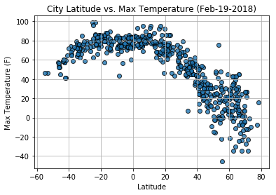
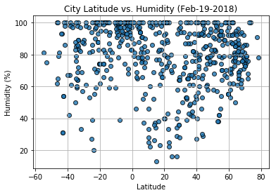
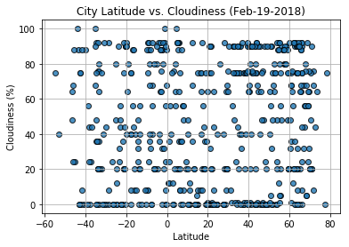
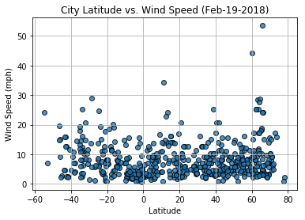
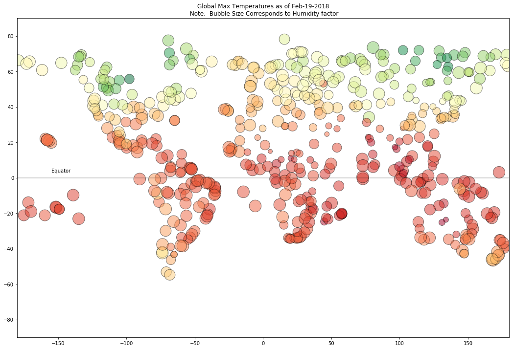
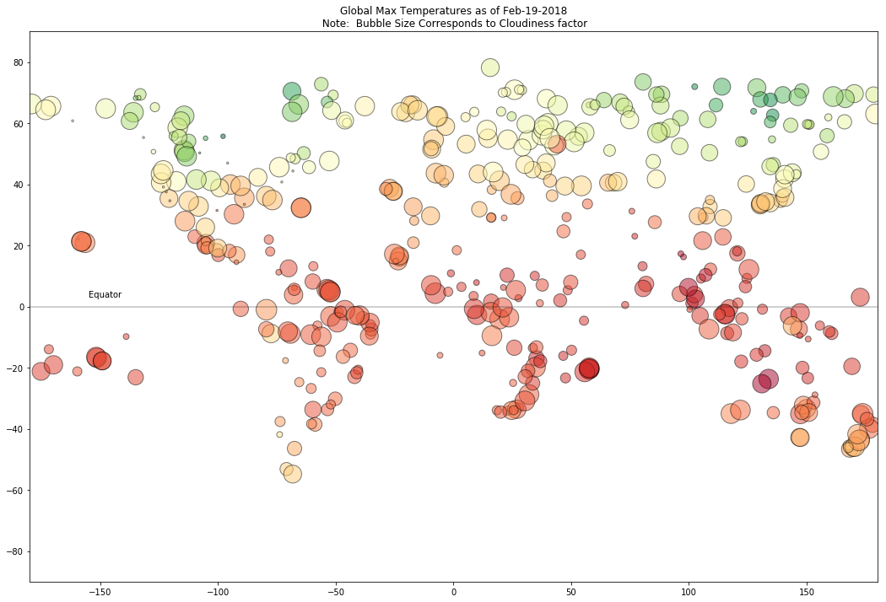
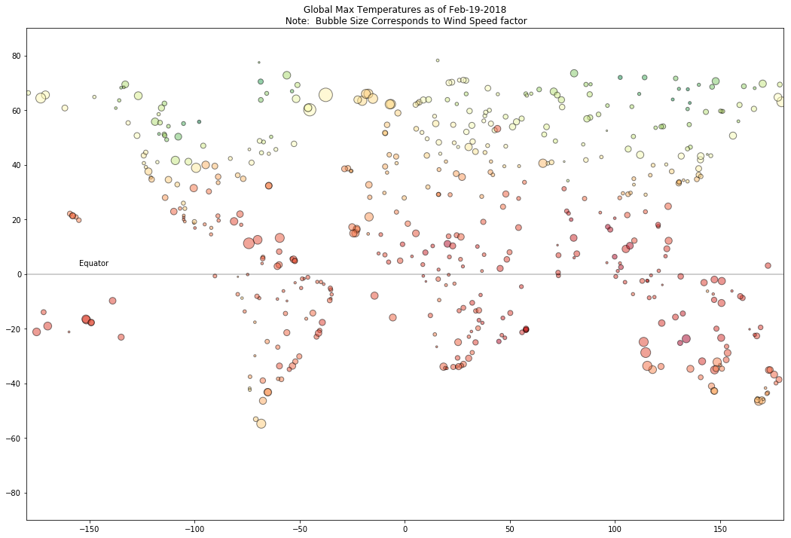

# WeatherPy
----

### Observable Trends
####  Based on the City Latitude vs Max Temperature scatter plot and Global Temperature plot, you can see that:
* Within the tropic region (Between 23.5 N and 23.5 S which), the temperatures does range around the (60-100 Degree F) being significantly warmer. These are the areas closer to the equator and are expected to be warmer. 
* The southern hemispehere temps seems to warmer than the northern hemisphere due to the southern hemisphere tilted towards the sun during this time of the year.

#### Based on the City Latitude vs. Humidity scatter plot and Global Temperature by Humidity, you can see that: 
* There does not seem to be a direct trend on Humidity vs latitude. It seems Humidity % is higher around N and S of latitude overall. Usually, higher humidity causes the weather to be more warmer than what it feels like when we have warm air around and vice versa for cold air. 

* From the Global temperature plot, you can see that there may be some other factor like Elevation that needs to be taken into consideration to understand why Humidity % in certain cities closer to equator is lesser.  

#### On Cloudiness:
* Based on the scatter plot, you can see that there seems to be no strong relationship between latitude and cloudiness. However, it is interesting to see that a strong band of cities sits at 0, 20, 80, and around 90% cloudiness. Usually warmer weather is ecpected on a clear day (less cloudy) and cooler weather is expected on a Cloudy Day (more cloudy).

* On the Global Tempeature plot by Cloudiness, you can see the Cloudiness seems to be less closer to the equator (bubble size relatively smaller) compared to the ones farther way from the equator (bubble size relatively bigger)

#### On Wind Speed:
* Based on the scatter plot, there seems to be no strong relationshiop between latitude and Wind Speed. However, you can see that there ia flurry of cities in the norhtern hemisphere awith over 20 mph of wind. There needs to be more data points taken for he southern hemisphere to see if the trend continues on that side too. 

* The elevation level needs to be taken into consdieration to see if this affects temperature and wind speed across different latitudes. 


```python
# Updated the Weather Map API keys to unique keys and also ensure to store images with relevant names based on plot
# Ensure to install citipi as needed 
# By: Aruna Amaresan
# Last Updated: Feb 19th 2018 

# Dependencies and Setup
import matplotlib.pyplot as plt
import pandas as pd
import numpy as np
import seaborn as sns
import requests
import time
import urllib

# Incorporated citipy to determine city based on latitude and longitude
from citipy import citipy

# Output File (CSV)
output_data_file = "output_data/cities.csv"

# Range of latitudes and longitudes
lat_range = (-90, 90)
lng_range = (-180, 180)
```

## Generate City List using citipy library


```python
# List for holding lat_lngs and cities
lat_lngs = []
cities = []

# Create a set of random lat and lng combinations
lats = np.random.uniform(low=-90.000, high=90.000, size=1500)
lngs = np.random.uniform(low=-180.000, high=180.000, size=1500)
lat_lngs = zip(lats, lngs)

# Identify nearest city for each lat, lng combination
for lat_lng in lat_lngs:
    city = citipy.nearest_city(lat_lng[0], lat_lng[1]).city_name
    
    # If the city is unique, then add it to a our cities list
    if city not in cities:
        cities.append(city)

# Print the city count to confirm sufficient count
len(cities)
```


    616


```python
# Build data frame of randomly generated lat and long
loc_data = pd.DataFrame()
loc_data['rand_lat'] = [np.random.uniform(-90,90) for x in range(1500)]
loc_data['rand_lng'] = [np.random.uniform(-180, 180) for x in range(1500)]

# Add city and country column
loc_data['city'] = ""
loc_data['country'] = ""

# Find and Add the closest city and country code
for index, row in loc_data.iterrows():
    lat = row['rand_lat']
    lng = row['rand_lng']
    city = citipy.nearest_city(lat, lng)
    print("Index %d: City name: %s Country Code: %s" %(index, city.city_name, city.country_code))
    loc_data.set_value(index, 'city', city.city_name)
    loc_data.set_value(index, 'country', city.country_code)


```

    Index 0: City name: bambous virieux Country Code: mu
    Index 1: City name: bluff Country Code: nz
    Index 2: City name: tabialan Country Code: ph
    Index 3: City name: katherine Country Code: au
    Index 4: City name: presidencia roque saenz pena Country Code: ar
    Index 5: City name: bengkulu Country Code: id
    Index 6: City name: albany Country Code: au
    Index 7: City name: barentsburg Country Code: sj
    Index 8: City name: airai Country Code: pw
    Index 9: City name: ichhawar Country Code: in
    Index 10: City name: longyearbyen Country Code: sj
    Index 11: City name: rikitea Country Code: pf
    Index 12: City name: beringovskiy Country Code: ru
    Index 13: City name: ixtapa Country Code: mx
    Index 14: City name: killybegs Country Code: ie
    Index 15: City name: esperance Country Code: au
    Index 16: City name: sobolevo Country Code: ru
    Index 17: City name: isangel Country Code: vu
    Index 18: City name: yumbing Country Code: ph
    Index 19: City name: barentsburg Country Code: sj
    Index 20: City name: rikitea Country Code: pf
    Index 21: City name: punta arenas Country Code: cl
    Index 22: City name: mangai Country Code: cd
    Index 23: City name: hilo Country Code: us
    Index 24: City name: ancud Country Code: cl
    Index 25: City name: yellowknife Country Code: ca
    Index 26: City name: kaitangata Country Code: nz
    Index 27: City name: xichang Country Code: cn
    Index 28: City name: vaitupu Country Code: wf
    Index 29: City name: yellowknife Country Code: ca
    Index 30: City name: cidreira Country Code: br
    Index 31: City name: jamestown Country Code: sh
    Index 32: City name: cape town Country Code: za
    Index 33: City name: burnie Country Code: au
    Index 34: City name: mataura Country Code: pf
    Index 35: City name: atuona Country Code: pf
    Index 36: City name: kapaa Country Code: us
    Index 37: City name: punta arenas Country Code: cl
    Index 38: City name: severo-kurilsk Country Code: ru
    Index 39: City name: marfino Country Code: ru
    Index 40: City name: chuy Country Code: uy
    Index 41: City name: carnarvon Country Code: au
    Index 42: City name: qaanaaq Country Code: gl
    Index 43: City name: nikolskoye Country Code: ru
    Index 44: City name: tiksi Country Code: ru
    Index 45: City name: tasiilaq Country Code: gl
    Index 46: City name: hobyo Country Code: so
    Index 47: City name: cape town Country Code: za
    Index 48: City name: gisborne Country Code: nz
    Index 49: City name: payo Country Code: ph
    Index 50: City name: derzhavinsk Country Code: kz
    Index 51: City name: ayios matthaios Country Code: gr
    Index 52: City name: rikitea Country Code: pf
    Index 53: City name: dikson Country Code: ru
    Index 54: City name: kutum Country Code: sd
    Index 55: City name: geraldton Country Code: au
    Index 56: City name: hilo Country Code: us
    Index 57: City name: amderma Country Code: ru
    Index 58: City name: ancud Country Code: cl
    Index 59: City name: saint george Country Code: bm
    Index 60: City name: nsanje Country Code: mw
    Index 61: City name: maragogi Country Code: br
    Index 62: City name: leningradskiy Country Code: ru
    Index 63: City name: trelew Country Code: ar
    Index 64: City name: sal rei Country Code: cv
    Index 65: City name: beira Country Code: mz
    Index 66: City name: skibbereen Country Code: ie
    Index 67: City name: honningsvag Country Code: no
    Index 68: City name: rio grande Country Code: br
    Index 69: City name: bluff Country Code: nz
    Index 70: City name: alice springs Country Code: au
    Index 71: City name: saint george Country Code: bm
    Index 72: City name: rikitea Country Code: pf
    Index 73: City name: ushuaia Country Code: ar
    Index 74: City name: norman wells Country Code: ca
    Index 75: City name: jacareacanga Country Code: br
    Index 76: City name: hermanus Country Code: za
    Index 77: City name: puerto carreno Country Code: co
    Index 78: City name: knysna Country Code: za
    Index 79: City name: pisco Country Code: pe
    Index 80: City name: tumannyy Country Code: ru
    Index 81: City name: yulara Country Code: au
    Index 82: City name: albany Country Code: au
    Index 83: City name: busselton Country Code: au
    Index 84: City name: hithadhoo Country Code: mv
    Index 85: City name: belushya guba Country Code: ru
    Index 86: City name: morro bay Country Code: us
    Index 87: City name: kodiak Country Code: us
    Index 88: City name: bluff Country Code: nz
    Index 89: City name: inirida Country Code: co
    Index 90: City name: belushya guba Country Code: ru
    Index 91: City name: bathsheba Country Code: bb
    Index 92: City name: punta arenas Country Code: cl
    Index 93: City name: hithadhoo Country Code: mv
    Index 94: City name: kirsanov Country Code: ru
    Index 95: City name: ballina Country Code: au
    Index 96: City name: puerto ayora Country Code: ec
    Index 97: City name: mys shmidta Country Code: ru
    Index 98: City name: lotofaga Country Code: ws
    Index 99: City name: avarua Country Code: ck
    Index 100: City name: bud Country Code: no
    Index 101: City name: georgetown Country Code: sh
    Index 102: City name: port lincoln Country Code: au
    Index 103: City name: chinsali Country Code: zm
    Index 104: City name: ampanihy Country Code: mg
    Index 105: City name: bluff Country Code: nz
    Index 106: City name: isangel Country Code: vu
    Index 107: City name: east london Country Code: za
    Index 108: City name: mataura Country Code: pf
    Index 109: City name: altamira Country Code: br
    Index 110: City name: punta arenas Country Code: cl
    Index 111: City name: teguldet Country Code: ru
    Index 112: City name: praia Country Code: cv
    Index 113: City name: balaipungut Country Code: id
    Index 114: City name: santa maria Country Code: cv
    Index 115: City name: rikitea Country Code: pf
    Index 116: City name: ushuaia Country Code: ar
    Index 117: City name: port alfred Country Code: za
    Index 118: City name: clyde river Country Code: ca
    Index 119: City name: cape town Country Code: za
    Index 120: City name: liverpool Country Code: ca
    Index 121: City name: rikitea Country Code: pf
    Index 122: City name: shimoda Country Code: jp
    Index 123: City name: hilo Country Code: us
    Index 124: City name: wau Country Code: pg
    Index 125: City name: kapaa Country Code: us
    Index 126: City name: chuy Country Code: uy
    Index 127: City name: mataura Country Code: pf
    Index 128: City name: ushuaia Country Code: ar
    Index 129: City name: yar-sale Country Code: ru
    Index 130: City name: nikolskoye Country Code: ru
    Index 131: City name: kapaa Country Code: us
    Index 132: City name: yellowknife Country Code: ca
    Index 133: City name: khatanga Country Code: ru
    Index 134: City name: kapaa Country Code: us
    Index 135: City name: port alfred Country Code: za
    Index 136: City name: talnakh Country Code: ru
    Index 137: City name: busselton Country Code: au
    Index 138: City name: divnomorskoye Country Code: ru
    Index 139: City name: kanye Country Code: bw
    Index 140: City name: cabo san lucas Country Code: mx
    Index 141: City name: nikolskoye Country Code: ru
    Index 142: City name: klaksvik Country Code: fo
    Index 143: City name: rikitea Country Code: pf
    Index 144: City name: mataura Country Code: pf
    Index 145: City name: odweyne Country Code: so
    Index 146: City name: mataura Country Code: pf
    Index 147: City name: avarua Country Code: ck
    Index 148: City name: kruisfontein Country Code: za
    Index 149: City name: auki Country Code: sb
    Index 150: City name: busselton Country Code: au
    Index 151: City name: rikitea Country Code: pf
    Index 152: City name: port alfred Country Code: za
    Index 153: City name: puerto ayacucho Country Code: ve
    Index 154: City name: punta arenas Country Code: cl
    Index 155: City name: puerto ayora Country Code: ec
    Index 156: City name: okhotsk Country Code: ru
    Index 157: City name: meyungs Country Code: pw
    Index 158: City name: atuona Country Code: pf
    Index 159: City name: busselton Country Code: au
    Index 160: City name: taolanaro Country Code: mg
    Index 161: City name: waddan Country Code: ly
    Index 162: City name: luderitz Country Code: na
    Index 163: City name: khatanga Country Code: ru
    Index 164: City name: vila velha Country Code: br
    Index 165: City name: new norfolk Country Code: au
    Index 166: City name: mataura Country Code: pf
    Index 167: City name: peshkovo Country Code: ru
    Index 168: City name: ilulissat Country Code: gl
    Index 169: City name: jerantut Country Code: my
    Index 170: City name: oelde Country Code: de
    Index 171: City name: amderma Country Code: ru
    Index 172: City name: high level Country Code: ca
    Index 173: City name: thompson Country Code: ca
    Index 174: City name: karpathos Country Code: gr
    Index 175: City name: khatanga Country Code: ru
    Index 176: City name: katsuura Country Code: jp
    Index 177: City name: east london Country Code: za
    Index 178: City name: wagga wagga Country Code: au
    Index 179: City name: ilo Country Code: pe
    Index 180: City name: arraial do cabo Country Code: br
    Index 181: City name: muravlenko Country Code: ru
    Index 182: City name: lagoa Country Code: pt
    Index 183: City name: mataura Country Code: pf
    Index 184: City name: kattivakkam Country Code: in
    Index 185: City name: pangnirtung Country Code: ca
    Index 186: City name: tevaitoa Country Code: pf
    Index 187: City name: ushuaia Country Code: ar
    Index 188: City name: tuktoyaktuk Country Code: ca
    Index 189: City name: vestmannaeyjar Country Code: is
    Index 190: City name: malanje Country Code: ao
    Index 191: City name: albany Country Code: au
    Index 192: City name: longyearbyen Country Code: sj
    Index 193: City name: tabiauea Country Code: ki
    Index 194: City name: umi Country Code: jp
    Index 195: City name: inirida Country Code: co
    Index 196: City name: lavrentiya Country Code: ru
    Index 197: City name: rikitea Country Code: pf
    Index 198: City name: atuona Country Code: pf
    Index 199: City name: maragogi Country Code: br
    Index 200: City name: tasiilaq Country Code: gl
    Index 201: City name: kamiiso Country Code: jp
    Index 202: City name: asau Country Code: tv
    Index 203: City name: ronne Country Code: dk
    Index 204: City name: pomabamba Country Code: pe
    Index 205: City name: kitami Country Code: jp
    Index 206: City name: albany Country Code: au
    Index 207: City name: vao Country Code: nc
    Index 208: City name: upernavik Country Code: gl
    Index 209: City name: rikitea Country Code: pf
    Index 210: City name: khatanga Country Code: ru
    Index 211: City name: mys shmidta Country Code: ru
    Index 212: City name: tilichiki Country Code: ru
    Index 213: City name: oksfjord Country Code: no
    Index 214: City name: jackson Country Code: us
    Index 215: City name: belushya guba Country Code: ru
    Index 216: City name: pitimbu Country Code: br
    Index 217: City name: punta arenas Country Code: cl
    Index 218: City name: butaritari Country Code: ki
    Index 219: City name: georgetown Country Code: sh
    Index 220: City name: busselton Country Code: au
    Index 221: City name: airai Country Code: pw
    Index 222: City name: nadym Country Code: ru
    Index 223: City name: ushuaia Country Code: ar
    Index 224: City name: yefimovskiy Country Code: ru
    Index 225: City name: barrow Country Code: us
    Index 226: City name: kapaa Country Code: us
    Index 227: City name: lagoa Country Code: pt
    Index 228: City name: ushuaia Country Code: ar
    Index 229: City name: longhua Country Code: cn
    Index 230: City name: upernavik Country Code: gl
    Index 231: City name: oyama Country Code: jp
    Index 232: City name: port alfred Country Code: za
    Index 233: City name: am timan Country Code: td
    Index 234: City name: ilulissat Country Code: gl
    Index 235: City name: vaini Country Code: to
    Index 236: City name: vaini Country Code: to
    Index 237: City name: portland Country Code: au
    Index 238: City name: lompoc Country Code: us
    Index 239: City name: barrow Country Code: us
    Index 240: City name: sao filipe Country Code: cv
    Index 241: City name: nha trang Country Code: vn
    Index 242: City name: dubbo Country Code: au
    Index 243: City name: punta arenas Country Code: cl
    Index 244: City name: torrelodones Country Code: es
    Index 245: City name: atuona Country Code: pf
    Index 246: City name: oranjestad Country Code: aw
    Index 247: City name: torbay Country Code: ca
    Index 248: City name: barrow Country Code: us
    Index 249: City name: albany Country Code: au
    Index 250: City name: barrow Country Code: us
    Index 251: City name: kaitangata Country Code: nz
    Index 252: City name: yining Country Code: cn
    Index 253: City name: yellowknife Country Code: ca
    Index 254: City name: rikitea Country Code: pf
    Index 255: City name: umea Country Code: se
    Index 256: City name: tahoua Country Code: ne
    Index 257: City name: cidreira Country Code: br
    Index 258: City name: jabiru Country Code: au
    Index 259: City name: kununurra Country Code: au
    Index 260: City name: sentyabrskiy Country Code: ru
    Index 261: City name: mudon Country Code: mm
    Index 262: City name: rikitea Country Code: pf
    Index 263: City name: mataura Country Code: pf
    Index 264: City name: gamba Country Code: ga
    Index 265: City name: hobart Country Code: au
    Index 266: City name: thinadhoo Country Code: mv
    Index 267: City name: clyde river Country Code: ca
    Index 268: City name: butaritari Country Code: ki
    Index 269: City name: tabas Country Code: ir
    Index 270: City name: maralal Country Code: ke
    Index 271: City name: mayo Country Code: ca
    Index 272: City name: ilulissat Country Code: gl
    Index 273: City name: zaysan Country Code: kz
    Index 274: City name: victoria Country Code: sc
    Index 275: City name: sakakah Country Code: sa
    Index 276: City name: mana Country Code: gf
    Index 277: City name: san lorenzo Country Code: ar
    Index 278: City name: illoqqortoormiut Country Code: gl
    Index 279: City name: sisimiut Country Code: gl
    Index 280: City name: atuona Country Code: pf
    Index 281: City name: ancud Country Code: cl
    Index 282: City name: menzelinsk Country Code: ru
    Index 283: City name: kendari Country Code: id
    Index 284: City name: saint george Country Code: bm
    Index 285: City name: ilulissat Country Code: gl
    Index 286: City name: barentsburg Country Code: sj
    Index 287: City name: phan rang Country Code: vn
    Index 288: City name: port alfred Country Code: za
    Index 289: City name: aripuana Country Code: br
    Index 290: City name: kahului Country Code: us
    Index 291: City name: waipawa Country Code: nz
    Index 292: City name: port alfred Country Code: za
    Index 293: City name: belushya guba Country Code: ru
    Index 294: City name: pevek Country Code: ru
    Index 295: City name: mataura Country Code: pf
    Index 296: City name: hithadhoo Country Code: mv
    Index 297: City name: baykit Country Code: ru
    Index 298: City name: saskylakh Country Code: ru
    Index 299: City name: ardesen Country Code: tr
    Index 300: City name: port alfred Country Code: za
    Index 301: City name: bantogon Country Code: ph
    Index 302: City name: pevek Country Code: ru
    Index 303: City name: ipixuna Country Code: br
    Index 304: City name: hobart Country Code: au
    Index 305: City name: mataura Country Code: pf
    Index 306: City name: khatanga Country Code: ru
    Index 307: City name: ushuaia Country Code: ar
    Index 308: City name: thanatpin Country Code: mm
    Index 309: City name: bilibino Country Code: ru
    Index 310: City name: bambous virieux Country Code: mu
    Index 311: City name: winnemucca Country Code: us
    Index 312: City name: ushuaia Country Code: ar
    Index 313: City name: mardin Country Code: tr
    Index 314: City name: te anau Country Code: nz
    Index 315: City name: port elizabeth Country Code: za
    Index 316: City name: mataura Country Code: pf
    Index 317: City name: rikitea Country Code: pf
    Index 318: City name: ushuaia Country Code: ar
    Index 319: City name: albany Country Code: au
    Index 320: City name: bargal Country Code: so
    Index 321: City name: hobart Country Code: au
    Index 322: City name: ushuaia Country Code: ar
    Index 323: City name: puerto ayora Country Code: ec
    Index 324: City name: mataura Country Code: pf
    Index 325: City name: husavik Country Code: is
    Index 326: City name: vaini Country Code: to
    Index 327: City name: chokurdakh Country Code: ru
    Index 328: City name: tuktoyaktuk Country Code: ca
    Index 329: City name: mys shmidta Country Code: ru
    Index 330: City name: kodiak Country Code: us
    Index 331: City name: maldonado Country Code: uy
    Index 332: City name: kalmunai Country Code: lk
    Index 333: City name: ushuaia Country Code: ar
    Index 334: City name: aitape Country Code: pg
    Index 335: City name: lagoa Country Code: pt
    Index 336: City name: chokurdakh Country Code: ru
    Index 337: City name: sinjar Country Code: iq
    Index 338: City name: rikitea Country Code: pf
    Index 339: City name: mys shmidta Country Code: ru
    Index 340: City name: punta arenas Country Code: cl
    Index 341: City name: port hawkesbury Country Code: ca
    Index 342: City name: deputatskiy Country Code: ru
    Index 343: City name: ilulissat Country Code: gl
    Index 344: City name: mataura Country Code: pf
    Index 345: City name: avarua Country Code: ck
    Index 346: City name: kodiak Country Code: us
    Index 347: City name: bethel Country Code: us
    Index 348: City name: busselton Country Code: au
    Index 349: City name: tiksi Country Code: ru
    Index 350: City name: punta arenas Country Code: cl
    Index 351: City name: punta arenas Country Code: cl
    Index 352: City name: bredasdorp Country Code: za
    Index 353: City name: praia da vitoria Country Code: pt
    Index 354: City name: kharovsk Country Code: ru
    Index 355: City name: seoul Country Code: kr
    Index 356: City name: magadan Country Code: ru
    Index 357: City name: new norfolk Country Code: au
    Index 358: City name: mataura Country Code: pf
    Index 359: City name: vangaindrano Country Code: mg
    Index 360: City name: usinsk Country Code: ru
    Index 361: City name: port hardy Country Code: ca
    Index 362: City name: jardim Country Code: br
    Index 363: City name: luderitz Country Code: na
    Index 364: City name: yerbogachen Country Code: ru
    Index 365: City name: makakilo city Country Code: us
    Index 366: City name: brookhaven Country Code: us
    Index 367: City name: mataura Country Code: pf
    Index 368: City name: victoria Country Code: sc
    Index 369: City name: san angelo Country Code: us
    Index 370: City name: castro Country Code: cl
    Index 371: City name: carnarvon Country Code: au
    Index 372: City name: danshui Country Code: cn
    Index 373: City name: christchurch Country Code: nz
    Index 374: City name: coahuayana Country Code: mx
    Index 375: City name: broome Country Code: au
    Index 376: City name: tasiilaq Country Code: gl
    Index 377: City name: haines junction Country Code: ca
    Index 378: City name: natal Country Code: br
    Index 379: City name: hithadhoo Country Code: mv
    Index 380: City name: saskylakh Country Code: ru
    Index 381: City name: mataura Country Code: pf
    Index 382: City name: bluff Country Code: nz
    Index 383: City name: broome Country Code: au
    Index 384: City name: taolanaro Country Code: mg
    Index 385: City name: ruatoria Country Code: nz
    Index 386: City name: mataura Country Code: pf
    Index 387: City name: mount gambier Country Code: au
    Index 388: City name: georgetown Country Code: sh
    Index 389: City name: labuhan Country Code: id
    Index 390: City name: wukari Country Code: ng
    Index 391: City name: harper Country Code: lr
    Index 392: City name: el mahalla el kubra Country Code: eg
    Index 393: City name: bluff Country Code: nz
    Index 394: City name: hay river Country Code: ca
    Index 395: City name: avarua Country Code: ck
    Index 396: City name: mabaruma Country Code: gy
    Index 397: City name: bluff Country Code: nz
    Index 398: City name: mataura Country Code: pf
    Index 399: City name: saskylakh Country Code: ru
    Index 400: City name: cape town Country Code: za
    Index 401: City name: faanui Country Code: pf
    Index 402: City name: saskylakh Country Code: ru
    Index 403: City name: iqaluit Country Code: ca
    Index 404: City name: cherskiy Country Code: ru
    Index 405: City name: punta arenas Country Code: cl
    Index 406: City name: touros Country Code: br
    Index 407: City name: constitucion Country Code: mx
    Index 408: City name: mahebourg Country Code: mu
    Index 409: City name: husavik Country Code: is
    Index 410: City name: vaini Country Code: to
    Index 411: City name: isangel Country Code: vu
    Index 412: City name: mar del plata Country Code: ar
    Index 413: City name: saiha Country Code: in
    Index 414: City name: suao Country Code: tw
    Index 415: City name: hobart Country Code: au
    Index 416: City name: esperance Country Code: au
    Index 417: City name: busselton Country Code: au
    Index 418: City name: maceio Country Code: br
    Index 419: City name: dikson Country Code: ru
    Index 420: City name: sao filipe Country Code: cv
    Index 421: City name: severo-kurilsk Country Code: ru
    Index 422: City name: vila franca do campo Country Code: pt
    Index 423: City name: cochrane Country Code: ca
    Index 424: City name: upernavik Country Code: gl
    Index 425: City name: rikitea Country Code: pf
    Index 426: City name: torbay Country Code: ca
    Index 427: City name: tabiauea Country Code: ki
    Index 428: City name: tuktoyaktuk Country Code: ca
    Index 429: City name: bengkulu Country Code: id
    Index 430: City name: cayenne Country Code: gf
    Index 431: City name: ushuaia Country Code: ar
    Index 432: City name: chiredzi Country Code: zw
    Index 433: City name: taolanaro Country Code: mg
    Index 434: City name: mataura Country Code: pf
    Index 435: City name: caravelas Country Code: br
    Index 436: City name: ushuaia Country Code: ar
    Index 437: City name: richards bay Country Code: za
    Index 438: City name: coquimbo Country Code: cl
    Index 439: City name: albany Country Code: au
    Index 440: City name: taolanaro Country Code: mg
    Index 441: City name: kirovohrad Country Code: ua
    Index 442: City name: navrongo Country Code: gh
    Index 443: City name: ancud Country Code: cl
    Index 444: City name: dzilam gonzalez Country Code: mx
    Index 445: City name: kahului Country Code: us
    Index 446: City name: mys shmidta Country Code: ru
    Index 447: City name: ahipara Country Code: nz
    Index 448: City name: jamestown Country Code: sh
    Index 449: City name: hermanus Country Code: za
    Index 450: City name: ushuaia Country Code: ar
    Index 451: City name: kuusamo Country Code: fi
    Index 452: City name: east london Country Code: za
    Index 453: City name: alofi Country Code: nu
    Index 454: City name: dustlik Country Code: uz
    Index 455: City name: vaini Country Code: to
    Index 456: City name: hami Country Code: cn
    Index 457: City name: torbay Country Code: ca
    Index 458: City name: punta arenas Country Code: cl
    Index 459: City name: ippy Country Code: cf
    Index 460: City name: sinnamary Country Code: gf
    Index 461: City name: zhanatas Country Code: kz
    Index 462: City name: black diamond Country Code: ca
    Index 463: City name: belushya guba Country Code: ru
    Index 464: City name: tasiilaq Country Code: gl
    Index 465: City name: punta arenas Country Code: cl
    Index 466: City name: bluff Country Code: nz
    Index 467: City name: taolanaro Country Code: mg
    Index 468: City name: bethel Country Code: us
    Index 469: City name: puerto ayora Country Code: ec
    Index 470: City name: salalah Country Code: om
    Index 471: City name: punta arenas Country Code: cl
    Index 472: City name: ushuaia Country Code: ar
    Index 473: City name: tuktoyaktuk Country Code: ca
    Index 474: City name: ushuaia Country Code: ar
    Index 475: City name: rikitea Country Code: pf
    Index 476: City name: vaini Country Code: to
    Index 477: City name: ouesso Country Code: cg
    Index 478: City name: maragogi Country Code: br
    Index 479: City name: cape town Country Code: za
    Index 480: City name: hithadhoo Country Code: mv
    Index 481: City name: keuruu Country Code: fi
    Index 482: City name: raozan Country Code: bd
    Index 483: City name: vaini Country Code: to
    Index 484: City name: bluff Country Code: nz
    Index 485: City name: mocambique Country Code: mz
    Index 486: City name: albany Country Code: au
    Index 487: City name: rikitea Country Code: pf
    Index 488: City name: kavieng Country Code: pg
    Index 489: City name: shahpur Country Code: in
    Index 490: City name: morbach Country Code: de
    Index 491: City name: kapaa Country Code: us
    Index 492: City name: dunedin Country Code: nz
    Index 493: City name: rikitea Country Code: pf
    Index 494: City name: hithadhoo Country Code: mv
    Index 495: City name: busselton Country Code: au
    Index 496: City name: punta arenas Country Code: cl
    Index 497: City name: punta arenas Country Code: cl
    Index 498: City name: samusu Country Code: ws
    Index 499: City name: arraial do cabo Country Code: br
    Index 500: City name: promyshlennyy Country Code: ru
    Index 501: City name: primero de enero Country Code: cu
    Index 502: City name: khatanga Country Code: ru
    Index 503: City name: punta arenas Country Code: cl
    Index 504: City name: vaini Country Code: to
    Index 505: City name: port alfred Country Code: za
    Index 506: City name: asau Country Code: tv
    Index 507: City name: mogadishu Country Code: so
    Index 508: City name: ushuaia Country Code: ar
    Index 509: City name: chuy Country Code: uy
    Index 510: City name: punta arenas Country Code: cl
    Index 511: City name: itarema Country Code: br
    Index 512: City name: guerrero negro Country Code: mx
    Index 513: City name: puerto leguizamo Country Code: co
    Index 514: City name: mataura Country Code: pf
    Index 515: City name: black river Country Code: jm
    Index 516: City name: jonkoping Country Code: se
    Index 517: City name: ewa beach Country Code: us
    Index 518: City name: atuona Country Code: pf
    Index 519: City name: luderitz Country Code: na
    Index 520: City name: evensk Country Code: ru
    Index 521: City name: thompson Country Code: ca
    Index 522: City name: berlevag Country Code: no
    Index 523: City name: acapulco Country Code: mx
    Index 524: City name: te anau Country Code: nz
    Index 525: City name: tsihombe Country Code: mg
    Index 526: City name: rikitea Country Code: pf
    Index 527: City name: mehamn Country Code: no
    Index 528: City name: souillac Country Code: mu
    Index 529: City name: kavieng Country Code: pg
    Index 530: City name: bluff Country Code: nz
    Index 531: City name: thompson Country Code: ca
    Index 532: City name: kodiak Country Code: us
    Index 533: City name: atuona Country Code: pf
    Index 534: City name: nemuro Country Code: jp
    Index 535: City name: airai Country Code: pw
    Index 536: City name: katsuura Country Code: jp
    Index 537: City name: saint-augustin Country Code: ca
    Index 538: City name: esso Country Code: ru
    Index 539: City name: ust-kamchatsk Country Code: ru
    Index 540: City name: maragogi Country Code: br
    Index 541: City name: ushuaia Country Code: ar
    Index 542: City name: mataura Country Code: pf
    Index 543: City name: punta arenas Country Code: cl
    Index 544: City name: kapaa Country Code: us
    Index 545: City name: cidreira Country Code: br
    Index 546: City name: samarinda Country Code: id
    Index 547: City name: sentyabrskiy Country Code: ru
    Index 548: City name: east london Country Code: za
    Index 549: City name: novyy nekouz Country Code: ru
    Index 550: City name: mar del plata Country Code: ar
    Index 551: City name: nizhneyansk Country Code: ru
    Index 552: City name: luderitz Country Code: na
    Index 553: City name: vaini Country Code: to
    Index 554: City name: faanui Country Code: pf
    Index 555: City name: bethel Country Code: us
    Index 556: City name: kapaa Country Code: us
    Index 557: City name: new norfolk Country Code: au
    Index 558: City name: hilo Country Code: us
    Index 559: City name: hamilton Country Code: bm
    Index 560: City name: dalvik Country Code: is
    Index 561: City name: cape town Country Code: za
    Index 562: City name: ushuaia Country Code: ar
    Index 563: City name: ushuaia Country Code: ar
    Index 564: City name: barbar Country Code: sd
    Index 565: City name: carinhanha Country Code: br
    Index 566: City name: busselton Country Code: au
    Index 567: City name: tiksi Country Code: ru
    Index 568: City name: bredasdorp Country Code: za
    Index 569: City name: busselton Country Code: au
    Index 570: City name: starkville Country Code: us
    Index 571: City name: albany Country Code: au
    Index 572: City name: port alfred Country Code: za
    Index 573: City name: severo-kurilsk Country Code: ru
    Index 574: City name: puerto ayora Country Code: ec
    Index 575: City name: hermanus Country Code: za
    Index 576: City name: busselton Country Code: au
    Index 577: City name: phan rang Country Code: vn
    Index 578: City name: amuntai Country Code: id
    Index 579: City name: punta arenas Country Code: cl
    Index 580: City name: kodiak Country Code: us
    Index 581: City name: chokurdakh Country Code: ru
    Index 582: City name: fortuna Country Code: us
    Index 583: City name: lake charles Country Code: us
    Index 584: City name: hermanus Country Code: za
    Index 585: City name: ushuaia Country Code: ar
    Index 586: City name: san pedro Country Code: ar
    Index 587: City name: talnakh Country Code: ru
    Index 588: City name: la ronge Country Code: ca
    Index 589: City name: mahebourg Country Code: mu
    Index 590: City name: hilo Country Code: us
    Index 591: City name: kruisfontein Country Code: za
    Index 592: City name: southbridge Country Code: nz
    Index 593: City name: el badari Country Code: eg
    Index 594: City name: kodiak Country Code: us
    Index 595: City name: guarapari Country Code: br
    Index 596: City name: ushuaia Country Code: ar
    Index 597: City name: illoqqortoormiut Country Code: gl
    Index 598: City name: mataura Country Code: pf
    Index 599: City name: butaritari Country Code: ki
    Index 600: City name: warqla Country Code: dz
    Index 601: City name: ilulissat Country Code: gl
    Index 602: City name: saskylakh Country Code: ru
    Index 603: City name: albany Country Code: au
    Index 604: City name: nizhneyansk Country Code: ru
    Index 605: City name: khatanga Country Code: ru
    Index 606: City name: hilo Country Code: us
    Index 607: City name: dikson Country Code: ru
    Index 608: City name: busselton Country Code: au
    Index 609: City name: new norfolk Country Code: au
    Index 610: City name: qaqortoq Country Code: gl
    Index 611: City name: georgetown Country Code: sh
    Index 612: City name: ilula Country Code: tz
    Index 613: City name: taolanaro Country Code: mg
    Index 614: City name: east london Country Code: za
    Index 615: City name: north bend Country Code: us
    Index 616: City name: rincon Country Code: an
    Index 617: City name: san quintin Country Code: mx
    Index 618: City name: lavrentiya Country Code: ru
    Index 619: City name: cabo san lucas Country Code: mx
    Index 620: City name: mataura Country Code: pf
    Index 621: City name: hermanus Country Code: za
    Index 622: City name: ushuaia Country Code: ar
    Index 623: City name: grindavik Country Code: is
    Index 624: City name: vostok Country Code: ru
    Index 625: City name: thompson Country Code: ca
    Index 626: City name: auki Country Code: sb
    Index 627: City name: punta arenas Country Code: cl
    Index 628: City name: airai Country Code: pw
    Index 629: City name: buala Country Code: sb
    Index 630: City name: punta arenas Country Code: cl
    Index 631: City name: vaini Country Code: to
    Index 632: City name: labuhan Country Code: id
    Index 633: City name: tasiilaq Country Code: gl
    Index 634: City name: upernavik Country Code: gl
    Index 635: City name: santa marta Country Code: co
    Index 636: City name: cayenne Country Code: gf
    Index 637: City name: esperance Country Code: au
    Index 638: City name: luderitz Country Code: na
    Index 639: City name: taolanaro Country Code: mg
    Index 640: City name: ushuaia Country Code: ar
    Index 641: City name: haines junction Country Code: ca
    Index 642: City name: puerto ayora Country Code: ec
    Index 643: City name: punta arenas Country Code: cl
    Index 644: City name: fortuna Country Code: us
    Index 645: City name: rikitea Country Code: pf
    Index 646: City name: punta arenas Country Code: cl
    Index 647: City name: rikitea Country Code: pf
    Index 648: City name: tabuk Country Code: sa
    Index 649: City name: hilo Country Code: us
    Index 650: City name: at-bashi Country Code: kg
    Index 651: City name: kapaa Country Code: us
    Index 652: City name: codrington Country Code: ag
    Index 653: City name: faanui Country Code: pf
    Index 654: City name: mar del plata Country Code: ar
    Index 655: City name: hithadhoo Country Code: mv
    Index 656: City name: pilar Country Code: ph
    Index 657: City name: quelimane Country Code: mz
    Index 658: City name: bredasdorp Country Code: za
    Index 659: City name: punta arenas Country Code: cl
    Index 660: City name: kapaa Country Code: us
    Index 661: City name: castro Country Code: cl
    Index 662: City name: busselton Country Code: au
    Index 663: City name: avarua Country Code: ck
    Index 664: City name: albany Country Code: au
    Index 665: City name: hasaki Country Code: jp
    Index 666: City name: ponta delgada Country Code: pt
    Index 667: City name: meulaboh Country Code: id
    Index 668: City name: tsuruoka Country Code: jp
    Index 669: City name: rikitea Country Code: pf
    Index 670: City name: attawapiskat Country Code: ca
    Index 671: City name: faanui Country Code: pf
    Index 672: City name: saint-philippe Country Code: re
    Index 673: City name: ushuaia Country Code: ar
    Index 674: City name: mahebourg Country Code: mu
    Index 675: City name: mataura Country Code: pf
    Index 676: City name: gat Country Code: ly
    Index 677: City name: port macquarie Country Code: au
    Index 678: City name: batagay-alyta Country Code: ru
    Index 679: City name: ginda Country Code: er
    Index 680: City name: marzuq Country Code: ly
    Index 681: City name: mponela Country Code: mw
    Index 682: City name: samusu Country Code: ws
    Index 683: City name: corvallis Country Code: us
    Index 684: City name: padang Country Code: id
    Index 685: City name: krasnoselkup Country Code: ru
    Index 686: City name: ola Country Code: ru
    Index 687: City name: thompson Country Code: ca
    Index 688: City name: thai nguyen Country Code: vn
    Index 689: City name: tuktoyaktuk Country Code: ca
    Index 690: City name: qaanaaq Country Code: gl
    Index 691: City name: cidreira Country Code: br
    Index 692: City name: ankang Country Code: cn
    Index 693: City name: akyab Country Code: mm
    Index 694: City name: lethem Country Code: gy
    Index 695: City name: yoichi Country Code: jp
    Index 696: City name: saint-philippe Country Code: re
    Index 697: City name: nouadhibou Country Code: mr
    Index 698: City name: davenda Country Code: ru
    Index 699: City name: illoqqortoormiut Country Code: gl
    Index 700: City name: jalu Country Code: ly
    Index 701: City name: nikolskoye Country Code: ru
    Index 702: City name: barrow Country Code: us
    Index 703: City name: avarua Country Code: ck
    Index 704: City name: matara Country Code: lk
    Index 705: City name: busselton Country Code: au
    Index 706: City name: cidreira Country Code: br
    Index 707: City name: kapaa Country Code: us
    Index 708: City name: viseu Country Code: br
    Index 709: City name: tongchuan Country Code: cn
    Index 710: City name: punta arenas Country Code: cl
    Index 711: City name: torbay Country Code: ca
    Index 712: City name: cidreira Country Code: br
    Index 713: City name: ushuaia Country Code: ar
    Index 714: City name: synya Country Code: ru
    Index 715: City name: qaanaaq Country Code: gl
    Index 716: City name: busselton Country Code: au
    Index 717: City name: tuktoyaktuk Country Code: ca
    Index 718: City name: chokurdakh Country Code: ru
    Index 719: City name: pisco Country Code: pe
    Index 720: City name: castro Country Code: cl
    Index 721: City name: port elizabeth Country Code: za
    Index 722: City name: uhlove Country Code: ua
    Index 723: City name: anadyr Country Code: ru
    Index 724: City name: airai Country Code: pw
    Index 725: City name: thompson Country Code: ca
    Index 726: City name: saint-philippe Country Code: re
    Index 727: City name: ushuaia Country Code: ar
    Index 728: City name: kaitangata Country Code: nz
    Index 729: City name: taolanaro Country Code: mg
    Index 730: City name: henties bay Country Code: na
    Index 731: City name: yeniseysk Country Code: ru
    Index 732: City name: norman wells Country Code: ca
    Index 733: City name: jiddah Country Code: sa
    Index 734: City name: noumea Country Code: nc
    Index 735: City name: vestmannaeyjar Country Code: is
    Index 736: City name: sheksna Country Code: ru
    Index 737: City name: turukhansk Country Code: ru
    Index 738: City name: khatanga Country Code: ru
    Index 739: City name: arona Country Code: es
    Index 740: City name: punta arenas Country Code: cl
    Index 741: City name: busselton Country Code: au
    Index 742: City name: butaritari Country Code: ki
    Index 743: City name: kapaa Country Code: us
    Index 744: City name: dikson Country Code: ru
    Index 745: City name: barrow Country Code: us
    Index 746: City name: torbay Country Code: ca
    Index 747: City name: egvekinot Country Code: ru
    Index 748: City name: vaini Country Code: to
    Index 749: City name: barrow Country Code: us
    Index 750: City name: isiro Country Code: cd
    Index 751: City name: esperance Country Code: au
    Index 752: City name: baykit Country Code: ru
    Index 753: City name: mar del plata Country Code: ar
    Index 754: City name: rikitea Country Code: pf
    Index 755: City name: roald Country Code: no
    Index 756: City name: lodja Country Code: cd
    Index 757: City name: avarua Country Code: ck
    Index 758: City name: north bend Country Code: us
    Index 759: City name: busselton Country Code: au
    Index 760: City name: sao joao da barra Country Code: br
    Index 761: City name: punta arenas Country Code: cl
    Index 762: City name: smoky lake Country Code: ca
    Index 763: City name: erenhot Country Code: cn
    Index 764: City name: rikitea Country Code: pf
    Index 765: City name: lorengau Country Code: pg
    Index 766: City name: hirara Country Code: jp
    Index 767: City name: bobo dioulasso Country Code: bf
    Index 768: City name: nurota Country Code: uz
    Index 769: City name: segamat Country Code: my
    Index 770: City name: kapaa Country Code: us
    Index 771: City name: fevralsk Country Code: ru
    Index 772: City name: saint-philippe Country Code: re
    Index 773: City name: chokurdakh Country Code: ru
    Index 774: City name: ushuaia Country Code: ar
    Index 775: City name: port moresby Country Code: pg
    Index 776: City name: ushuaia Country Code: ar
    Index 777: City name: jalu Country Code: ly
    Index 778: City name: albany Country Code: au
    Index 779: City name: kieta Country Code: pg
    Index 780: City name: mehamn Country Code: no
    Index 781: City name: bathsheba Country Code: bb
    Index 782: City name: sergeyevka Country Code: kz
    Index 783: City name: belushya guba Country Code: ru
    Index 784: City name: puerto ayora Country Code: ec
    Index 785: City name: mahebourg Country Code: mu
    Index 786: City name: punta arenas Country Code: cl
    Index 787: City name: riyadh Country Code: sa
    Index 788: City name: iqaluit Country Code: ca
    Index 789: City name: gerash Country Code: ir
    Index 790: City name: upernavik Country Code: gl
    Index 791: City name: port alfred Country Code: za
    Index 792: City name: margate Country Code: za
    Index 793: City name: leningradskiy Country Code: ru
    Index 794: City name: taolanaro Country Code: mg
    Index 795: City name: ushuaia Country Code: ar
    Index 796: City name: nanortalik Country Code: gl
    Index 797: City name: namibe Country Code: ao
    Index 798: City name: ushuaia Country Code: ar
    Index 799: City name: linguere Country Code: sn
    Index 800: City name: necochea Country Code: ar
    Index 801: City name: cervo Country Code: es
    Index 802: City name: yellowknife Country Code: ca
    Index 803: City name: hithadhoo Country Code: mv
    Index 804: City name: cidreira Country Code: br
    Index 805: City name: albany Country Code: au
    Index 806: City name: praya Country Code: id
    Index 807: City name: jamestown Country Code: sh
    Index 808: City name: ostrovnoy Country Code: ru
    Index 809: City name: cidreira Country Code: br
    Index 810: City name: provideniya Country Code: ru
    Index 811: City name: roura Country Code: gf
    Index 812: City name: ushuaia Country Code: ar
    Index 813: City name: eyl Country Code: so
    Index 814: City name: rockhampton Country Code: au
    Index 815: City name: butaritari Country Code: ki
    Index 816: City name: high level Country Code: ca
    Index 817: City name: hilo Country Code: us
    Index 818: City name: vaitupu Country Code: wf
    Index 819: City name: mezen Country Code: ru
    Index 820: City name: castro Country Code: cl
    Index 821: City name: bluff Country Code: nz
    Index 822: City name: albany Country Code: au
    Index 823: City name: albany Country Code: au
    Index 824: City name: norman wells Country Code: ca
    Index 825: City name: port alfred Country Code: za
    Index 826: City name: butaritari Country Code: ki
    Index 827: City name: bilibino Country Code: ru
    Index 828: City name: kapaa Country Code: us
    Index 829: City name: barrow Country Code: us
    Index 830: City name: axim Country Code: gh
    Index 831: City name: husavik Country Code: is
    Index 832: City name: locri Country Code: it
    Index 833: City name: spirit river Country Code: ca
    Index 834: City name: illoqqortoormiut Country Code: gl
    Index 835: City name: vaini Country Code: to
    Index 836: City name: ushuaia Country Code: ar
    Index 837: City name: cape town Country Code: za
    Index 838: City name: busselton Country Code: au
    Index 839: City name: hobart Country Code: au
    Index 840: City name: butaritari Country Code: ki
    Index 841: City name: hithadhoo Country Code: mv
    Index 842: City name: katsuura Country Code: jp
    Index 843: City name: port alfred Country Code: za
    Index 844: City name: belaya gora Country Code: ru
    Index 845: City name: mataura Country Code: pf
    Index 846: City name: rikitea Country Code: pf
    Index 847: City name: punta arenas Country Code: cl
    Index 848: City name: lebu Country Code: cl
    Index 849: City name: butaritari Country Code: ki
    Index 850: City name: yellowknife Country Code: ca
    Index 851: City name: jamestown Country Code: sh
    Index 852: City name: kavaratti Country Code: in
    Index 853: City name: belushya guba Country Code: ru
    Index 854: City name: tomatlan Country Code: mx
    Index 855: City name: qaanaaq Country Code: gl
    Index 856: City name: kununurra Country Code: au
    Index 857: City name: pueblo nuevo Country Code: mx
    Index 858: City name: beringovskiy Country Code: ru
    Index 859: City name: port elizabeth Country Code: za
    Index 860: City name: hermanus Country Code: za
    Index 861: City name: hays Country Code: us
    Index 862: City name: airai Country Code: pw
    Index 863: City name: busselton Country Code: au
    Index 864: City name: hithadhoo Country Code: mv
    Index 865: City name: hobart Country Code: au
    Index 866: City name: rosignano marittimo Country Code: it
    Index 867: City name: sentyabrskiy Country Code: ru
    Index 868: City name: birao Country Code: cf
    Index 869: City name: mae sai Country Code: th
    Index 870: City name: barda Country Code: ru
    Index 871: City name: busselton Country Code: au
    Index 872: City name: mataura Country Code: pf
    Index 873: City name: lebu Country Code: cl
    Index 874: City name: samarai Country Code: pg
    Index 875: City name: kodiak Country Code: us
    Index 876: City name: beringovskiy Country Code: ru
    Index 877: City name: obo Country Code: cf
    Index 878: City name: leh Country Code: in
    Index 879: City name: ossipee Country Code: us
    Index 880: City name: kapaa Country Code: us
    Index 881: City name: broome Country Code: au
    Index 882: City name: zyryanskoye Country Code: ru
    Index 883: City name: tanshui Country Code: tw
    Index 884: City name: cape town Country Code: za
    Index 885: City name: haines junction Country Code: ca
    Index 886: City name: hermanus Country Code: za
    Index 887: City name: east london Country Code: za
    Index 888: City name: mar del plata Country Code: ar
    Index 889: City name: cape town Country Code: za
    Index 890: City name: castro Country Code: cl
    Index 891: City name: severo-kurilsk Country Code: ru
    Index 892: City name: port elizabeth Country Code: za
    Index 893: City name: fremont Country Code: us
    Index 894: City name: solovetskiy Country Code: ru
    Index 895: City name: albany Country Code: au
    Index 896: City name: isangel Country Code: vu
    Index 897: City name: cherskiy Country Code: ru
    Index 898: City name: mataura Country Code: pf
    Index 899: City name: port alfred Country Code: za
    Index 900: City name: bathsheba Country Code: bb
    Index 901: City name: saskylakh Country Code: ru
    Index 902: City name: rikitea Country Code: pf
    Index 903: City name: vaini Country Code: to
    Index 904: City name: gat Country Code: ly
    Index 905: City name: skjervoy Country Code: no
    Index 906: City name: sistranda Country Code: no
    Index 907: City name: rikitea Country Code: pf
    Index 908: City name: bambous virieux Country Code: mu
    Index 909: City name: mount gambier Country Code: au
    Index 910: City name: busselton Country Code: au
    Index 911: City name: kodiak Country Code: us
    Index 912: City name: ushuaia Country Code: ar
    Index 913: City name: longyearbyen Country Code: sj
    Index 914: City name: manoel urbano Country Code: br
    Index 915: City name: mys shmidta Country Code: ru
    Index 916: City name: rikitea Country Code: pf
    Index 917: City name: port alfred Country Code: za
    Index 918: City name: bushtyno Country Code: ua
    Index 919: City name: hami Country Code: cn
    Index 920: City name: qaanaaq Country Code: gl
    Index 921: City name: kapaa Country Code: us
    Index 922: City name: punta arenas Country Code: cl
    Index 923: City name: windsor Country Code: us
    Index 924: City name: sinkat Country Code: sd
    Index 925: City name: batagay-alyta Country Code: ru
    Index 926: City name: mataura Country Code: pf
    Index 927: City name: mar del plata Country Code: ar
    Index 928: City name: albany Country Code: au
    Index 929: City name: airai Country Code: pw
    Index 930: City name: dakar Country Code: sn
    Index 931: City name: luba Country Code: gq
    Index 932: City name: el llano Country Code: mx
    Index 933: City name: balkanabat Country Code: tm
    Index 934: City name: urusha Country Code: ru
    Index 935: City name: punta arenas Country Code: cl
    Index 936: City name: arman Country Code: ru
    Index 937: City name: alta floresta Country Code: br
    Index 938: City name: upernavik Country Code: gl
    Index 939: City name: mataura Country Code: pf
    Index 940: City name: gamboma Country Code: cg
    Index 941: City name: mataura Country Code: pf
    Index 942: City name: bagotville Country Code: ca
    Index 943: City name: hay river Country Code: ca
    Index 944: City name: qaqortoq Country Code: gl
    Index 945: City name: atuona Country Code: pf
    Index 946: City name: buala Country Code: sb
    Index 947: City name: leningradskiy Country Code: ru
    Index 948: City name: hofn Country Code: is
    Index 949: City name: tidore Country Code: id
    Index 950: City name: tuzha Country Code: ru
    Index 951: City name: tiksi Country Code: ru
    Index 952: City name: coquimbo Country Code: cl
    Index 953: City name: busselton Country Code: au
    Index 954: City name: axim Country Code: gh
    Index 955: City name: cape town Country Code: za
    Index 956: City name: yellowknife Country Code: ca
    Index 957: City name: bluff Country Code: nz
    Index 958: City name: vaini Country Code: to
    Index 959: City name: atuona Country Code: pf
    Index 960: City name: busselton Country Code: au
    Index 961: City name: fuling Country Code: cn
    Index 962: City name: hilo Country Code: us
    Index 963: City name: severo-kurilsk Country Code: ru
    Index 964: City name: banepa Country Code: np
    Index 965: City name: khandyga Country Code: ru
    Index 966: City name: lagoa Country Code: pt
    Index 967: City name: yellowknife Country Code: ca
    Index 968: City name: saint-philippe Country Code: re
    Index 969: City name: bar harbor Country Code: us
    Index 970: City name: husavik Country Code: is
    Index 971: City name: cape town Country Code: za
    Index 972: City name: punta arenas Country Code: cl
    Index 973: City name: cape town Country Code: za
    Index 974: City name: longyearbyen Country Code: sj
    Index 975: City name: pevek Country Code: ru
    Index 976: City name: korla Country Code: cn
    Index 977: City name: xai-xai Country Code: mz
    Index 978: City name: hobart Country Code: au
    Index 979: City name: hasaki Country Code: jp
    Index 980: City name: ocosingo Country Code: mx
    Index 981: City name: straumen Country Code: no
    Index 982: City name: yellowknife Country Code: ca
    Index 983: City name: port elizabeth Country Code: za
    Index 984: City name: roald Country Code: no
    Index 985: City name: acapulco Country Code: mx
    Index 986: City name: areka Country Code: et
    Index 987: City name: chunhuhub Country Code: mx
    Index 988: City name: leshan Country Code: cn
    Index 989: City name: lagoa Country Code: pt
    Index 990: City name: punta arenas Country Code: cl
    Index 991: City name: nalut Country Code: ly
    Index 992: City name: itupiranga Country Code: br
    Index 993: City name: margate Country Code: za
    Index 994: City name: mahebourg Country Code: mu
    Index 995: City name: jamestown Country Code: sh
    Index 996: City name: rikitea Country Code: pf
    Index 997: City name: butaritari Country Code: ki
    Index 998: City name: toora-khem Country Code: ru
    Index 999: City name: stromness Country Code: gb
    Index 1000: City name: rikitea Country Code: pf
    Index 1001: City name: khatanga Country Code: ru
    Index 1002: City name: buala Country Code: sb
    Index 1003: City name: butaritari Country Code: ki
    Index 1004: City name: raudeberg Country Code: no
    Index 1005: City name: kapaa Country Code: us
    Index 1006: City name: egvekinot Country Code: ru
    Index 1007: City name: bethel Country Code: us
    Index 1008: City name: havre-saint-pierre Country Code: ca
    Index 1009: City name: saint-philippe Country Code: re
    Index 1010: City name: sentyabrskiy Country Code: ru
    Index 1011: City name: kavaje Country Code: al
    Index 1012: City name: belushya guba Country Code: ru
    Index 1013: City name: ukiah Country Code: us
    Index 1014: City name: sampit Country Code: id
    Index 1015: City name: busselton Country Code: au
    Index 1016: City name: chokurdakh Country Code: ru
    Index 1017: City name: beringovskiy Country Code: ru
    Index 1018: City name: san cristobal Country Code: ec
    Index 1019: City name: glamoc Country Code: ba
    Index 1020: City name: palembang Country Code: id
    Index 1021: City name: rikitea Country Code: pf
    Index 1022: City name: busselton Country Code: au
    Index 1023: City name: kayes Country Code: ml
    Index 1024: City name: salalah Country Code: om
    Index 1025: City name: harlingen Country Code: nl
    Index 1026: City name: wukari Country Code: ng
    Index 1027: City name: illoqqortoormiut Country Code: gl
    Index 1028: City name: rikitea Country Code: pf
    Index 1029: City name: ponta delgada Country Code: pt
    Index 1030: City name: gbarnga Country Code: lr
    Index 1031: City name: santa maria del oro Country Code: mx
    Index 1032: City name: barbar Country Code: sd
    Index 1033: City name: rikitea Country Code: pf
    Index 1034: City name: dhidhdhoo Country Code: mv
    Index 1035: City name: ust-maya Country Code: ru
    Index 1036: City name: albany Country Code: au
    Index 1037: City name: mahebourg Country Code: mu
    Index 1038: City name: georgetown Country Code: sh
    Index 1039: City name: feijo Country Code: br
    Index 1040: City name: atuona Country Code: pf
    Index 1041: City name: upernavik Country Code: gl
    Index 1042: City name: grindavik Country Code: is
    Index 1043: City name: saleaula Country Code: ws
    Index 1044: City name: albany Country Code: au
    Index 1045: City name: saskylakh Country Code: ru
    Index 1046: City name: ushuaia Country Code: ar
    Index 1047: City name: batagay Country Code: ru
    Index 1048: City name: yellowknife Country Code: ca
    Index 1049: City name: punta arenas Country Code: cl
    Index 1050: City name: georgetown Country Code: sh
    Index 1051: City name: mataura Country Code: pf
    Index 1052: City name: hobart Country Code: au
    Index 1053: City name: hilo Country Code: us
    Index 1054: City name: taolanaro Country Code: mg
    Index 1055: City name: butaritari Country Code: ki
    Index 1056: City name: mataura Country Code: pf
    Index 1057: City name: cherskiy Country Code: ru
    Index 1058: City name: sambava Country Code: mg
    Index 1059: City name: kasempa Country Code: zm
    Index 1060: City name: fengrun Country Code: cn
    Index 1061: City name: kodiak Country Code: us
    Index 1062: City name: maceio Country Code: br
    Index 1063: City name: mandalgovi Country Code: mn
    Index 1064: City name: nikolskoye Country Code: ru
    Index 1065: City name: busselton Country Code: au
    Index 1066: City name: khatanga Country Code: ru
    Index 1067: City name: sawakin Country Code: sd
    Index 1068: City name: kaitangata Country Code: nz
    Index 1069: City name: winnemucca Country Code: us
    Index 1070: City name: barrow Country Code: us
    Index 1071: City name: yellowknife Country Code: ca
    Index 1072: City name: kavieng Country Code: pg
    Index 1073: City name: mar del plata Country Code: ar
    Index 1074: City name: longyearbyen Country Code: sj
    Index 1075: City name: vaini Country Code: to
    Index 1076: City name: cardston Country Code: ca
    Index 1077: City name: varsag Country Code: ro
    Index 1078: City name: rikitea Country Code: pf
    Index 1079: City name: kaitangata Country Code: nz
    Index 1080: City name: cape town Country Code: za
    Index 1081: City name: novopokrovka Country Code: ru
    Index 1082: City name: albany Country Code: au
    Index 1083: City name: dudinka Country Code: ru
    Index 1084: City name: vila franca do campo Country Code: pt
    Index 1085: City name: caravelas Country Code: br
    Index 1086: City name: vilkaviskis Country Code: lt
    Index 1087: City name: hermanus Country Code: za
    Index 1088: City name: barabash Country Code: ru
    Index 1089: City name: rikitea Country Code: pf
    Index 1090: City name: ushuaia Country Code: ar
    Index 1091: City name: rikitea Country Code: pf
    Index 1092: City name: albany Country Code: au
    Index 1093: City name: hobart Country Code: au
    Index 1094: City name: tiruvottiyur Country Code: in
    Index 1095: City name: poum Country Code: nc
    Index 1096: City name: sidney Country Code: us
    Index 1097: City name: iqaluit Country Code: ca
    Index 1098: City name: adrar Country Code: dz
    Index 1099: City name: hun Country Code: ly
    Index 1100: City name: new norfolk Country Code: au
    Index 1101: City name: hilo Country Code: us
    Index 1102: City name: cape town Country Code: za
    Index 1103: City name: teplodar Country Code: ua
    Index 1104: City name: punta arenas Country Code: cl
    Index 1105: City name: pisco Country Code: pe
    Index 1106: City name: amderma Country Code: ru
    Index 1107: City name: callaway Country Code: us
    Index 1108: City name: san patricio Country Code: mx
    Index 1109: City name: saskylakh Country Code: ru
    Index 1110: City name: hermanus Country Code: za
    Index 1111: City name: butaritari Country Code: ki
    Index 1112: City name: saga Country Code: jp
    Index 1113: City name: grand gaube Country Code: mu
    Index 1114: City name: hithadhoo Country Code: mv
    Index 1115: City name: ushuaia Country Code: ar
    Index 1116: City name: boende Country Code: cd
    Index 1117: City name: mataura Country Code: pf
    Index 1118: City name: vaini Country Code: to
    Index 1119: City name: severo-kurilsk Country Code: ru
    Index 1120: City name: bambous virieux Country Code: mu
    Index 1121: City name: itarema Country Code: br
    Index 1122: City name: rikitea Country Code: pf
    Index 1123: City name: hilo Country Code: us
    Index 1124: City name: el sauzal Country Code: mx
    Index 1125: City name: causapscal Country Code: ca
    Index 1126: City name: iuna Country Code: br
    Index 1127: City name: vaitupu Country Code: wf
    Index 1128: City name: dikson Country Code: ru
    Index 1129: City name: castro Country Code: cl
    Index 1130: City name: avarua Country Code: ck
    Index 1131: City name: tiksi Country Code: ru
    Index 1132: City name: busselton Country Code: au
    Index 1133: City name: husavik Country Code: is
    Index 1134: City name: kodiak Country Code: us
    Index 1135: City name: hobart Country Code: au
    Index 1136: City name: bluff Country Code: nz
    Index 1137: City name: port alfred Country Code: za
    Index 1138: City name: ketchikan Country Code: us
    Index 1139: City name: inta Country Code: ru
    Index 1140: City name: chuy Country Code: uy
    Index 1141: City name: atuona Country Code: pf
    Index 1142: City name: severo-kurilsk Country Code: ru
    Index 1143: City name: fukuma Country Code: jp
    Index 1144: City name: lagos Country Code: ng
    Index 1145: City name: horadiz Country Code: az
    Index 1146: City name: westport Country Code: nz
    Index 1147: City name: deputatskiy Country Code: ru
    Index 1148: City name: mataura Country Code: pf
    Index 1149: City name: chokurdakh Country Code: ru
    Index 1150: City name: luis correia Country Code: br
    Index 1151: City name: kahului Country Code: us
    Index 1152: City name: chililabombwe Country Code: zm
    Index 1153: City name: barrow Country Code: us
    Index 1154: City name: kaitangata Country Code: nz
    Index 1155: City name: toliary Country Code: mg
    Index 1156: City name: rikitea Country Code: pf
    Index 1157: City name: atuona Country Code: pf
    Index 1158: City name: fairbanks Country Code: us
    Index 1159: City name: port alfred Country Code: za
    Index 1160: City name: aykhal Country Code: ru
    Index 1161: City name: mar del plata Country Code: ar
    Index 1162: City name: hermanus Country Code: za
    Index 1163: City name: barrow Country Code: us
    Index 1164: City name: teahupoo Country Code: pf
    Index 1165: City name: ponta do sol Country Code: cv
    Index 1166: City name: rikitea Country Code: pf
    Index 1167: City name: iqaluit Country Code: ca
    Index 1168: City name: sernovodsk Country Code: ru
    Index 1169: City name: saskylakh Country Code: ru
    Index 1170: City name: tumannyy Country Code: ru
    Index 1171: City name: arraial do cabo Country Code: br
    Index 1172: City name: bethel Country Code: us
    Index 1173: City name: rikitea Country Code: pf
    Index 1174: City name: banjar Country Code: id
    Index 1175: City name: asau Country Code: tv
    Index 1176: City name: butaritari Country Code: ki
    Index 1177: City name: alice springs Country Code: au
    Index 1178: City name: kapaa Country Code: us
    Index 1179: City name: chuy Country Code: uy
    Index 1180: City name: bantry Country Code: ie
    Index 1181: City name: bayan Country Code: kw
    Index 1182: City name: rikitea Country Code: pf
    Index 1183: City name: albany Country Code: au
    Index 1184: City name: escalerillas Country Code: mx
    Index 1185: City name: ushuaia Country Code: ar
    Index 1186: City name: barrow Country Code: us
    Index 1187: City name: cape town Country Code: za
    Index 1188: City name: arraial do cabo Country Code: br
    Index 1189: City name: qaanaaq Country Code: gl
    Index 1190: City name: lata Country Code: sb
    Index 1191: City name: albany Country Code: au
    Index 1192: City name: saint george Country Code: bm
    Index 1193: City name: poum Country Code: nc
    Index 1194: City name: kuche Country Code: cn
    Index 1195: City name: milos Country Code: gr
    Index 1196: City name: taolanaro Country Code: mg
    Index 1197: City name: ushuaia Country Code: ar
    Index 1198: City name: ushuaia Country Code: ar
    Index 1199: City name: taolanaro Country Code: mg
    Index 1200: City name: amderma Country Code: ru
    Index 1201: City name: tuktoyaktuk Country Code: ca
    Index 1202: City name: gat Country Code: ly
    Index 1203: City name: sorong Country Code: id
    Index 1204: City name: kumano Country Code: jp
    Index 1205: City name: vaini Country Code: to
    Index 1206: City name: chastoozerye Country Code: ru
    Index 1207: City name: hobart Country Code: au
    Index 1208: City name: butaritari Country Code: ki
    Index 1209: City name: bandar-e torkaman Country Code: ir
    Index 1210: City name: bredasdorp Country Code: za
    Index 1211: City name: nizhneyansk Country Code: ru
    Index 1212: City name: atuona Country Code: pf
    Index 1213: City name: tautira Country Code: pf
    Index 1214: City name: kaeo Country Code: nz
    Index 1215: City name: vaini Country Code: to
    Index 1216: City name: vaini Country Code: to
    Index 1217: City name: hasaki Country Code: jp
    Index 1218: City name: cabo san lucas Country Code: mx
    Index 1219: City name: mataura Country Code: pf
    Index 1220: City name: chokurdakh Country Code: ru
    Index 1221: City name: ialibu Country Code: pg
    Index 1222: City name: qaanaaq Country Code: gl
    Index 1223: City name: qaanaaq Country Code: gl
    Index 1224: City name: longyearbyen Country Code: sj
    Index 1225: City name: nikolskoye Country Code: ru
    Index 1226: City name: mar del plata Country Code: ar
    Index 1227: City name: new norfolk Country Code: au
    Index 1228: City name: ushuaia Country Code: ar
    Index 1229: City name: halalo Country Code: wf
    Index 1230: City name: lokosovo Country Code: ru
    Index 1231: City name: busselton Country Code: au
    Index 1232: City name: nuuk Country Code: gl
    Index 1233: City name: berlevag Country Code: no
    Index 1234: City name: bredasdorp Country Code: za
    Index 1235: City name: magadan Country Code: ru
    Index 1236: City name: carnarvon Country Code: au
    Index 1237: City name: kiama Country Code: au
    Index 1238: City name: aksarayskiy Country Code: ru
    Index 1239: City name: taolanaro Country Code: mg
    Index 1240: City name: phagwara Country Code: in
    Index 1241: City name: upernavik Country Code: gl
    Index 1242: City name: yulara Country Code: au
    Index 1243: City name: thohoyandou Country Code: za
    Index 1244: City name: arraial do cabo Country Code: br
    Index 1245: City name: mazyr Country Code: by
    Index 1246: City name: ihosy Country Code: mg
    Index 1247: City name: busselton Country Code: au
    Index 1248: City name: maralal Country Code: ke
    Index 1249: City name: purkersdorf Country Code: at
    Index 1250: City name: taoudenni Country Code: ml
    Index 1251: City name: necochea Country Code: ar
    Index 1252: City name: punta arenas Country Code: cl
    Index 1253: City name: east london Country Code: za
    Index 1254: City name: busselton Country Code: au
    Index 1255: City name: lichinga Country Code: mz
    Index 1256: City name: codrington Country Code: ag
    Index 1257: City name: bethel Country Code: us
    Index 1258: City name: pilar Country Code: ph
    Index 1259: City name: salalah Country Code: om
    Index 1260: City name: puerto ayora Country Code: ec
    Index 1261: City name: callaguip Country Code: ph
    Index 1262: City name: arraial do cabo Country Code: br
    Index 1263: City name: busselton Country Code: au
    Index 1264: City name: albany Country Code: au
    Index 1265: City name: albany Country Code: au
    Index 1266: City name: coquimbo Country Code: cl
    Index 1267: City name: qaanaaq Country Code: gl
    Index 1268: City name: hobart Country Code: au
    Index 1269: City name: kruisfontein Country Code: za
    Index 1270: City name: port-gentil Country Code: ga
    Index 1271: City name: pisco Country Code: pe
    Index 1272: City name: rikitea Country Code: pf
    Index 1273: City name: new norfolk Country Code: au
    Index 1274: City name: tuktoyaktuk Country Code: ca
    Index 1275: City name: avera Country Code: pf
    Index 1276: City name: norman wells Country Code: ca
    Index 1277: City name: tiksi Country Code: ru
    Index 1278: City name: bowen Country Code: au
    Index 1279: City name: ca mau Country Code: vn
    Index 1280: City name: mataura Country Code: pf
    Index 1281: City name: taoudenni Country Code: ml
    Index 1282: City name: laguna Country Code: br
    Index 1283: City name: peniche Country Code: pt
    Index 1284: City name: klaksvik Country Code: fo
    Index 1285: City name: rikitea Country Code: pf
    Index 1286: City name: ushuaia Country Code: ar
    Index 1287: City name: feicheng Country Code: cn
    Index 1288: City name: vaini Country Code: to
    Index 1289: City name: yerofey pavlovich Country Code: ru
    Index 1290: City name: colesberg Country Code: za
    Index 1291: City name: mae sai Country Code: th
    Index 1292: City name: qaanaaq Country Code: gl
    Index 1293: City name: taolanaro Country Code: mg
    Index 1294: City name: puerto ayora Country Code: ec
    Index 1295: City name: tiznit Country Code: ma
    Index 1296: City name: golden Country Code: ca
    Index 1297: City name: havelock Country Code: us
    Index 1298: City name: boa vista Country Code: br
    Index 1299: City name: illoqqortoormiut Country Code: gl
    Index 1300: City name: narsaq Country Code: gl
    Index 1301: City name: new norfolk Country Code: au
    Index 1302: City name: yellowknife Country Code: ca
    Index 1303: City name: albany Country Code: au
    Index 1304: City name: buala Country Code: sb
    Index 1305: City name: provideniya Country Code: ru
    Index 1306: City name: illoqqortoormiut Country Code: gl
    Index 1307: City name: albany Country Code: au
    Index 1308: City name: albany Country Code: au
    Index 1309: City name: jamestown Country Code: sh
    Index 1310: City name: vestmanna Country Code: fo
    Index 1311: City name: port elizabeth Country Code: za
    Index 1312: City name: chumikan Country Code: ru
    Index 1313: City name: havre-saint-pierre Country Code: ca
    Index 1314: City name: sangar Country Code: ru
    Index 1315: City name: general roca Country Code: ar
    Index 1316: City name: ponta do sol Country Code: pt
    Index 1317: City name: kamenka Country Code: ru
    Index 1318: City name: tumannyy Country Code: ru
    Index 1319: City name: tiksi Country Code: ru
    Index 1320: City name: port alfred Country Code: za
    Index 1321: City name: liverpool Country Code: ca
    Index 1322: City name: cape town Country Code: za
    Index 1323: City name: kavieng Country Code: pg
    Index 1324: City name: kodiak Country Code: us
    Index 1325: City name: kaitangata Country Code: nz
    Index 1326: City name: yellowknife Country Code: ca
    Index 1327: City name: umm kaddadah Country Code: sd
    Index 1328: City name: tres arroyos Country Code: ar
    Index 1329: City name: vaini Country Code: to
    Index 1330: City name: kazalinsk Country Code: kz
    Index 1331: City name: saleaula Country Code: ws
    Index 1332: City name: nikolskoye Country Code: ru
    Index 1333: City name: bonthe Country Code: sl
    Index 1334: City name: cabo san lucas Country Code: mx
    Index 1335: City name: port elizabeth Country Code: za
    Index 1336: City name: sabang Country Code: id
    Index 1337: City name: atasu Country Code: kz
    Index 1338: City name: cape town Country Code: za
    Index 1339: City name: san policarpo Country Code: ph
    Index 1340: City name: marovoay Country Code: mg
    Index 1341: City name: swift current Country Code: ca
    Index 1342: City name: upernavik Country Code: gl
    Index 1343: City name: karakendzha Country Code: tj
    Index 1344: City name: new norfolk Country Code: au
    Index 1345: City name: bima Country Code: id
    Index 1346: City name: tuatapere Country Code: nz
    Index 1347: City name: albany Country Code: au
    Index 1348: City name: sabang Country Code: id
    Index 1349: City name: vaini Country Code: to
    Index 1350: City name: meulaboh Country Code: id
    Index 1351: City name: fortuna Country Code: us
    Index 1352: City name: coolum beach Country Code: au
    Index 1353: City name: dikson Country Code: ru
    Index 1354: City name: saint george Country Code: bm
    Index 1355: City name: mahebourg Country Code: mu
    Index 1356: City name: busselton Country Code: au
    Index 1357: City name: rikitea Country Code: pf
    Index 1358: City name: puerto ayora Country Code: ec
    Index 1359: City name: san cristobal Country Code: ec
    Index 1360: City name: rawson Country Code: ar
    Index 1361: City name: touros Country Code: br
    Index 1362: City name: cape town Country Code: za
    Index 1363: City name: hithadhoo Country Code: mv
    Index 1364: City name: hermanus Country Code: za
    Index 1365: City name: vila velha Country Code: br
    Index 1366: City name: jutai Country Code: br
    Index 1367: City name: severo-kurilsk Country Code: ru
    Index 1368: City name: high prairie Country Code: ca
    Index 1369: City name: nikolskoye Country Code: ru
    Index 1370: City name: grand river south east Country Code: mu
    Index 1371: City name: ushuaia Country Code: ar
    Index 1372: City name: illoqqortoormiut Country Code: gl
    Index 1373: City name: dandong Country Code: cn
    Index 1374: City name: ilulissat Country Code: gl
    Index 1375: City name: qaqortoq Country Code: gl
    Index 1376: City name: yerbogachen Country Code: ru
    Index 1377: City name: asau Country Code: tv
    Index 1378: City name: nortelandia Country Code: br
    Index 1379: City name: victoria Country Code: sc
    Index 1380: City name: kapaa Country Code: us
    Index 1381: City name: ocos Country Code: gt
    Index 1382: City name: vaini Country Code: to
    Index 1383: City name: reinosa Country Code: es
    Index 1384: City name: illoqqortoormiut Country Code: gl
    Index 1385: City name: asosa Country Code: et
    Index 1386: City name: ushuaia Country Code: ar
    Index 1387: City name: busselton Country Code: au
    Index 1388: City name: mataura Country Code: pf
    Index 1389: City name: mubi Country Code: ng
    Index 1390: City name: silver city Country Code: us
    Index 1391: City name: cootamundra Country Code: au
    Index 1392: City name: thompson Country Code: ca
    Index 1393: City name: vaini Country Code: to
    Index 1394: City name: mar del plata Country Code: ar
    Index 1395: City name: coahuayana Country Code: mx
    Index 1396: City name: qaqortoq Country Code: gl
    Index 1397: City name: sambava Country Code: mg
    Index 1398: City name: kaitangata Country Code: nz
    Index 1399: City name: taoudenni Country Code: ml
    Index 1400: City name: mataura Country Code: pf
    Index 1401: City name: wahran Country Code: dz
    Index 1402: City name: hermanus Country Code: za
    Index 1403: City name: tasiilaq Country Code: gl
    Index 1404: City name: ascension Country Code: mx
    Index 1405: City name: mahebourg Country Code: mu
    Index 1406: City name: thompson Country Code: ca
    Index 1407: City name: jamestown Country Code: sh
    Index 1408: City name: cape town Country Code: za
    Index 1409: City name: ancud Country Code: cl
    Index 1410: City name: thompson Country Code: ca
    Index 1411: City name: saskylakh Country Code: ru
    Index 1412: City name: busselton Country Code: au
    Index 1413: City name: lompoc Country Code: us
    Index 1414: City name: jamestown Country Code: sh
    Index 1415: City name: ushuaia Country Code: ar
    Index 1416: City name: busselton Country Code: au
    Index 1417: City name: whitianga Country Code: nz
    Index 1418: City name: qaanaaq Country Code: gl
    Index 1419: City name: busselton Country Code: au
    Index 1420: City name: nurobod Country Code: uz
    Index 1421: City name: hithadhoo Country Code: mv
    Index 1422: City name: saint-augustin Country Code: ca
    Index 1423: City name: hilo Country Code: us
    Index 1424: City name: luderitz Country Code: na
    Index 1425: City name: maldonado Country Code: uy
    Index 1426: City name: hilo Country Code: us
    Index 1427: City name: codrington Country Code: ag
    Index 1428: City name: ribeira grande Country Code: pt
    Index 1429: City name: ushuaia Country Code: ar
    Index 1430: City name: albany Country Code: au
    Index 1431: City name: punta arenas Country Code: cl
    Index 1432: City name: qaanaaq Country Code: gl
    Index 1433: City name: mar del plata Country Code: ar
    Index 1434: City name: dikson Country Code: ru
    Index 1435: City name: mandalgovi Country Code: mn
    Index 1436: City name: port elizabeth Country Code: za
    Index 1437: City name: vaini Country Code: to
    Index 1438: City name: ushuaia Country Code: ar
    Index 1439: City name: hasaki Country Code: jp
    Index 1440: City name: bluff Country Code: nz
    Index 1441: City name: albany Country Code: au
    Index 1442: City name: castro Country Code: cl
    Index 1443: City name: ushuaia Country Code: ar
    Index 1444: City name: narsaq Country Code: gl
    Index 1445: City name: prescott Country Code: us
    Index 1446: City name: vikulovo Country Code: ru
    Index 1447: City name: coquimbo Country Code: cl
    Index 1448: City name: atuona Country Code: pf
    Index 1449: City name: castro Country Code: cl
    Index 1450: City name: bluff Country Code: nz
    Index 1451: City name: dujuma Country Code: so
    Index 1452: City name: butaritari Country Code: ki
    Index 1453: City name: provideniya Country Code: ru
    Index 1454: City name: hermanus Country Code: za
    Index 1455: City name: vung tau Country Code: vn
    Index 1456: City name: ushuaia Country Code: ar
    Index 1457: City name: fairbanks Country Code: us
    Index 1458: City name: rock springs Country Code: us
    Index 1459: City name: jamestown Country Code: sh
    Index 1460: City name: puerto ayora Country Code: ec
    Index 1461: City name: ribeira grande Country Code: pt
    Index 1462: City name: hilo Country Code: us
    Index 1463: City name: krasnyy chikoy Country Code: ru
    Index 1464: City name: abeche Country Code: td
    Index 1465: City name: mahebourg Country Code: mu
    Index 1466: City name: kidal Country Code: ml
    Index 1467: City name: souillac Country Code: mu
    Index 1468: City name: ghugus Country Code: in
    Index 1469: City name: cape town Country Code: za
    Index 1470: City name: inuvik Country Code: ca
    Index 1471: City name: mar del plata Country Code: ar
    Index 1472: City name: ngukurr Country Code: au
    Index 1473: City name: broken hill Country Code: au
    Index 1474: City name: kuah Country Code: my
    Index 1475: City name: leningradskiy Country Code: ru
    Index 1476: City name: chokurdakh Country Code: ru
    Index 1477: City name: avarua Country Code: ck
    Index 1478: City name: khatanga Country Code: ru
    Index 1479: City name: ribeira grande Country Code: pt
    Index 1480: City name: waipawa Country Code: nz
    Index 1481: City name: avarua Country Code: ck
    Index 1482: City name: atuona Country Code: pf
    Index 1483: City name: rikitea Country Code: pf
    Index 1484: City name: vaini Country Code: to
    Index 1485: City name: aklavik Country Code: ca
    Index 1486: City name: bluff Country Code: nz
    Index 1487: City name: taolanaro Country Code: mg
    Index 1488: City name: severo-kurilsk Country Code: ru
    Index 1489: City name: rikitea Country Code: pf
    Index 1490: City name: albany Country Code: au
    Index 1491: City name: bluff Country Code: nz
    Index 1492: City name: ushuaia Country Code: ar
    Index 1493: City name: forestville Country Code: ca
    Index 1494: City name: tasiilaq Country Code: gl
    Index 1495: City name: bodden town Country Code: ky
    Index 1496: City name: mount gambier Country Code: au
    Index 1497: City name: cidreira Country Code: br
    Index 1498: City name: kodiak Country Code: us
    Index 1499: City name: san pedro de lloc Country Code: pe


```python
# Delete repeated cities and find unique city count
loc_data = loc_data.drop_duplicates(['city', 'country'])
loc_data = loc_data.dropna()
len(loc_data['city'].value_counts())
```


    603


```python
# Check to see list of all cities - difference may be due to same city name in different country 
rec_check = len(loc_data['city'])  
print(rec_check)

loc_data.head()
```

    604


<div>
<style>
    .dataframe thead tr:only-child th {
        text-align: right;
    }

    .dataframe thead th {
        text-align: left;
    }

    .dataframe tbody tr th {
        vertical-align: top;
    }
</style>
<table border="1" class="dataframe">
  <thead>
    <tr style="text-align: right;">
      <th></th>
      <th>rand_lat</th>
      <th>rand_lng</th>
      <th>city</th>
      <th>country</th>
    </tr>
  </thead>
  <tbody>
    <tr>
      <th>0</th>
      <td>-25.314903</td>
      <td>63.815343</td>
      <td>bambous virieux</td>
      <td>mu</td>
    </tr>
    <tr>
      <th>1</th>
      <td>-77.697752</td>
      <td>161.774805</td>
      <td>bluff</td>
      <td>nz</td>
    </tr>
    <tr>
      <th>2</th>
      <td>5.313399</td>
      <td>122.879035</td>
      <td>tabialan</td>
      <td>ph</td>
    </tr>
    <tr>
      <th>3</th>
      <td>-18.693405</td>
      <td>132.724402</td>
      <td>katherine</td>
      <td>au</td>
    </tr>
    <tr>
      <th>4</th>
      <td>-25.219286</td>
      <td>-61.530829</td>
      <td>presidencia roque saenz pena</td>
      <td>ar</td>
    </tr>
  </tbody>
</table>
</div>


## Perform API Calls 


```python
# Do the actual WeatherMap API call for each city with country code
api_key = "35f9addc033a3eddcd538e1df0680fd0"

# List of city data
city_data = []

# Print to logger
print("Start Data Retrieval        ")
print("----------------------------")

for index, row in loc_data.iterrows():
    lat = row['rand_lat']
    lng = row['rand_lng']
    city = row['city']
    country = row['country']
    
    url = 'https://api.openweathermap.org/data/2.5/weather?q=%s,%s&APPID=%s&units=imperial' % (city, country, api_key)
    #city_url = 'http://api.openweathermap.org/data/2.5/weather?units=Imperial&APPID=%s&q=%s' % (api_key, city) 
    
    # Log the url, record, and set numbers
    print("Processing Record %s | City: %s Country Code: %s" % (index+1, city, country))
    print(url)
    
     # Run an API request for each of the cities
    try:
        # Parse the JSON and retrieve data
        city_weather = requests.get(url).json()

        # Parse out the max temp, humidity, and cloudiness
        city_lat = city_weather["coord"]["lat"]
        city_lng = city_weather["coord"]["lon"]
        city_max_temp = city_weather["main"]["temp_max"]
        city_humidity = city_weather["main"]["humidity"]
        city_clouds = city_weather["clouds"]["all"]
        city_wind = city_weather["wind"]["speed"]
        city_country = city_weather["sys"]["country"]
        city_date = city_weather["dt"]

        # Append the City information into city_data list
        city_data.append({"City": city, 
                          "Lat": city_lat, 
                          "Lng": city_lng, 
                          "Max Temp": city_max_temp,
                          "Humidity": city_humidity,
                          "Cloudiness": city_clouds,
                          "Wind Speed": city_wind,
                          "Country": city_country,
                          "Date": city_date})

    # If an error is experienced, skip the city
    except:
        print("City not found. Skipping...")
        pass
              
# Indicate that Data Loading is complete 
print("-----------------------------")
print("Data Retrieval Done          ")
print("-----------------------------")
        
        

```

    Start Data Retrieval        
    ----------------------------
    Processing Record 1 | City: bambous virieux Country Code: mu
    https://api.openweathermap.org/data/2.5/weather?q=bambous virieux,mu&APPID=35f9addc033a3eddcd538e1df0680fd0&units=imperial
    Processing Record 2 | City: bluff Country Code: nz
    https://api.openweathermap.org/data/2.5/weather?q=bluff,nz&APPID=35f9addc033a3eddcd538e1df0680fd0&units=imperial
    Processing Record 3 | City: tabialan Country Code: ph
    https://api.openweathermap.org/data/2.5/weather?q=tabialan,ph&APPID=35f9addc033a3eddcd538e1df0680fd0&units=imperial
    City not found. Skipping...
    Processing Record 4 | City: katherine Country Code: au
    https://api.openweathermap.org/data/2.5/weather?q=katherine,au&APPID=35f9addc033a3eddcd538e1df0680fd0&units=imperial
    Processing Record 5 | City: presidencia roque saenz pena Country Code: ar
    https://api.openweathermap.org/data/2.5/weather?q=presidencia roque saenz pena,ar&APPID=35f9addc033a3eddcd538e1df0680fd0&units=imperial
    Processing Record 6 | City: bengkulu Country Code: id
    https://api.openweathermap.org/data/2.5/weather?q=bengkulu,id&APPID=35f9addc033a3eddcd538e1df0680fd0&units=imperial
    City not found. Skipping...
    Processing Record 7 | City: albany Country Code: au
    https://api.openweathermap.org/data/2.5/weather?q=albany,au&APPID=35f9addc033a3eddcd538e1df0680fd0&units=imperial
    Processing Record 8 | City: barentsburg Country Code: sj
    https://api.openweathermap.org/data/2.5/weather?q=barentsburg,sj&APPID=35f9addc033a3eddcd538e1df0680fd0&units=imperial
    City not found. Skipping...
    Processing Record 9 | City: airai Country Code: pw
    https://api.openweathermap.org/data/2.5/weather?q=airai,pw&APPID=35f9addc033a3eddcd538e1df0680fd0&units=imperial
    City not found. Skipping...
    Processing Record 10 | City: ichhawar Country Code: in
    https://api.openweathermap.org/data/2.5/weather?q=ichhawar,in&APPID=35f9addc033a3eddcd538e1df0680fd0&units=imperial
    Processing Record 11 | City: longyearbyen Country Code: sj
    https://api.openweathermap.org/data/2.5/weather?q=longyearbyen,sj&APPID=35f9addc033a3eddcd538e1df0680fd0&units=imperial
    Processing Record 12 | City: rikitea Country Code: pf
    https://api.openweathermap.org/data/2.5/weather?q=rikitea,pf&APPID=35f9addc033a3eddcd538e1df0680fd0&units=imperial
    Processing Record 13 | City: beringovskiy Country Code: ru
    https://api.openweathermap.org/data/2.5/weather?q=beringovskiy,ru&APPID=35f9addc033a3eddcd538e1df0680fd0&units=imperial
    Processing Record 14 | City: ixtapa Country Code: mx
    https://api.openweathermap.org/data/2.5/weather?q=ixtapa,mx&APPID=35f9addc033a3eddcd538e1df0680fd0&units=imperial
    Processing Record 15 | City: killybegs Country Code: ie
    https://api.openweathermap.org/data/2.5/weather?q=killybegs,ie&APPID=35f9addc033a3eddcd538e1df0680fd0&units=imperial
    Processing Record 16 | City: esperance Country Code: au
    https://api.openweathermap.org/data/2.5/weather?q=esperance,au&APPID=35f9addc033a3eddcd538e1df0680fd0&units=imperial
    Processing Record 17 | City: sobolevo Country Code: ru
    https://api.openweathermap.org/data/2.5/weather?q=sobolevo,ru&APPID=35f9addc033a3eddcd538e1df0680fd0&units=imperial
    Processing Record 18 | City: isangel Country Code: vu
    https://api.openweathermap.org/data/2.5/weather?q=isangel,vu&APPID=35f9addc033a3eddcd538e1df0680fd0&units=imperial
    Processing Record 19 | City: yumbing Country Code: ph
    https://api.openweathermap.org/data/2.5/weather?q=yumbing,ph&APPID=35f9addc033a3eddcd538e1df0680fd0&units=imperial
    Processing Record 22 | City: punta arenas Country Code: cl
    https://api.openweathermap.org/data/2.5/weather?q=punta arenas,cl&APPID=35f9addc033a3eddcd538e1df0680fd0&units=imperial
    Processing Record 23 | City: mangai Country Code: cd
    https://api.openweathermap.org/data/2.5/weather?q=mangai,cd&APPID=35f9addc033a3eddcd538e1df0680fd0&units=imperial
    Processing Record 24 | City: hilo Country Code: us
    https://api.openweathermap.org/data/2.5/weather?q=hilo,us&APPID=35f9addc033a3eddcd538e1df0680fd0&units=imperial
    Processing Record 25 | City: ancud Country Code: cl
    https://api.openweathermap.org/data/2.5/weather?q=ancud,cl&APPID=35f9addc033a3eddcd538e1df0680fd0&units=imperial
    Processing Record 26 | City: yellowknife Country Code: ca
    https://api.openweathermap.org/data/2.5/weather?q=yellowknife,ca&APPID=35f9addc033a3eddcd538e1df0680fd0&units=imperial
    Processing Record 27 | City: kaitangata Country Code: nz
    https://api.openweathermap.org/data/2.5/weather?q=kaitangata,nz&APPID=35f9addc033a3eddcd538e1df0680fd0&units=imperial
    Processing Record 28 | City: xichang Country Code: cn
    https://api.openweathermap.org/data/2.5/weather?q=xichang,cn&APPID=35f9addc033a3eddcd538e1df0680fd0&units=imperial
    Processing Record 29 | City: vaitupu Country Code: wf
    https://api.openweathermap.org/data/2.5/weather?q=vaitupu,wf&APPID=35f9addc033a3eddcd538e1df0680fd0&units=imperial
    City not found. Skipping...
    Processing Record 31 | City: cidreira Country Code: br
    https://api.openweathermap.org/data/2.5/weather?q=cidreira,br&APPID=35f9addc033a3eddcd538e1df0680fd0&units=imperial
    Processing Record 32 | City: jamestown Country Code: sh
    https://api.openweathermap.org/data/2.5/weather?q=jamestown,sh&APPID=35f9addc033a3eddcd538e1df0680fd0&units=imperial
    Processing Record 33 | City: cape town Country Code: za
    https://api.openweathermap.org/data/2.5/weather?q=cape town,za&APPID=35f9addc033a3eddcd538e1df0680fd0&units=imperial
    Processing Record 34 | City: burnie Country Code: au
    https://api.openweathermap.org/data/2.5/weather?q=burnie,au&APPID=35f9addc033a3eddcd538e1df0680fd0&units=imperial
    Processing Record 35 | City: mataura Country Code: pf
    https://api.openweathermap.org/data/2.5/weather?q=mataura,pf&APPID=35f9addc033a3eddcd538e1df0680fd0&units=imperial
    City not found. Skipping...
    Processing Record 36 | City: atuona Country Code: pf
    https://api.openweathermap.org/data/2.5/weather?q=atuona,pf&APPID=35f9addc033a3eddcd538e1df0680fd0&units=imperial
    Processing Record 37 | City: kapaa Country Code: us
    https://api.openweathermap.org/data/2.5/weather?q=kapaa,us&APPID=35f9addc033a3eddcd538e1df0680fd0&units=imperial
    Processing Record 39 | City: severo-kurilsk Country Code: ru
    https://api.openweathermap.org/data/2.5/weather?q=severo-kurilsk,ru&APPID=35f9addc033a3eddcd538e1df0680fd0&units=imperial
    Processing Record 40 | City: marfino Country Code: ru
    https://api.openweathermap.org/data/2.5/weather?q=marfino,ru&APPID=35f9addc033a3eddcd538e1df0680fd0&units=imperial
    Processing Record 41 | City: chuy Country Code: uy
    https://api.openweathermap.org/data/2.5/weather?q=chuy,uy&APPID=35f9addc033a3eddcd538e1df0680fd0&units=imperial
    Processing Record 42 | City: carnarvon Country Code: au
    https://api.openweathermap.org/data/2.5/weather?q=carnarvon,au&APPID=35f9addc033a3eddcd538e1df0680fd0&units=imperial
    Processing Record 43 | City: qaanaaq Country Code: gl
    https://api.openweathermap.org/data/2.5/weather?q=qaanaaq,gl&APPID=35f9addc033a3eddcd538e1df0680fd0&units=imperial
    Processing Record 44 | City: nikolskoye Country Code: ru
    https://api.openweathermap.org/data/2.5/weather?q=nikolskoye,ru&APPID=35f9addc033a3eddcd538e1df0680fd0&units=imperial
    Processing Record 45 | City: tiksi Country Code: ru
    https://api.openweathermap.org/data/2.5/weather?q=tiksi,ru&APPID=35f9addc033a3eddcd538e1df0680fd0&units=imperial
    Processing Record 46 | City: tasiilaq Country Code: gl
    https://api.openweathermap.org/data/2.5/weather?q=tasiilaq,gl&APPID=35f9addc033a3eddcd538e1df0680fd0&units=imperial
    Processing Record 47 | City: hobyo Country Code: so
    https://api.openweathermap.org/data/2.5/weather?q=hobyo,so&APPID=35f9addc033a3eddcd538e1df0680fd0&units=imperial
    Processing Record 49 | City: gisborne Country Code: nz
    https://api.openweathermap.org/data/2.5/weather?q=gisborne,nz&APPID=35f9addc033a3eddcd538e1df0680fd0&units=imperial
    Processing Record 50 | City: payo Country Code: ph
    https://api.openweathermap.org/data/2.5/weather?q=payo,ph&APPID=35f9addc033a3eddcd538e1df0680fd0&units=imperial
    City not found. Skipping...
    Processing Record 51 | City: derzhavinsk Country Code: kz
    https://api.openweathermap.org/data/2.5/weather?q=derzhavinsk,kz&APPID=35f9addc033a3eddcd538e1df0680fd0&units=imperial
    Processing Record 52 | City: ayios matthaios Country Code: gr
    https://api.openweathermap.org/data/2.5/weather?q=ayios matthaios,gr&APPID=35f9addc033a3eddcd538e1df0680fd0&units=imperial
    City not found. Skipping...
    Processing Record 54 | City: dikson Country Code: ru
    https://api.openweathermap.org/data/2.5/weather?q=dikson,ru&APPID=35f9addc033a3eddcd538e1df0680fd0&units=imperial
    Processing Record 55 | City: kutum Country Code: sd
    https://api.openweathermap.org/data/2.5/weather?q=kutum,sd&APPID=35f9addc033a3eddcd538e1df0680fd0&units=imperial
    Processing Record 56 | City: geraldton Country Code: au
    https://api.openweathermap.org/data/2.5/weather?q=geraldton,au&APPID=35f9addc033a3eddcd538e1df0680fd0&units=imperial
    Processing Record 58 | City: amderma Country Code: ru
    https://api.openweathermap.org/data/2.5/weather?q=amderma,ru&APPID=35f9addc033a3eddcd538e1df0680fd0&units=imperial
    City not found. Skipping...
    Processing Record 60 | City: saint george Country Code: bm
    https://api.openweathermap.org/data/2.5/weather?q=saint george,bm&APPID=35f9addc033a3eddcd538e1df0680fd0&units=imperial
    Processing Record 61 | City: nsanje Country Code: mw
    https://api.openweathermap.org/data/2.5/weather?q=nsanje,mw&APPID=35f9addc033a3eddcd538e1df0680fd0&units=imperial
    Processing Record 62 | City: maragogi Country Code: br
    https://api.openweathermap.org/data/2.5/weather?q=maragogi,br&APPID=35f9addc033a3eddcd538e1df0680fd0&units=imperial
    Processing Record 63 | City: leningradskiy Country Code: ru
    https://api.openweathermap.org/data/2.5/weather?q=leningradskiy,ru&APPID=35f9addc033a3eddcd538e1df0680fd0&units=imperial
    Processing Record 64 | City: trelew Country Code: ar
    https://api.openweathermap.org/data/2.5/weather?q=trelew,ar&APPID=35f9addc033a3eddcd538e1df0680fd0&units=imperial
    Processing Record 65 | City: sal rei Country Code: cv
    https://api.openweathermap.org/data/2.5/weather?q=sal rei,cv&APPID=35f9addc033a3eddcd538e1df0680fd0&units=imperial
    Processing Record 66 | City: beira Country Code: mz
    https://api.openweathermap.org/data/2.5/weather?q=beira,mz&APPID=35f9addc033a3eddcd538e1df0680fd0&units=imperial
    Processing Record 67 | City: skibbereen Country Code: ie
    https://api.openweathermap.org/data/2.5/weather?q=skibbereen,ie&APPID=35f9addc033a3eddcd538e1df0680fd0&units=imperial
    Processing Record 68 | City: honningsvag Country Code: no
    https://api.openweathermap.org/data/2.5/weather?q=honningsvag,no&APPID=35f9addc033a3eddcd538e1df0680fd0&units=imperial
    Processing Record 69 | City: rio grande Country Code: br
    https://api.openweathermap.org/data/2.5/weather?q=rio grande,br&APPID=35f9addc033a3eddcd538e1df0680fd0&units=imperial
    Processing Record 71 | City: alice springs Country Code: au
    https://api.openweathermap.org/data/2.5/weather?q=alice springs,au&APPID=35f9addc033a3eddcd538e1df0680fd0&units=imperial
    Processing Record 74 | City: ushuaia Country Code: ar
    https://api.openweathermap.org/data/2.5/weather?q=ushuaia,ar&APPID=35f9addc033a3eddcd538e1df0680fd0&units=imperial
    Processing Record 75 | City: norman wells Country Code: ca
    https://api.openweathermap.org/data/2.5/weather?q=norman wells,ca&APPID=35f9addc033a3eddcd538e1df0680fd0&units=imperial
    Processing Record 76 | City: jacareacanga Country Code: br
    https://api.openweathermap.org/data/2.5/weather?q=jacareacanga,br&APPID=35f9addc033a3eddcd538e1df0680fd0&units=imperial
    Processing Record 77 | City: hermanus Country Code: za
    https://api.openweathermap.org/data/2.5/weather?q=hermanus,za&APPID=35f9addc033a3eddcd538e1df0680fd0&units=imperial
    Processing Record 78 | City: puerto carreno Country Code: co
    https://api.openweathermap.org/data/2.5/weather?q=puerto carreno,co&APPID=35f9addc033a3eddcd538e1df0680fd0&units=imperial
    Processing Record 79 | City: knysna Country Code: za
    https://api.openweathermap.org/data/2.5/weather?q=knysna,za&APPID=35f9addc033a3eddcd538e1df0680fd0&units=imperial
    Processing Record 80 | City: pisco Country Code: pe
    https://api.openweathermap.org/data/2.5/weather?q=pisco,pe&APPID=35f9addc033a3eddcd538e1df0680fd0&units=imperial
    Processing Record 81 | City: tumannyy Country Code: ru
    https://api.openweathermap.org/data/2.5/weather?q=tumannyy,ru&APPID=35f9addc033a3eddcd538e1df0680fd0&units=imperial
    City not found. Skipping...
    Processing Record 82 | City: yulara Country Code: au
    https://api.openweathermap.org/data/2.5/weather?q=yulara,au&APPID=35f9addc033a3eddcd538e1df0680fd0&units=imperial
    Processing Record 84 | City: busselton Country Code: au
    https://api.openweathermap.org/data/2.5/weather?q=busselton,au&APPID=35f9addc033a3eddcd538e1df0680fd0&units=imperial
    Processing Record 85 | City: hithadhoo Country Code: mv
    https://api.openweathermap.org/data/2.5/weather?q=hithadhoo,mv&APPID=35f9addc033a3eddcd538e1df0680fd0&units=imperial
    Processing Record 86 | City: belushya guba Country Code: ru
    https://api.openweathermap.org/data/2.5/weather?q=belushya guba,ru&APPID=35f9addc033a3eddcd538e1df0680fd0&units=imperial
    City not found. Skipping...
    Processing Record 87 | City: morro bay Country Code: us
    https://api.openweathermap.org/data/2.5/weather?q=morro bay,us&APPID=35f9addc033a3eddcd538e1df0680fd0&units=imperial
    Processing Record 88 | City: kodiak Country Code: us
    https://api.openweathermap.org/data/2.5/weather?q=kodiak,us&APPID=35f9addc033a3eddcd538e1df0680fd0&units=imperial
    Processing Record 90 | City: inirida Country Code: co
    https://api.openweathermap.org/data/2.5/weather?q=inirida,co&APPID=35f9addc033a3eddcd538e1df0680fd0&units=imperial
    Processing Record 92 | City: bathsheba Country Code: bb
    https://api.openweathermap.org/data/2.5/weather?q=bathsheba,bb&APPID=35f9addc033a3eddcd538e1df0680fd0&units=imperial
    Processing Record 95 | City: kirsanov Country Code: ru
    https://api.openweathermap.org/data/2.5/weather?q=kirsanov,ru&APPID=35f9addc033a3eddcd538e1df0680fd0&units=imperial
    Processing Record 96 | City: ballina Country Code: au
    https://api.openweathermap.org/data/2.5/weather?q=ballina,au&APPID=35f9addc033a3eddcd538e1df0680fd0&units=imperial
    Processing Record 97 | City: puerto ayora Country Code: ec
    https://api.openweathermap.org/data/2.5/weather?q=puerto ayora,ec&APPID=35f9addc033a3eddcd538e1df0680fd0&units=imperial
    Processing Record 98 | City: mys shmidta Country Code: ru
    https://api.openweathermap.org/data/2.5/weather?q=mys shmidta,ru&APPID=35f9addc033a3eddcd538e1df0680fd0&units=imperial
    City not found. Skipping...
    Processing Record 99 | City: lotofaga Country Code: ws
    https://api.openweathermap.org/data/2.5/weather?q=lotofaga,ws&APPID=35f9addc033a3eddcd538e1df0680fd0&units=imperial
    Processing Record 100 | City: avarua Country Code: ck
    https://api.openweathermap.org/data/2.5/weather?q=avarua,ck&APPID=35f9addc033a3eddcd538e1df0680fd0&units=imperial
    Processing Record 101 | City: bud Country Code: no
    https://api.openweathermap.org/data/2.5/weather?q=bud,no&APPID=35f9addc033a3eddcd538e1df0680fd0&units=imperial
    Processing Record 102 | City: georgetown Country Code: sh
    https://api.openweathermap.org/data/2.5/weather?q=georgetown,sh&APPID=35f9addc033a3eddcd538e1df0680fd0&units=imperial
    Processing Record 103 | City: port lincoln Country Code: au
    https://api.openweathermap.org/data/2.5/weather?q=port lincoln,au&APPID=35f9addc033a3eddcd538e1df0680fd0&units=imperial
    Processing Record 104 | City: chinsali Country Code: zm
    https://api.openweathermap.org/data/2.5/weather?q=chinsali,zm&APPID=35f9addc033a3eddcd538e1df0680fd0&units=imperial
    Processing Record 105 | City: ampanihy Country Code: mg
    https://api.openweathermap.org/data/2.5/weather?q=ampanihy,mg&APPID=35f9addc033a3eddcd538e1df0680fd0&units=imperial
    Processing Record 108 | City: east london Country Code: za
    https://api.openweathermap.org/data/2.5/weather?q=east london,za&APPID=35f9addc033a3eddcd538e1df0680fd0&units=imperial
    Processing Record 110 | City: altamira Country Code: br
    https://api.openweathermap.org/data/2.5/weather?q=altamira,br&APPID=35f9addc033a3eddcd538e1df0680fd0&units=imperial
    Processing Record 112 | City: teguldet Country Code: ru
    https://api.openweathermap.org/data/2.5/weather?q=teguldet,ru&APPID=35f9addc033a3eddcd538e1df0680fd0&units=imperial
    Processing Record 113 | City: praia Country Code: cv
    https://api.openweathermap.org/data/2.5/weather?q=praia,cv&APPID=35f9addc033a3eddcd538e1df0680fd0&units=imperial
    Processing Record 114 | City: balaipungut Country Code: id
    https://api.openweathermap.org/data/2.5/weather?q=balaipungut,id&APPID=35f9addc033a3eddcd538e1df0680fd0&units=imperial
    Processing Record 115 | City: santa maria Country Code: cv
    https://api.openweathermap.org/data/2.5/weather?q=santa maria,cv&APPID=35f9addc033a3eddcd538e1df0680fd0&units=imperial
    Processing Record 118 | City: port alfred Country Code: za
    https://api.openweathermap.org/data/2.5/weather?q=port alfred,za&APPID=35f9addc033a3eddcd538e1df0680fd0&units=imperial
    Processing Record 119 | City: clyde river Country Code: ca
    https://api.openweathermap.org/data/2.5/weather?q=clyde river,ca&APPID=35f9addc033a3eddcd538e1df0680fd0&units=imperial
    Processing Record 121 | City: liverpool Country Code: ca
    https://api.openweathermap.org/data/2.5/weather?q=liverpool,ca&APPID=35f9addc033a3eddcd538e1df0680fd0&units=imperial
    Processing Record 123 | City: shimoda Country Code: jp
    https://api.openweathermap.org/data/2.5/weather?q=shimoda,jp&APPID=35f9addc033a3eddcd538e1df0680fd0&units=imperial
    Processing Record 125 | City: wau Country Code: pg
    https://api.openweathermap.org/data/2.5/weather?q=wau,pg&APPID=35f9addc033a3eddcd538e1df0680fd0&units=imperial
    Processing Record 130 | City: yar-sale Country Code: ru
    https://api.openweathermap.org/data/2.5/weather?q=yar-sale,ru&APPID=35f9addc033a3eddcd538e1df0680fd0&units=imperial
    Processing Record 134 | City: khatanga Country Code: ru
    https://api.openweathermap.org/data/2.5/weather?q=khatanga,ru&APPID=35f9addc033a3eddcd538e1df0680fd0&units=imperial
    Processing Record 137 | City: talnakh Country Code: ru
    https://api.openweathermap.org/data/2.5/weather?q=talnakh,ru&APPID=35f9addc033a3eddcd538e1df0680fd0&units=imperial
    Processing Record 139 | City: divnomorskoye Country Code: ru
    https://api.openweathermap.org/data/2.5/weather?q=divnomorskoye,ru&APPID=35f9addc033a3eddcd538e1df0680fd0&units=imperial
    Processing Record 140 | City: kanye Country Code: bw
    https://api.openweathermap.org/data/2.5/weather?q=kanye,bw&APPID=35f9addc033a3eddcd538e1df0680fd0&units=imperial
    Processing Record 141 | City: cabo san lucas Country Code: mx
    https://api.openweathermap.org/data/2.5/weather?q=cabo san lucas,mx&APPID=35f9addc033a3eddcd538e1df0680fd0&units=imperial
    Processing Record 143 | City: klaksvik Country Code: fo
    https://api.openweathermap.org/data/2.5/weather?q=klaksvik,fo&APPID=35f9addc033a3eddcd538e1df0680fd0&units=imperial
    Processing Record 146 | City: odweyne Country Code: so
    https://api.openweathermap.org/data/2.5/weather?q=odweyne,so&APPID=35f9addc033a3eddcd538e1df0680fd0&units=imperial
    City not found. Skipping...
    Processing Record 149 | City: kruisfontein Country Code: za
    https://api.openweathermap.org/data/2.5/weather?q=kruisfontein,za&APPID=35f9addc033a3eddcd538e1df0680fd0&units=imperial
    Processing Record 150 | City: auki Country Code: sb
    https://api.openweathermap.org/data/2.5/weather?q=auki,sb&APPID=35f9addc033a3eddcd538e1df0680fd0&units=imperial
    Processing Record 154 | City: puerto ayacucho Country Code: ve
    https://api.openweathermap.org/data/2.5/weather?q=puerto ayacucho,ve&APPID=35f9addc033a3eddcd538e1df0680fd0&units=imperial
    Processing Record 157 | City: okhotsk Country Code: ru
    https://api.openweathermap.org/data/2.5/weather?q=okhotsk,ru&APPID=35f9addc033a3eddcd538e1df0680fd0&units=imperial
    Processing Record 158 | City: meyungs Country Code: pw
    https://api.openweathermap.org/data/2.5/weather?q=meyungs,pw&APPID=35f9addc033a3eddcd538e1df0680fd0&units=imperial
    City not found. Skipping...
    Processing Record 161 | City: taolanaro Country Code: mg
    https://api.openweathermap.org/data/2.5/weather?q=taolanaro,mg&APPID=35f9addc033a3eddcd538e1df0680fd0&units=imperial
    City not found. Skipping...
    Processing Record 162 | City: waddan Country Code: ly
    https://api.openweathermap.org/data/2.5/weather?q=waddan,ly&APPID=35f9addc033a3eddcd538e1df0680fd0&units=imperial
    Processing Record 163 | City: luderitz Country Code: na
    https://api.openweathermap.org/data/2.5/weather?q=luderitz,na&APPID=35f9addc033a3eddcd538e1df0680fd0&units=imperial
    Processing Record 165 | City: vila velha Country Code: br
    https://api.openweathermap.org/data/2.5/weather?q=vila velha,br&APPID=35f9addc033a3eddcd538e1df0680fd0&units=imperial
    Processing Record 166 | City: new norfolk Country Code: au
    https://api.openweathermap.org/data/2.5/weather?q=new norfolk,au&APPID=35f9addc033a3eddcd538e1df0680fd0&units=imperial
    Processing Record 168 | City: peshkovo Country Code: ru
    https://api.openweathermap.org/data/2.5/weather?q=peshkovo,ru&APPID=35f9addc033a3eddcd538e1df0680fd0&units=imperial
    Processing Record 169 | City: ilulissat Country Code: gl
    https://api.openweathermap.org/data/2.5/weather?q=ilulissat,gl&APPID=35f9addc033a3eddcd538e1df0680fd0&units=imperial
    Processing Record 170 | City: jerantut Country Code: my
    https://api.openweathermap.org/data/2.5/weather?q=jerantut,my&APPID=35f9addc033a3eddcd538e1df0680fd0&units=imperial
    Processing Record 171 | City: oelde Country Code: de
    https://api.openweathermap.org/data/2.5/weather?q=oelde,de&APPID=35f9addc033a3eddcd538e1df0680fd0&units=imperial
    Processing Record 173 | City: high level Country Code: ca
    https://api.openweathermap.org/data/2.5/weather?q=high level,ca&APPID=35f9addc033a3eddcd538e1df0680fd0&units=imperial
    Processing Record 174 | City: thompson Country Code: ca
    https://api.openweathermap.org/data/2.5/weather?q=thompson,ca&APPID=35f9addc033a3eddcd538e1df0680fd0&units=imperial
    Processing Record 175 | City: karpathos Country Code: gr
    https://api.openweathermap.org/data/2.5/weather?q=karpathos,gr&APPID=35f9addc033a3eddcd538e1df0680fd0&units=imperial
    Processing Record 177 | City: katsuura Country Code: jp
    https://api.openweathermap.org/data/2.5/weather?q=katsuura,jp&APPID=35f9addc033a3eddcd538e1df0680fd0&units=imperial
    Processing Record 179 | City: wagga wagga Country Code: au
    https://api.openweathermap.org/data/2.5/weather?q=wagga wagga,au&APPID=35f9addc033a3eddcd538e1df0680fd0&units=imperial
    Processing Record 180 | City: ilo Country Code: pe
    https://api.openweathermap.org/data/2.5/weather?q=ilo,pe&APPID=35f9addc033a3eddcd538e1df0680fd0&units=imperial
    Processing Record 181 | City: arraial do cabo Country Code: br
    https://api.openweathermap.org/data/2.5/weather?q=arraial do cabo,br&APPID=35f9addc033a3eddcd538e1df0680fd0&units=imperial
    Processing Record 182 | City: muravlenko Country Code: ru
    https://api.openweathermap.org/data/2.5/weather?q=muravlenko,ru&APPID=35f9addc033a3eddcd538e1df0680fd0&units=imperial
    Processing Record 183 | City: lagoa Country Code: pt
    https://api.openweathermap.org/data/2.5/weather?q=lagoa,pt&APPID=35f9addc033a3eddcd538e1df0680fd0&units=imperial
    Processing Record 185 | City: kattivakkam Country Code: in
    https://api.openweathermap.org/data/2.5/weather?q=kattivakkam,in&APPID=35f9addc033a3eddcd538e1df0680fd0&units=imperial
    Processing Record 186 | City: pangnirtung Country Code: ca
    https://api.openweathermap.org/data/2.5/weather?q=pangnirtung,ca&APPID=35f9addc033a3eddcd538e1df0680fd0&units=imperial
    Processing Record 187 | City: tevaitoa Country Code: pf
    https://api.openweathermap.org/data/2.5/weather?q=tevaitoa,pf&APPID=35f9addc033a3eddcd538e1df0680fd0&units=imperial
    Processing Record 189 | City: tuktoyaktuk Country Code: ca
    https://api.openweathermap.org/data/2.5/weather?q=tuktoyaktuk,ca&APPID=35f9addc033a3eddcd538e1df0680fd0&units=imperial
    Processing Record 190 | City: vestmannaeyjar Country Code: is
    https://api.openweathermap.org/data/2.5/weather?q=vestmannaeyjar,is&APPID=35f9addc033a3eddcd538e1df0680fd0&units=imperial
    Processing Record 191 | City: malanje Country Code: ao
    https://api.openweathermap.org/data/2.5/weather?q=malanje,ao&APPID=35f9addc033a3eddcd538e1df0680fd0&units=imperial
    Processing Record 194 | City: tabiauea Country Code: ki
    https://api.openweathermap.org/data/2.5/weather?q=tabiauea,ki&APPID=35f9addc033a3eddcd538e1df0680fd0&units=imperial
    City not found. Skipping...
    Processing Record 195 | City: umi Country Code: jp
    https://api.openweathermap.org/data/2.5/weather?q=umi,jp&APPID=35f9addc033a3eddcd538e1df0680fd0&units=imperial
    Processing Record 197 | City: lavrentiya Country Code: ru
    https://api.openweathermap.org/data/2.5/weather?q=lavrentiya,ru&APPID=35f9addc033a3eddcd538e1df0680fd0&units=imperial
    Processing Record 202 | City: kamiiso Country Code: jp
    https://api.openweathermap.org/data/2.5/weather?q=kamiiso,jp&APPID=35f9addc033a3eddcd538e1df0680fd0&units=imperial
    Processing Record 203 | City: asau Country Code: tv
    https://api.openweathermap.org/data/2.5/weather?q=asau,tv&APPID=35f9addc033a3eddcd538e1df0680fd0&units=imperial
    City not found. Skipping...
    Processing Record 204 | City: ronne Country Code: dk
    https://api.openweathermap.org/data/2.5/weather?q=ronne,dk&APPID=35f9addc033a3eddcd538e1df0680fd0&units=imperial
    Processing Record 205 | City: pomabamba Country Code: pe
    https://api.openweathermap.org/data/2.5/weather?q=pomabamba,pe&APPID=35f9addc033a3eddcd538e1df0680fd0&units=imperial
    Processing Record 206 | City: kitami Country Code: jp
    https://api.openweathermap.org/data/2.5/weather?q=kitami,jp&APPID=35f9addc033a3eddcd538e1df0680fd0&units=imperial
    Processing Record 208 | City: vao Country Code: nc
    https://api.openweathermap.org/data/2.5/weather?q=vao,nc&APPID=35f9addc033a3eddcd538e1df0680fd0&units=imperial
    Processing Record 209 | City: upernavik Country Code: gl
    https://api.openweathermap.org/data/2.5/weather?q=upernavik,gl&APPID=35f9addc033a3eddcd538e1df0680fd0&units=imperial
    Processing Record 213 | City: tilichiki Country Code: ru
    https://api.openweathermap.org/data/2.5/weather?q=tilichiki,ru&APPID=35f9addc033a3eddcd538e1df0680fd0&units=imperial
    Processing Record 214 | City: oksfjord Country Code: no
    https://api.openweathermap.org/data/2.5/weather?q=oksfjord,no&APPID=35f9addc033a3eddcd538e1df0680fd0&units=imperial
    Processing Record 215 | City: jackson Country Code: us
    https://api.openweathermap.org/data/2.5/weather?q=jackson,us&APPID=35f9addc033a3eddcd538e1df0680fd0&units=imperial
    Processing Record 217 | City: pitimbu Country Code: br
    https://api.openweathermap.org/data/2.5/weather?q=pitimbu,br&APPID=35f9addc033a3eddcd538e1df0680fd0&units=imperial
    Processing Record 219 | City: butaritari Country Code: ki
    https://api.openweathermap.org/data/2.5/weather?q=butaritari,ki&APPID=35f9addc033a3eddcd538e1df0680fd0&units=imperial
    Processing Record 223 | City: nadym Country Code: ru
    https://api.openweathermap.org/data/2.5/weather?q=nadym,ru&APPID=35f9addc033a3eddcd538e1df0680fd0&units=imperial
    Processing Record 225 | City: yefimovskiy Country Code: ru
    https://api.openweathermap.org/data/2.5/weather?q=yefimovskiy,ru&APPID=35f9addc033a3eddcd538e1df0680fd0&units=imperial
    City not found. Skipping...
    Processing Record 226 | City: barrow Country Code: us
    https://api.openweathermap.org/data/2.5/weather?q=barrow,us&APPID=35f9addc033a3eddcd538e1df0680fd0&units=imperial
    Processing Record 230 | City: longhua Country Code: cn
    https://api.openweathermap.org/data/2.5/weather?q=longhua,cn&APPID=35f9addc033a3eddcd538e1df0680fd0&units=imperial
    Processing Record 232 | City: oyama Country Code: jp
    https://api.openweathermap.org/data/2.5/weather?q=oyama,jp&APPID=35f9addc033a3eddcd538e1df0680fd0&units=imperial
    Processing Record 234 | City: am timan Country Code: td
    https://api.openweathermap.org/data/2.5/weather?q=am timan,td&APPID=35f9addc033a3eddcd538e1df0680fd0&units=imperial
    Processing Record 236 | City: vaini Country Code: to
    https://api.openweathermap.org/data/2.5/weather?q=vaini,to&APPID=35f9addc033a3eddcd538e1df0680fd0&units=imperial
    Processing Record 238 | City: portland Country Code: au
    https://api.openweathermap.org/data/2.5/weather?q=portland,au&APPID=35f9addc033a3eddcd538e1df0680fd0&units=imperial
    Processing Record 239 | City: lompoc Country Code: us
    https://api.openweathermap.org/data/2.5/weather?q=lompoc,us&APPID=35f9addc033a3eddcd538e1df0680fd0&units=imperial
    Processing Record 241 | City: sao filipe Country Code: cv
    https://api.openweathermap.org/data/2.5/weather?q=sao filipe,cv&APPID=35f9addc033a3eddcd538e1df0680fd0&units=imperial
    Processing Record 242 | City: nha trang Country Code: vn
    https://api.openweathermap.org/data/2.5/weather?q=nha trang,vn&APPID=35f9addc033a3eddcd538e1df0680fd0&units=imperial
    Processing Record 243 | City: dubbo Country Code: au
    https://api.openweathermap.org/data/2.5/weather?q=dubbo,au&APPID=35f9addc033a3eddcd538e1df0680fd0&units=imperial
    Processing Record 245 | City: torrelodones Country Code: es
    https://api.openweathermap.org/data/2.5/weather?q=torrelodones,es&APPID=35f9addc033a3eddcd538e1df0680fd0&units=imperial
    Processing Record 247 | City: oranjestad Country Code: aw
    https://api.openweathermap.org/data/2.5/weather?q=oranjestad,aw&APPID=35f9addc033a3eddcd538e1df0680fd0&units=imperial
    Processing Record 248 | City: torbay Country Code: ca
    https://api.openweathermap.org/data/2.5/weather?q=torbay,ca&APPID=35f9addc033a3eddcd538e1df0680fd0&units=imperial
    Processing Record 253 | City: yining Country Code: cn
    https://api.openweathermap.org/data/2.5/weather?q=yining,cn&APPID=35f9addc033a3eddcd538e1df0680fd0&units=imperial
    Processing Record 256 | City: umea Country Code: se
    https://api.openweathermap.org/data/2.5/weather?q=umea,se&APPID=35f9addc033a3eddcd538e1df0680fd0&units=imperial
    Processing Record 257 | City: tahoua Country Code: ne
    https://api.openweathermap.org/data/2.5/weather?q=tahoua,ne&APPID=35f9addc033a3eddcd538e1df0680fd0&units=imperial
    Processing Record 259 | City: jabiru Country Code: au
    https://api.openweathermap.org/data/2.5/weather?q=jabiru,au&APPID=35f9addc033a3eddcd538e1df0680fd0&units=imperial
    City not found. Skipping...
    Processing Record 260 | City: kununurra Country Code: au
    https://api.openweathermap.org/data/2.5/weather?q=kununurra,au&APPID=35f9addc033a3eddcd538e1df0680fd0&units=imperial
    Processing Record 261 | City: sentyabrskiy Country Code: ru
    https://api.openweathermap.org/data/2.5/weather?q=sentyabrskiy,ru&APPID=35f9addc033a3eddcd538e1df0680fd0&units=imperial
    City not found. Skipping...
    Processing Record 262 | City: mudon Country Code: mm
    https://api.openweathermap.org/data/2.5/weather?q=mudon,mm&APPID=35f9addc033a3eddcd538e1df0680fd0&units=imperial
    Processing Record 265 | City: gamba Country Code: ga
    https://api.openweathermap.org/data/2.5/weather?q=gamba,ga&APPID=35f9addc033a3eddcd538e1df0680fd0&units=imperial
    Processing Record 266 | City: hobart Country Code: au
    https://api.openweathermap.org/data/2.5/weather?q=hobart,au&APPID=35f9addc033a3eddcd538e1df0680fd0&units=imperial
    Processing Record 267 | City: thinadhoo Country Code: mv
    https://api.openweathermap.org/data/2.5/weather?q=thinadhoo,mv&APPID=35f9addc033a3eddcd538e1df0680fd0&units=imperial
    Processing Record 270 | City: tabas Country Code: ir
    https://api.openweathermap.org/data/2.5/weather?q=tabas,ir&APPID=35f9addc033a3eddcd538e1df0680fd0&units=imperial
    Processing Record 271 | City: maralal Country Code: ke
    https://api.openweathermap.org/data/2.5/weather?q=maralal,ke&APPID=35f9addc033a3eddcd538e1df0680fd0&units=imperial
    Processing Record 272 | City: mayo Country Code: ca
    https://api.openweathermap.org/data/2.5/weather?q=mayo,ca&APPID=35f9addc033a3eddcd538e1df0680fd0&units=imperial
    Processing Record 274 | City: zaysan Country Code: kz
    https://api.openweathermap.org/data/2.5/weather?q=zaysan,kz&APPID=35f9addc033a3eddcd538e1df0680fd0&units=imperial
    Processing Record 275 | City: victoria Country Code: sc
    https://api.openweathermap.org/data/2.5/weather?q=victoria,sc&APPID=35f9addc033a3eddcd538e1df0680fd0&units=imperial
    Processing Record 276 | City: sakakah Country Code: sa
    https://api.openweathermap.org/data/2.5/weather?q=sakakah,sa&APPID=35f9addc033a3eddcd538e1df0680fd0&units=imperial
    City not found. Skipping...
    Processing Record 277 | City: mana Country Code: gf
    https://api.openweathermap.org/data/2.5/weather?q=mana,gf&APPID=35f9addc033a3eddcd538e1df0680fd0&units=imperial
    Processing Record 278 | City: san lorenzo Country Code: ar
    https://api.openweathermap.org/data/2.5/weather?q=san lorenzo,ar&APPID=35f9addc033a3eddcd538e1df0680fd0&units=imperial
    Processing Record 279 | City: illoqqortoormiut Country Code: gl
    https://api.openweathermap.org/data/2.5/weather?q=illoqqortoormiut,gl&APPID=35f9addc033a3eddcd538e1df0680fd0&units=imperial
    City not found. Skipping...
    Processing Record 280 | City: sisimiut Country Code: gl
    https://api.openweathermap.org/data/2.5/weather?q=sisimiut,gl&APPID=35f9addc033a3eddcd538e1df0680fd0&units=imperial
    Processing Record 283 | City: menzelinsk Country Code: ru
    https://api.openweathermap.org/data/2.5/weather?q=menzelinsk,ru&APPID=35f9addc033a3eddcd538e1df0680fd0&units=imperial
    Processing Record 284 | City: kendari Country Code: id
    https://api.openweathermap.org/data/2.5/weather?q=kendari,id&APPID=35f9addc033a3eddcd538e1df0680fd0&units=imperial
    Processing Record 288 | City: phan rang Country Code: vn
    https://api.openweathermap.org/data/2.5/weather?q=phan rang,vn&APPID=35f9addc033a3eddcd538e1df0680fd0&units=imperial
    City not found. Skipping...
    Processing Record 290 | City: aripuana Country Code: br
    https://api.openweathermap.org/data/2.5/weather?q=aripuana,br&APPID=35f9addc033a3eddcd538e1df0680fd0&units=imperial
    Processing Record 291 | City: kahului Country Code: us
    https://api.openweathermap.org/data/2.5/weather?q=kahului,us&APPID=35f9addc033a3eddcd538e1df0680fd0&units=imperial
    Processing Record 292 | City: waipawa Country Code: nz
    https://api.openweathermap.org/data/2.5/weather?q=waipawa,nz&APPID=35f9addc033a3eddcd538e1df0680fd0&units=imperial
    Processing Record 295 | City: pevek Country Code: ru
    https://api.openweathermap.org/data/2.5/weather?q=pevek,ru&APPID=35f9addc033a3eddcd538e1df0680fd0&units=imperial
    Processing Record 298 | City: baykit Country Code: ru
    https://api.openweathermap.org/data/2.5/weather?q=baykit,ru&APPID=35f9addc033a3eddcd538e1df0680fd0&units=imperial
    Processing Record 299 | City: saskylakh Country Code: ru
    https://api.openweathermap.org/data/2.5/weather?q=saskylakh,ru&APPID=35f9addc033a3eddcd538e1df0680fd0&units=imperial
    Processing Record 300 | City: ardesen Country Code: tr
    https://api.openweathermap.org/data/2.5/weather?q=ardesen,tr&APPID=35f9addc033a3eddcd538e1df0680fd0&units=imperial
    Processing Record 302 | City: bantogon Country Code: ph
    https://api.openweathermap.org/data/2.5/weather?q=bantogon,ph&APPID=35f9addc033a3eddcd538e1df0680fd0&units=imperial
    Processing Record 304 | City: ipixuna Country Code: br
    https://api.openweathermap.org/data/2.5/weather?q=ipixuna,br&APPID=35f9addc033a3eddcd538e1df0680fd0&units=imperial
    Processing Record 309 | City: thanatpin Country Code: mm
    https://api.openweathermap.org/data/2.5/weather?q=thanatpin,mm&APPID=35f9addc033a3eddcd538e1df0680fd0&units=imperial
    Processing Record 310 | City: bilibino Country Code: ru
    https://api.openweathermap.org/data/2.5/weather?q=bilibino,ru&APPID=35f9addc033a3eddcd538e1df0680fd0&units=imperial
    Processing Record 312 | City: winnemucca Country Code: us
    https://api.openweathermap.org/data/2.5/weather?q=winnemucca,us&APPID=35f9addc033a3eddcd538e1df0680fd0&units=imperial
    Processing Record 314 | City: mardin Country Code: tr
    https://api.openweathermap.org/data/2.5/weather?q=mardin,tr&APPID=35f9addc033a3eddcd538e1df0680fd0&units=imperial
    Processing Record 315 | City: te anau Country Code: nz
    https://api.openweathermap.org/data/2.5/weather?q=te anau,nz&APPID=35f9addc033a3eddcd538e1df0680fd0&units=imperial
    Processing Record 316 | City: port elizabeth Country Code: za
    https://api.openweathermap.org/data/2.5/weather?q=port elizabeth,za&APPID=35f9addc033a3eddcd538e1df0680fd0&units=imperial
    Processing Record 321 | City: bargal Country Code: so
    https://api.openweathermap.org/data/2.5/weather?q=bargal,so&APPID=35f9addc033a3eddcd538e1df0680fd0&units=imperial
    City not found. Skipping...
    Processing Record 326 | City: husavik Country Code: is
    https://api.openweathermap.org/data/2.5/weather?q=husavik,is&APPID=35f9addc033a3eddcd538e1df0680fd0&units=imperial
    Processing Record 328 | City: chokurdakh Country Code: ru
    https://api.openweathermap.org/data/2.5/weather?q=chokurdakh,ru&APPID=35f9addc033a3eddcd538e1df0680fd0&units=imperial
    Processing Record 332 | City: maldonado Country Code: uy
    https://api.openweathermap.org/data/2.5/weather?q=maldonado,uy&APPID=35f9addc033a3eddcd538e1df0680fd0&units=imperial
    Processing Record 333 | City: kalmunai Country Code: lk
    https://api.openweathermap.org/data/2.5/weather?q=kalmunai,lk&APPID=35f9addc033a3eddcd538e1df0680fd0&units=imperial
    Processing Record 335 | City: aitape Country Code: pg
    https://api.openweathermap.org/data/2.5/weather?q=aitape,pg&APPID=35f9addc033a3eddcd538e1df0680fd0&units=imperial
    Processing Record 338 | City: sinjar Country Code: iq
    https://api.openweathermap.org/data/2.5/weather?q=sinjar,iq&APPID=35f9addc033a3eddcd538e1df0680fd0&units=imperial
    Processing Record 342 | City: port hawkesbury Country Code: ca
    https://api.openweathermap.org/data/2.5/weather?q=port hawkesbury,ca&APPID=35f9addc033a3eddcd538e1df0680fd0&units=imperial
    Processing Record 343 | City: deputatskiy Country Code: ru
    https://api.openweathermap.org/data/2.5/weather?q=deputatskiy,ru&APPID=35f9addc033a3eddcd538e1df0680fd0&units=imperial
    Processing Record 348 | City: bethel Country Code: us
    https://api.openweathermap.org/data/2.5/weather?q=bethel,us&APPID=35f9addc033a3eddcd538e1df0680fd0&units=imperial
    Processing Record 353 | City: bredasdorp Country Code: za
    https://api.openweathermap.org/data/2.5/weather?q=bredasdorp,za&APPID=35f9addc033a3eddcd538e1df0680fd0&units=imperial
    Processing Record 354 | City: praia da vitoria Country Code: pt
    https://api.openweathermap.org/data/2.5/weather?q=praia da vitoria,pt&APPID=35f9addc033a3eddcd538e1df0680fd0&units=imperial
    Processing Record 355 | City: kharovsk Country Code: ru
    https://api.openweathermap.org/data/2.5/weather?q=kharovsk,ru&APPID=35f9addc033a3eddcd538e1df0680fd0&units=imperial
    Processing Record 356 | City: seoul Country Code: kr
    https://api.openweathermap.org/data/2.5/weather?q=seoul,kr&APPID=35f9addc033a3eddcd538e1df0680fd0&units=imperial
    Processing Record 357 | City: magadan Country Code: ru
    https://api.openweathermap.org/data/2.5/weather?q=magadan,ru&APPID=35f9addc033a3eddcd538e1df0680fd0&units=imperial
    Processing Record 360 | City: vangaindrano Country Code: mg
    https://api.openweathermap.org/data/2.5/weather?q=vangaindrano,mg&APPID=35f9addc033a3eddcd538e1df0680fd0&units=imperial
    Processing Record 361 | City: usinsk Country Code: ru
    https://api.openweathermap.org/data/2.5/weather?q=usinsk,ru&APPID=35f9addc033a3eddcd538e1df0680fd0&units=imperial
    Processing Record 362 | City: port hardy Country Code: ca
    https://api.openweathermap.org/data/2.5/weather?q=port hardy,ca&APPID=35f9addc033a3eddcd538e1df0680fd0&units=imperial
    Processing Record 363 | City: jardim Country Code: br
    https://api.openweathermap.org/data/2.5/weather?q=jardim,br&APPID=35f9addc033a3eddcd538e1df0680fd0&units=imperial
    Processing Record 365 | City: yerbogachen Country Code: ru
    https://api.openweathermap.org/data/2.5/weather?q=yerbogachen,ru&APPID=35f9addc033a3eddcd538e1df0680fd0&units=imperial
    Processing Record 366 | City: makakilo city Country Code: us
    https://api.openweathermap.org/data/2.5/weather?q=makakilo city,us&APPID=35f9addc033a3eddcd538e1df0680fd0&units=imperial
    Processing Record 367 | City: brookhaven Country Code: us
    https://api.openweathermap.org/data/2.5/weather?q=brookhaven,us&APPID=35f9addc033a3eddcd538e1df0680fd0&units=imperial
    Processing Record 370 | City: san angelo Country Code: us
    https://api.openweathermap.org/data/2.5/weather?q=san angelo,us&APPID=35f9addc033a3eddcd538e1df0680fd0&units=imperial
    Processing Record 371 | City: castro Country Code: cl
    https://api.openweathermap.org/data/2.5/weather?q=castro,cl&APPID=35f9addc033a3eddcd538e1df0680fd0&units=imperial
    Processing Record 373 | City: danshui Country Code: cn
    https://api.openweathermap.org/data/2.5/weather?q=danshui,cn&APPID=35f9addc033a3eddcd538e1df0680fd0&units=imperial
    Processing Record 374 | City: christchurch Country Code: nz
    https://api.openweathermap.org/data/2.5/weather?q=christchurch,nz&APPID=35f9addc033a3eddcd538e1df0680fd0&units=imperial
    Processing Record 375 | City: coahuayana Country Code: mx
    https://api.openweathermap.org/data/2.5/weather?q=coahuayana,mx&APPID=35f9addc033a3eddcd538e1df0680fd0&units=imperial
    Processing Record 376 | City: broome Country Code: au
    https://api.openweathermap.org/data/2.5/weather?q=broome,au&APPID=35f9addc033a3eddcd538e1df0680fd0&units=imperial
    Processing Record 378 | City: haines junction Country Code: ca
    https://api.openweathermap.org/data/2.5/weather?q=haines junction,ca&APPID=35f9addc033a3eddcd538e1df0680fd0&units=imperial
    Processing Record 379 | City: natal Country Code: br
    https://api.openweathermap.org/data/2.5/weather?q=natal,br&APPID=35f9addc033a3eddcd538e1df0680fd0&units=imperial
    Processing Record 386 | City: ruatoria Country Code: nz
    https://api.openweathermap.org/data/2.5/weather?q=ruatoria,nz&APPID=35f9addc033a3eddcd538e1df0680fd0&units=imperial
    City not found. Skipping...
    Processing Record 388 | City: mount gambier Country Code: au
    https://api.openweathermap.org/data/2.5/weather?q=mount gambier,au&APPID=35f9addc033a3eddcd538e1df0680fd0&units=imperial
    Processing Record 390 | City: labuhan Country Code: id
    https://api.openweathermap.org/data/2.5/weather?q=labuhan,id&APPID=35f9addc033a3eddcd538e1df0680fd0&units=imperial
    Processing Record 391 | City: wukari Country Code: ng
    https://api.openweathermap.org/data/2.5/weather?q=wukari,ng&APPID=35f9addc033a3eddcd538e1df0680fd0&units=imperial
    Processing Record 392 | City: harper Country Code: lr
    https://api.openweathermap.org/data/2.5/weather?q=harper,lr&APPID=35f9addc033a3eddcd538e1df0680fd0&units=imperial
    Processing Record 393 | City: el mahalla el kubra Country Code: eg
    https://api.openweathermap.org/data/2.5/weather?q=el mahalla el kubra,eg&APPID=35f9addc033a3eddcd538e1df0680fd0&units=imperial
    City not found. Skipping...
    Processing Record 395 | City: hay river Country Code: ca
    https://api.openweathermap.org/data/2.5/weather?q=hay river,ca&APPID=35f9addc033a3eddcd538e1df0680fd0&units=imperial
    Processing Record 397 | City: mabaruma Country Code: gy
    https://api.openweathermap.org/data/2.5/weather?q=mabaruma,gy&APPID=35f9addc033a3eddcd538e1df0680fd0&units=imperial
    Processing Record 402 | City: faanui Country Code: pf
    https://api.openweathermap.org/data/2.5/weather?q=faanui,pf&APPID=35f9addc033a3eddcd538e1df0680fd0&units=imperial
    Processing Record 404 | City: iqaluit Country Code: ca
    https://api.openweathermap.org/data/2.5/weather?q=iqaluit,ca&APPID=35f9addc033a3eddcd538e1df0680fd0&units=imperial
    Processing Record 405 | City: cherskiy Country Code: ru
    https://api.openweathermap.org/data/2.5/weather?q=cherskiy,ru&APPID=35f9addc033a3eddcd538e1df0680fd0&units=imperial
    Processing Record 407 | City: touros Country Code: br
    https://api.openweathermap.org/data/2.5/weather?q=touros,br&APPID=35f9addc033a3eddcd538e1df0680fd0&units=imperial
    Processing Record 408 | City: constitucion Country Code: mx
    https://api.openweathermap.org/data/2.5/weather?q=constitucion,mx&APPID=35f9addc033a3eddcd538e1df0680fd0&units=imperial
    Processing Record 409 | City: mahebourg Country Code: mu
    https://api.openweathermap.org/data/2.5/weather?q=mahebourg,mu&APPID=35f9addc033a3eddcd538e1df0680fd0&units=imperial
    Processing Record 413 | City: mar del plata Country Code: ar
    https://api.openweathermap.org/data/2.5/weather?q=mar del plata,ar&APPID=35f9addc033a3eddcd538e1df0680fd0&units=imperial
    Processing Record 414 | City: saiha Country Code: in
    https://api.openweathermap.org/data/2.5/weather?q=saiha,in&APPID=35f9addc033a3eddcd538e1df0680fd0&units=imperial
    Processing Record 415 | City: suao Country Code: tw
    https://api.openweathermap.org/data/2.5/weather?q=suao,tw&APPID=35f9addc033a3eddcd538e1df0680fd0&units=imperial
    City not found. Skipping...
    Processing Record 419 | City: maceio Country Code: br
    https://api.openweathermap.org/data/2.5/weather?q=maceio,br&APPID=35f9addc033a3eddcd538e1df0680fd0&units=imperial
    Processing Record 423 | City: vila franca do campo Country Code: pt
    https://api.openweathermap.org/data/2.5/weather?q=vila franca do campo,pt&APPID=35f9addc033a3eddcd538e1df0680fd0&units=imperial
    Processing Record 424 | City: cochrane Country Code: ca
    https://api.openweathermap.org/data/2.5/weather?q=cochrane,ca&APPID=35f9addc033a3eddcd538e1df0680fd0&units=imperial
    Processing Record 431 | City: cayenne Country Code: gf
    https://api.openweathermap.org/data/2.5/weather?q=cayenne,gf&APPID=35f9addc033a3eddcd538e1df0680fd0&units=imperial
    Processing Record 433 | City: chiredzi Country Code: zw
    https://api.openweathermap.org/data/2.5/weather?q=chiredzi,zw&APPID=35f9addc033a3eddcd538e1df0680fd0&units=imperial
    Processing Record 436 | City: caravelas Country Code: br
    https://api.openweathermap.org/data/2.5/weather?q=caravelas,br&APPID=35f9addc033a3eddcd538e1df0680fd0&units=imperial
    Processing Record 438 | City: richards bay Country Code: za
    https://api.openweathermap.org/data/2.5/weather?q=richards bay,za&APPID=35f9addc033a3eddcd538e1df0680fd0&units=imperial
    Processing Record 439 | City: coquimbo Country Code: cl
    https://api.openweathermap.org/data/2.5/weather?q=coquimbo,cl&APPID=35f9addc033a3eddcd538e1df0680fd0&units=imperial
    Processing Record 442 | City: kirovohrad Country Code: ua
    https://api.openweathermap.org/data/2.5/weather?q=kirovohrad,ua&APPID=35f9addc033a3eddcd538e1df0680fd0&units=imperial
    Processing Record 443 | City: navrongo Country Code: gh
    https://api.openweathermap.org/data/2.5/weather?q=navrongo,gh&APPID=35f9addc033a3eddcd538e1df0680fd0&units=imperial
    Processing Record 445 | City: dzilam gonzalez Country Code: mx
    https://api.openweathermap.org/data/2.5/weather?q=dzilam gonzalez,mx&APPID=35f9addc033a3eddcd538e1df0680fd0&units=imperial
    Processing Record 448 | City: ahipara Country Code: nz
    https://api.openweathermap.org/data/2.5/weather?q=ahipara,nz&APPID=35f9addc033a3eddcd538e1df0680fd0&units=imperial
    Processing Record 452 | City: kuusamo Country Code: fi
    https://api.openweathermap.org/data/2.5/weather?q=kuusamo,fi&APPID=35f9addc033a3eddcd538e1df0680fd0&units=imperial
    Processing Record 454 | City: alofi Country Code: nu
    https://api.openweathermap.org/data/2.5/weather?q=alofi,nu&APPID=35f9addc033a3eddcd538e1df0680fd0&units=imperial
    Processing Record 455 | City: dustlik Country Code: uz
    https://api.openweathermap.org/data/2.5/weather?q=dustlik,uz&APPID=35f9addc033a3eddcd538e1df0680fd0&units=imperial
    Processing Record 457 | City: hami Country Code: cn
    https://api.openweathermap.org/data/2.5/weather?q=hami,cn&APPID=35f9addc033a3eddcd538e1df0680fd0&units=imperial
    Processing Record 460 | City: ippy Country Code: cf
    https://api.openweathermap.org/data/2.5/weather?q=ippy,cf&APPID=35f9addc033a3eddcd538e1df0680fd0&units=imperial
    Processing Record 461 | City: sinnamary Country Code: gf
    https://api.openweathermap.org/data/2.5/weather?q=sinnamary,gf&APPID=35f9addc033a3eddcd538e1df0680fd0&units=imperial
    Processing Record 462 | City: zhanatas Country Code: kz
    https://api.openweathermap.org/data/2.5/weather?q=zhanatas,kz&APPID=35f9addc033a3eddcd538e1df0680fd0&units=imperial
    City not found. Skipping...
    Processing Record 463 | City: black diamond Country Code: ca
    https://api.openweathermap.org/data/2.5/weather?q=black diamond,ca&APPID=35f9addc033a3eddcd538e1df0680fd0&units=imperial
    Processing Record 471 | City: salalah Country Code: om
    https://api.openweathermap.org/data/2.5/weather?q=salalah,om&APPID=35f9addc033a3eddcd538e1df0680fd0&units=imperial
    Processing Record 478 | City: ouesso Country Code: cg
    https://api.openweathermap.org/data/2.5/weather?q=ouesso,cg&APPID=35f9addc033a3eddcd538e1df0680fd0&units=imperial
    Processing Record 482 | City: keuruu Country Code: fi
    https://api.openweathermap.org/data/2.5/weather?q=keuruu,fi&APPID=35f9addc033a3eddcd538e1df0680fd0&units=imperial
    Processing Record 483 | City: raozan Country Code: bd
    https://api.openweathermap.org/data/2.5/weather?q=raozan,bd&APPID=35f9addc033a3eddcd538e1df0680fd0&units=imperial
    City not found. Skipping...
    Processing Record 486 | City: mocambique Country Code: mz
    https://api.openweathermap.org/data/2.5/weather?q=mocambique,mz&APPID=35f9addc033a3eddcd538e1df0680fd0&units=imperial
    City not found. Skipping...
    Processing Record 489 | City: kavieng Country Code: pg
    https://api.openweathermap.org/data/2.5/weather?q=kavieng,pg&APPID=35f9addc033a3eddcd538e1df0680fd0&units=imperial
    Processing Record 490 | City: shahpur Country Code: in
    https://api.openweathermap.org/data/2.5/weather?q=shahpur,in&APPID=35f9addc033a3eddcd538e1df0680fd0&units=imperial
    Processing Record 491 | City: morbach Country Code: de
    https://api.openweathermap.org/data/2.5/weather?q=morbach,de&APPID=35f9addc033a3eddcd538e1df0680fd0&units=imperial
    Processing Record 493 | City: dunedin Country Code: nz
    https://api.openweathermap.org/data/2.5/weather?q=dunedin,nz&APPID=35f9addc033a3eddcd538e1df0680fd0&units=imperial
    Processing Record 499 | City: samusu Country Code: ws
    https://api.openweathermap.org/data/2.5/weather?q=samusu,ws&APPID=35f9addc033a3eddcd538e1df0680fd0&units=imperial
    City not found. Skipping...
    Processing Record 501 | City: promyshlennyy Country Code: ru
    https://api.openweathermap.org/data/2.5/weather?q=promyshlennyy,ru&APPID=35f9addc033a3eddcd538e1df0680fd0&units=imperial
    Processing Record 502 | City: primero de enero Country Code: cu
    https://api.openweathermap.org/data/2.5/weather?q=primero de enero,cu&APPID=35f9addc033a3eddcd538e1df0680fd0&units=imperial
    Processing Record 508 | City: mogadishu Country Code: so
    https://api.openweathermap.org/data/2.5/weather?q=mogadishu,so&APPID=35f9addc033a3eddcd538e1df0680fd0&units=imperial
    Processing Record 512 | City: itarema Country Code: br
    https://api.openweathermap.org/data/2.5/weather?q=itarema,br&APPID=35f9addc033a3eddcd538e1df0680fd0&units=imperial
    Processing Record 513 | City: guerrero negro Country Code: mx
    https://api.openweathermap.org/data/2.5/weather?q=guerrero negro,mx&APPID=35f9addc033a3eddcd538e1df0680fd0&units=imperial
    Processing Record 514 | City: puerto leguizamo Country Code: co
    https://api.openweathermap.org/data/2.5/weather?q=puerto leguizamo,co&APPID=35f9addc033a3eddcd538e1df0680fd0&units=imperial
    Processing Record 516 | City: black river Country Code: jm
    https://api.openweathermap.org/data/2.5/weather?q=black river,jm&APPID=35f9addc033a3eddcd538e1df0680fd0&units=imperial
    Processing Record 517 | City: jonkoping Country Code: se
    https://api.openweathermap.org/data/2.5/weather?q=jonkoping,se&APPID=35f9addc033a3eddcd538e1df0680fd0&units=imperial
    Processing Record 518 | City: ewa beach Country Code: us
    https://api.openweathermap.org/data/2.5/weather?q=ewa beach,us&APPID=35f9addc033a3eddcd538e1df0680fd0&units=imperial
    Processing Record 521 | City: evensk Country Code: ru
    https://api.openweathermap.org/data/2.5/weather?q=evensk,ru&APPID=35f9addc033a3eddcd538e1df0680fd0&units=imperial
    Processing Record 523 | City: berlevag Country Code: no
    https://api.openweathermap.org/data/2.5/weather?q=berlevag,no&APPID=35f9addc033a3eddcd538e1df0680fd0&units=imperial
    Processing Record 524 | City: acapulco Country Code: mx
    https://api.openweathermap.org/data/2.5/weather?q=acapulco,mx&APPID=35f9addc033a3eddcd538e1df0680fd0&units=imperial
    Processing Record 526 | City: tsihombe Country Code: mg
    https://api.openweathermap.org/data/2.5/weather?q=tsihombe,mg&APPID=35f9addc033a3eddcd538e1df0680fd0&units=imperial
    City not found. Skipping...
    Processing Record 528 | City: mehamn Country Code: no
    https://api.openweathermap.org/data/2.5/weather?q=mehamn,no&APPID=35f9addc033a3eddcd538e1df0680fd0&units=imperial
    Processing Record 529 | City: souillac Country Code: mu
    https://api.openweathermap.org/data/2.5/weather?q=souillac,mu&APPID=35f9addc033a3eddcd538e1df0680fd0&units=imperial
    Processing Record 535 | City: nemuro Country Code: jp
    https://api.openweathermap.org/data/2.5/weather?q=nemuro,jp&APPID=35f9addc033a3eddcd538e1df0680fd0&units=imperial
    Processing Record 538 | City: saint-augustin Country Code: ca
    https://api.openweathermap.org/data/2.5/weather?q=saint-augustin,ca&APPID=35f9addc033a3eddcd538e1df0680fd0&units=imperial
    Processing Record 539 | City: esso Country Code: ru
    https://api.openweathermap.org/data/2.5/weather?q=esso,ru&APPID=35f9addc033a3eddcd538e1df0680fd0&units=imperial
    Processing Record 540 | City: ust-kamchatsk Country Code: ru
    https://api.openweathermap.org/data/2.5/weather?q=ust-kamchatsk,ru&APPID=35f9addc033a3eddcd538e1df0680fd0&units=imperial
    City not found. Skipping...
    Processing Record 547 | City: samarinda Country Code: id
    https://api.openweathermap.org/data/2.5/weather?q=samarinda,id&APPID=35f9addc033a3eddcd538e1df0680fd0&units=imperial
    Processing Record 550 | City: novyy nekouz Country Code: ru
    https://api.openweathermap.org/data/2.5/weather?q=novyy nekouz,ru&APPID=35f9addc033a3eddcd538e1df0680fd0&units=imperial
    Processing Record 552 | City: nizhneyansk Country Code: ru
    https://api.openweathermap.org/data/2.5/weather?q=nizhneyansk,ru&APPID=35f9addc033a3eddcd538e1df0680fd0&units=imperial
    City not found. Skipping...
    Processing Record 560 | City: hamilton Country Code: bm
    https://api.openweathermap.org/data/2.5/weather?q=hamilton,bm&APPID=35f9addc033a3eddcd538e1df0680fd0&units=imperial
    Processing Record 561 | City: dalvik Country Code: is
    https://api.openweathermap.org/data/2.5/weather?q=dalvik,is&APPID=35f9addc033a3eddcd538e1df0680fd0&units=imperial
    Processing Record 565 | City: barbar Country Code: sd
    https://api.openweathermap.org/data/2.5/weather?q=barbar,sd&APPID=35f9addc033a3eddcd538e1df0680fd0&units=imperial
    City not found. Skipping...
    Processing Record 566 | City: carinhanha Country Code: br
    https://api.openweathermap.org/data/2.5/weather?q=carinhanha,br&APPID=35f9addc033a3eddcd538e1df0680fd0&units=imperial
    Processing Record 571 | City: starkville Country Code: us
    https://api.openweathermap.org/data/2.5/weather?q=starkville,us&APPID=35f9addc033a3eddcd538e1df0680fd0&units=imperial
    Processing Record 579 | City: amuntai Country Code: id
    https://api.openweathermap.org/data/2.5/weather?q=amuntai,id&APPID=35f9addc033a3eddcd538e1df0680fd0&units=imperial
    Processing Record 583 | City: fortuna Country Code: us
    https://api.openweathermap.org/data/2.5/weather?q=fortuna,us&APPID=35f9addc033a3eddcd538e1df0680fd0&units=imperial
    Processing Record 584 | City: lake charles Country Code: us
    https://api.openweathermap.org/data/2.5/weather?q=lake charles,us&APPID=35f9addc033a3eddcd538e1df0680fd0&units=imperial
    Processing Record 587 | City: san pedro Country Code: ar
    https://api.openweathermap.org/data/2.5/weather?q=san pedro,ar&APPID=35f9addc033a3eddcd538e1df0680fd0&units=imperial
    Processing Record 589 | City: la ronge Country Code: ca
    https://api.openweathermap.org/data/2.5/weather?q=la ronge,ca&APPID=35f9addc033a3eddcd538e1df0680fd0&units=imperial
    Processing Record 593 | City: southbridge Country Code: nz
    https://api.openweathermap.org/data/2.5/weather?q=southbridge,nz&APPID=35f9addc033a3eddcd538e1df0680fd0&units=imperial
    Processing Record 594 | City: el badari Country Code: eg
    https://api.openweathermap.org/data/2.5/weather?q=el badari,eg&APPID=35f9addc033a3eddcd538e1df0680fd0&units=imperial
    City not found. Skipping...
    Processing Record 596 | City: guarapari Country Code: br
    https://api.openweathermap.org/data/2.5/weather?q=guarapari,br&APPID=35f9addc033a3eddcd538e1df0680fd0&units=imperial
    Processing Record 601 | City: warqla Country Code: dz
    https://api.openweathermap.org/data/2.5/weather?q=warqla,dz&APPID=35f9addc033a3eddcd538e1df0680fd0&units=imperial
    City not found. Skipping...
    Processing Record 611 | City: qaqortoq Country Code: gl
    https://api.openweathermap.org/data/2.5/weather?q=qaqortoq,gl&APPID=35f9addc033a3eddcd538e1df0680fd0&units=imperial
    Processing Record 613 | City: ilula Country Code: tz
    https://api.openweathermap.org/data/2.5/weather?q=ilula,tz&APPID=35f9addc033a3eddcd538e1df0680fd0&units=imperial
    Processing Record 616 | City: north bend Country Code: us
    https://api.openweathermap.org/data/2.5/weather?q=north bend,us&APPID=35f9addc033a3eddcd538e1df0680fd0&units=imperial
    Processing Record 617 | City: rincon Country Code: an
    https://api.openweathermap.org/data/2.5/weather?q=rincon,an&APPID=35f9addc033a3eddcd538e1df0680fd0&units=imperial
    City not found. Skipping...
    Processing Record 618 | City: san quintin Country Code: mx
    https://api.openweathermap.org/data/2.5/weather?q=san quintin,mx&APPID=35f9addc033a3eddcd538e1df0680fd0&units=imperial
    City not found. Skipping...
    Processing Record 624 | City: grindavik Country Code: is
    https://api.openweathermap.org/data/2.5/weather?q=grindavik,is&APPID=35f9addc033a3eddcd538e1df0680fd0&units=imperial
    Processing Record 625 | City: vostok Country Code: ru
    https://api.openweathermap.org/data/2.5/weather?q=vostok,ru&APPID=35f9addc033a3eddcd538e1df0680fd0&units=imperial
    Processing Record 630 | City: buala Country Code: sb
    https://api.openweathermap.org/data/2.5/weather?q=buala,sb&APPID=35f9addc033a3eddcd538e1df0680fd0&units=imperial
    Processing Record 636 | City: santa marta Country Code: co
    https://api.openweathermap.org/data/2.5/weather?q=santa marta,co&APPID=35f9addc033a3eddcd538e1df0680fd0&units=imperial
    Processing Record 649 | City: tabuk Country Code: sa
    https://api.openweathermap.org/data/2.5/weather?q=tabuk,sa&APPID=35f9addc033a3eddcd538e1df0680fd0&units=imperial
    Processing Record 651 | City: at-bashi Country Code: kg
    https://api.openweathermap.org/data/2.5/weather?q=at-bashi,kg&APPID=35f9addc033a3eddcd538e1df0680fd0&units=imperial
    Processing Record 653 | City: codrington Country Code: ag
    https://api.openweathermap.org/data/2.5/weather?q=codrington,ag&APPID=35f9addc033a3eddcd538e1df0680fd0&units=imperial
    City not found. Skipping...
    Processing Record 657 | City: pilar Country Code: ph
    https://api.openweathermap.org/data/2.5/weather?q=pilar,ph&APPID=35f9addc033a3eddcd538e1df0680fd0&units=imperial
    Processing Record 658 | City: quelimane Country Code: mz
    https://api.openweathermap.org/data/2.5/weather?q=quelimane,mz&APPID=35f9addc033a3eddcd538e1df0680fd0&units=imperial
    Processing Record 666 | City: hasaki Country Code: jp
    https://api.openweathermap.org/data/2.5/weather?q=hasaki,jp&APPID=35f9addc033a3eddcd538e1df0680fd0&units=imperial
    Processing Record 667 | City: ponta delgada Country Code: pt
    https://api.openweathermap.org/data/2.5/weather?q=ponta delgada,pt&APPID=35f9addc033a3eddcd538e1df0680fd0&units=imperial
    Processing Record 668 | City: meulaboh Country Code: id
    https://api.openweathermap.org/data/2.5/weather?q=meulaboh,id&APPID=35f9addc033a3eddcd538e1df0680fd0&units=imperial
    Processing Record 669 | City: tsuruoka Country Code: jp
    https://api.openweathermap.org/data/2.5/weather?q=tsuruoka,jp&APPID=35f9addc033a3eddcd538e1df0680fd0&units=imperial
    Processing Record 671 | City: attawapiskat Country Code: ca
    https://api.openweathermap.org/data/2.5/weather?q=attawapiskat,ca&APPID=35f9addc033a3eddcd538e1df0680fd0&units=imperial
    City not found. Skipping...
    Processing Record 673 | City: saint-philippe Country Code: re
    https://api.openweathermap.org/data/2.5/weather?q=saint-philippe,re&APPID=35f9addc033a3eddcd538e1df0680fd0&units=imperial
    Processing Record 677 | City: gat Country Code: ly
    https://api.openweathermap.org/data/2.5/weather?q=gat,ly&APPID=35f9addc033a3eddcd538e1df0680fd0&units=imperial
    City not found. Skipping...
    Processing Record 678 | City: port macquarie Country Code: au
    https://api.openweathermap.org/data/2.5/weather?q=port macquarie,au&APPID=35f9addc033a3eddcd538e1df0680fd0&units=imperial
    Processing Record 679 | City: batagay-alyta Country Code: ru
    https://api.openweathermap.org/data/2.5/weather?q=batagay-alyta,ru&APPID=35f9addc033a3eddcd538e1df0680fd0&units=imperial
    Processing Record 680 | City: ginda Country Code: er
    https://api.openweathermap.org/data/2.5/weather?q=ginda,er&APPID=35f9addc033a3eddcd538e1df0680fd0&units=imperial
    City not found. Skipping...
    Processing Record 681 | City: marzuq Country Code: ly
    https://api.openweathermap.org/data/2.5/weather?q=marzuq,ly&APPID=35f9addc033a3eddcd538e1df0680fd0&units=imperial
    City not found. Skipping...
    Processing Record 682 | City: mponela Country Code: mw
    https://api.openweathermap.org/data/2.5/weather?q=mponela,mw&APPID=35f9addc033a3eddcd538e1df0680fd0&units=imperial
    Processing Record 684 | City: corvallis Country Code: us
    https://api.openweathermap.org/data/2.5/weather?q=corvallis,us&APPID=35f9addc033a3eddcd538e1df0680fd0&units=imperial
    Processing Record 685 | City: padang Country Code: id
    https://api.openweathermap.org/data/2.5/weather?q=padang,id&APPID=35f9addc033a3eddcd538e1df0680fd0&units=imperial
    Processing Record 686 | City: krasnoselkup Country Code: ru
    https://api.openweathermap.org/data/2.5/weather?q=krasnoselkup,ru&APPID=35f9addc033a3eddcd538e1df0680fd0&units=imperial
    City not found. Skipping...
    Processing Record 687 | City: ola Country Code: ru
    https://api.openweathermap.org/data/2.5/weather?q=ola,ru&APPID=35f9addc033a3eddcd538e1df0680fd0&units=imperial
    Processing Record 689 | City: thai nguyen Country Code: vn
    https://api.openweathermap.org/data/2.5/weather?q=thai nguyen,vn&APPID=35f9addc033a3eddcd538e1df0680fd0&units=imperial
    Processing Record 693 | City: ankang Country Code: cn
    https://api.openweathermap.org/data/2.5/weather?q=ankang,cn&APPID=35f9addc033a3eddcd538e1df0680fd0&units=imperial
    Processing Record 694 | City: akyab Country Code: mm
    https://api.openweathermap.org/data/2.5/weather?q=akyab,mm&APPID=35f9addc033a3eddcd538e1df0680fd0&units=imperial
    City not found. Skipping...
    Processing Record 695 | City: lethem Country Code: gy
    https://api.openweathermap.org/data/2.5/weather?q=lethem,gy&APPID=35f9addc033a3eddcd538e1df0680fd0&units=imperial
    Processing Record 696 | City: yoichi Country Code: jp
    https://api.openweathermap.org/data/2.5/weather?q=yoichi,jp&APPID=35f9addc033a3eddcd538e1df0680fd0&units=imperial
    Processing Record 698 | City: nouadhibou Country Code: mr
    https://api.openweathermap.org/data/2.5/weather?q=nouadhibou,mr&APPID=35f9addc033a3eddcd538e1df0680fd0&units=imperial
    Processing Record 699 | City: davenda Country Code: ru
    https://api.openweathermap.org/data/2.5/weather?q=davenda,ru&APPID=35f9addc033a3eddcd538e1df0680fd0&units=imperial
    Processing Record 701 | City: jalu Country Code: ly
    https://api.openweathermap.org/data/2.5/weather?q=jalu,ly&APPID=35f9addc033a3eddcd538e1df0680fd0&units=imperial
    Processing Record 705 | City: matara Country Code: lk
    https://api.openweathermap.org/data/2.5/weather?q=matara,lk&APPID=35f9addc033a3eddcd538e1df0680fd0&units=imperial
    Processing Record 709 | City: viseu Country Code: br
    https://api.openweathermap.org/data/2.5/weather?q=viseu,br&APPID=35f9addc033a3eddcd538e1df0680fd0&units=imperial
    Processing Record 710 | City: tongchuan Country Code: cn
    https://api.openweathermap.org/data/2.5/weather?q=tongchuan,cn&APPID=35f9addc033a3eddcd538e1df0680fd0&units=imperial
    Processing Record 715 | City: synya Country Code: ru
    https://api.openweathermap.org/data/2.5/weather?q=synya,ru&APPID=35f9addc033a3eddcd538e1df0680fd0&units=imperial
    Processing Record 723 | City: uhlove Country Code: ua
    https://api.openweathermap.org/data/2.5/weather?q=uhlove,ua&APPID=35f9addc033a3eddcd538e1df0680fd0&units=imperial
    Processing Record 724 | City: anadyr Country Code: ru
    https://api.openweathermap.org/data/2.5/weather?q=anadyr,ru&APPID=35f9addc033a3eddcd538e1df0680fd0&units=imperial
    Processing Record 731 | City: henties bay Country Code: na
    https://api.openweathermap.org/data/2.5/weather?q=henties bay,na&APPID=35f9addc033a3eddcd538e1df0680fd0&units=imperial
    Processing Record 732 | City: yeniseysk Country Code: ru
    https://api.openweathermap.org/data/2.5/weather?q=yeniseysk,ru&APPID=35f9addc033a3eddcd538e1df0680fd0&units=imperial
    Processing Record 734 | City: jiddah Country Code: sa
    https://api.openweathermap.org/data/2.5/weather?q=jiddah,sa&APPID=35f9addc033a3eddcd538e1df0680fd0&units=imperial
    City not found. Skipping...
    Processing Record 735 | City: noumea Country Code: nc
    https://api.openweathermap.org/data/2.5/weather?q=noumea,nc&APPID=35f9addc033a3eddcd538e1df0680fd0&units=imperial
    Processing Record 737 | City: sheksna Country Code: ru
    https://api.openweathermap.org/data/2.5/weather?q=sheksna,ru&APPID=35f9addc033a3eddcd538e1df0680fd0&units=imperial
    Processing Record 738 | City: turukhansk Country Code: ru
    https://api.openweathermap.org/data/2.5/weather?q=turukhansk,ru&APPID=35f9addc033a3eddcd538e1df0680fd0&units=imperial
    Processing Record 740 | City: arona Country Code: es
    https://api.openweathermap.org/data/2.5/weather?q=arona,es&APPID=35f9addc033a3eddcd538e1df0680fd0&units=imperial
    Processing Record 748 | City: egvekinot Country Code: ru
    https://api.openweathermap.org/data/2.5/weather?q=egvekinot,ru&APPID=35f9addc033a3eddcd538e1df0680fd0&units=imperial
    Processing Record 751 | City: isiro Country Code: cd
    https://api.openweathermap.org/data/2.5/weather?q=isiro,cd&APPID=35f9addc033a3eddcd538e1df0680fd0&units=imperial
    Processing Record 756 | City: roald Country Code: no
    https://api.openweathermap.org/data/2.5/weather?q=roald,no&APPID=35f9addc033a3eddcd538e1df0680fd0&units=imperial
    Processing Record 757 | City: lodja Country Code: cd
    https://api.openweathermap.org/data/2.5/weather?q=lodja,cd&APPID=35f9addc033a3eddcd538e1df0680fd0&units=imperial
    Processing Record 761 | City: sao joao da barra Country Code: br
    https://api.openweathermap.org/data/2.5/weather?q=sao joao da barra,br&APPID=35f9addc033a3eddcd538e1df0680fd0&units=imperial
    Processing Record 763 | City: smoky lake Country Code: ca
    https://api.openweathermap.org/data/2.5/weather?q=smoky lake,ca&APPID=35f9addc033a3eddcd538e1df0680fd0&units=imperial
    Processing Record 764 | City: erenhot Country Code: cn
    https://api.openweathermap.org/data/2.5/weather?q=erenhot,cn&APPID=35f9addc033a3eddcd538e1df0680fd0&units=imperial
    Processing Record 766 | City: lorengau Country Code: pg
    https://api.openweathermap.org/data/2.5/weather?q=lorengau,pg&APPID=35f9addc033a3eddcd538e1df0680fd0&units=imperial
    Processing Record 767 | City: hirara Country Code: jp
    https://api.openweathermap.org/data/2.5/weather?q=hirara,jp&APPID=35f9addc033a3eddcd538e1df0680fd0&units=imperial
    Processing Record 768 | City: bobo dioulasso Country Code: bf
    https://api.openweathermap.org/data/2.5/weather?q=bobo dioulasso,bf&APPID=35f9addc033a3eddcd538e1df0680fd0&units=imperial
    City not found. Skipping...
    Processing Record 769 | City: nurota Country Code: uz
    https://api.openweathermap.org/data/2.5/weather?q=nurota,uz&APPID=35f9addc033a3eddcd538e1df0680fd0&units=imperial
    Processing Record 770 | City: segamat Country Code: my
    https://api.openweathermap.org/data/2.5/weather?q=segamat,my&APPID=35f9addc033a3eddcd538e1df0680fd0&units=imperial
    Processing Record 772 | City: fevralsk Country Code: ru
    https://api.openweathermap.org/data/2.5/weather?q=fevralsk,ru&APPID=35f9addc033a3eddcd538e1df0680fd0&units=imperial
    City not found. Skipping...
    Processing Record 776 | City: port moresby Country Code: pg
    https://api.openweathermap.org/data/2.5/weather?q=port moresby,pg&APPID=35f9addc033a3eddcd538e1df0680fd0&units=imperial
    Processing Record 780 | City: kieta Country Code: pg
    https://api.openweathermap.org/data/2.5/weather?q=kieta,pg&APPID=35f9addc033a3eddcd538e1df0680fd0&units=imperial
    Processing Record 783 | City: sergeyevka Country Code: kz
    https://api.openweathermap.org/data/2.5/weather?q=sergeyevka,kz&APPID=35f9addc033a3eddcd538e1df0680fd0&units=imperial
    Processing Record 788 | City: riyadh Country Code: sa
    https://api.openweathermap.org/data/2.5/weather?q=riyadh,sa&APPID=35f9addc033a3eddcd538e1df0680fd0&units=imperial
    Processing Record 790 | City: gerash Country Code: ir
    https://api.openweathermap.org/data/2.5/weather?q=gerash,ir&APPID=35f9addc033a3eddcd538e1df0680fd0&units=imperial
    Processing Record 793 | City: margate Country Code: za
    https://api.openweathermap.org/data/2.5/weather?q=margate,za&APPID=35f9addc033a3eddcd538e1df0680fd0&units=imperial
    Processing Record 797 | City: nanortalik Country Code: gl
    https://api.openweathermap.org/data/2.5/weather?q=nanortalik,gl&APPID=35f9addc033a3eddcd538e1df0680fd0&units=imperial
    Processing Record 798 | City: namibe Country Code: ao
    https://api.openweathermap.org/data/2.5/weather?q=namibe,ao&APPID=35f9addc033a3eddcd538e1df0680fd0&units=imperial
    Processing Record 800 | City: linguere Country Code: sn
    https://api.openweathermap.org/data/2.5/weather?q=linguere,sn&APPID=35f9addc033a3eddcd538e1df0680fd0&units=imperial
    City not found. Skipping...
    Processing Record 801 | City: necochea Country Code: ar
    https://api.openweathermap.org/data/2.5/weather?q=necochea,ar&APPID=35f9addc033a3eddcd538e1df0680fd0&units=imperial
    Processing Record 802 | City: cervo Country Code: es
    https://api.openweathermap.org/data/2.5/weather?q=cervo,es&APPID=35f9addc033a3eddcd538e1df0680fd0&units=imperial
    Processing Record 807 | City: praya Country Code: id
    https://api.openweathermap.org/data/2.5/weather?q=praya,id&APPID=35f9addc033a3eddcd538e1df0680fd0&units=imperial
    Processing Record 809 | City: ostrovnoy Country Code: ru
    https://api.openweathermap.org/data/2.5/weather?q=ostrovnoy,ru&APPID=35f9addc033a3eddcd538e1df0680fd0&units=imperial
    Processing Record 811 | City: provideniya Country Code: ru
    https://api.openweathermap.org/data/2.5/weather?q=provideniya,ru&APPID=35f9addc033a3eddcd538e1df0680fd0&units=imperial
    Processing Record 812 | City: roura Country Code: gf
    https://api.openweathermap.org/data/2.5/weather?q=roura,gf&APPID=35f9addc033a3eddcd538e1df0680fd0&units=imperial
    Processing Record 814 | City: eyl Country Code: so
    https://api.openweathermap.org/data/2.5/weather?q=eyl,so&APPID=35f9addc033a3eddcd538e1df0680fd0&units=imperial
    Processing Record 815 | City: rockhampton Country Code: au
    https://api.openweathermap.org/data/2.5/weather?q=rockhampton,au&APPID=35f9addc033a3eddcd538e1df0680fd0&units=imperial
    Processing Record 820 | City: mezen Country Code: ru
    https://api.openweathermap.org/data/2.5/weather?q=mezen,ru&APPID=35f9addc033a3eddcd538e1df0680fd0&units=imperial
    Processing Record 831 | City: axim Country Code: gh
    https://api.openweathermap.org/data/2.5/weather?q=axim,gh&APPID=35f9addc033a3eddcd538e1df0680fd0&units=imperial
    Processing Record 833 | City: locri Country Code: it
    https://api.openweathermap.org/data/2.5/weather?q=locri,it&APPID=35f9addc033a3eddcd538e1df0680fd0&units=imperial
    Processing Record 834 | City: spirit river Country Code: ca
    https://api.openweathermap.org/data/2.5/weather?q=spirit river,ca&APPID=35f9addc033a3eddcd538e1df0680fd0&units=imperial
    Processing Record 845 | City: belaya gora Country Code: ru
    https://api.openweathermap.org/data/2.5/weather?q=belaya gora,ru&APPID=35f9addc033a3eddcd538e1df0680fd0&units=imperial
    Processing Record 849 | City: lebu Country Code: cl
    https://api.openweathermap.org/data/2.5/weather?q=lebu,cl&APPID=35f9addc033a3eddcd538e1df0680fd0&units=imperial
    Processing Record 853 | City: kavaratti Country Code: in
    https://api.openweathermap.org/data/2.5/weather?q=kavaratti,in&APPID=35f9addc033a3eddcd538e1df0680fd0&units=imperial
    Processing Record 855 | City: tomatlan Country Code: mx
    https://api.openweathermap.org/data/2.5/weather?q=tomatlan,mx&APPID=35f9addc033a3eddcd538e1df0680fd0&units=imperial
    Processing Record 858 | City: pueblo nuevo Country Code: mx
    https://api.openweathermap.org/data/2.5/weather?q=pueblo nuevo,mx&APPID=35f9addc033a3eddcd538e1df0680fd0&units=imperial
    Processing Record 862 | City: hays Country Code: us
    https://api.openweathermap.org/data/2.5/weather?q=hays,us&APPID=35f9addc033a3eddcd538e1df0680fd0&units=imperial
    Processing Record 867 | City: rosignano marittimo Country Code: it
    https://api.openweathermap.org/data/2.5/weather?q=rosignano marittimo,it&APPID=35f9addc033a3eddcd538e1df0680fd0&units=imperial
    Processing Record 869 | City: birao Country Code: cf
    https://api.openweathermap.org/data/2.5/weather?q=birao,cf&APPID=35f9addc033a3eddcd538e1df0680fd0&units=imperial
    Processing Record 870 | City: mae sai Country Code: th
    https://api.openweathermap.org/data/2.5/weather?q=mae sai,th&APPID=35f9addc033a3eddcd538e1df0680fd0&units=imperial
    Processing Record 871 | City: barda Country Code: ru
    https://api.openweathermap.org/data/2.5/weather?q=barda,ru&APPID=35f9addc033a3eddcd538e1df0680fd0&units=imperial
    Processing Record 875 | City: samarai Country Code: pg
    https://api.openweathermap.org/data/2.5/weather?q=samarai,pg&APPID=35f9addc033a3eddcd538e1df0680fd0&units=imperial
    Processing Record 878 | City: obo Country Code: cf
    https://api.openweathermap.org/data/2.5/weather?q=obo,cf&APPID=35f9addc033a3eddcd538e1df0680fd0&units=imperial
    Processing Record 879 | City: leh Country Code: in
    https://api.openweathermap.org/data/2.5/weather?q=leh,in&APPID=35f9addc033a3eddcd538e1df0680fd0&units=imperial
    Processing Record 880 | City: ossipee Country Code: us
    https://api.openweathermap.org/data/2.5/weather?q=ossipee,us&APPID=35f9addc033a3eddcd538e1df0680fd0&units=imperial
    Processing Record 883 | City: zyryanskoye Country Code: ru
    https://api.openweathermap.org/data/2.5/weather?q=zyryanskoye,ru&APPID=35f9addc033a3eddcd538e1df0680fd0&units=imperial
    Processing Record 884 | City: tanshui Country Code: tw
    https://api.openweathermap.org/data/2.5/weather?q=tanshui,tw&APPID=35f9addc033a3eddcd538e1df0680fd0&units=imperial
    City not found. Skipping...
    Processing Record 894 | City: fremont Country Code: us
    https://api.openweathermap.org/data/2.5/weather?q=fremont,us&APPID=35f9addc033a3eddcd538e1df0680fd0&units=imperial
    Processing Record 895 | City: solovetskiy Country Code: ru
    https://api.openweathermap.org/data/2.5/weather?q=solovetskiy,ru&APPID=35f9addc033a3eddcd538e1df0680fd0&units=imperial
    City not found. Skipping...
    Processing Record 906 | City: skjervoy Country Code: no
    https://api.openweathermap.org/data/2.5/weather?q=skjervoy,no&APPID=35f9addc033a3eddcd538e1df0680fd0&units=imperial
    Processing Record 907 | City: sistranda Country Code: no
    https://api.openweathermap.org/data/2.5/weather?q=sistranda,no&APPID=35f9addc033a3eddcd538e1df0680fd0&units=imperial
    Processing Record 915 | City: manoel urbano Country Code: br
    https://api.openweathermap.org/data/2.5/weather?q=manoel urbano,br&APPID=35f9addc033a3eddcd538e1df0680fd0&units=imperial
    Processing Record 919 | City: bushtyno Country Code: ua
    https://api.openweathermap.org/data/2.5/weather?q=bushtyno,ua&APPID=35f9addc033a3eddcd538e1df0680fd0&units=imperial
    Processing Record 924 | City: windsor Country Code: us
    https://api.openweathermap.org/data/2.5/weather?q=windsor,us&APPID=35f9addc033a3eddcd538e1df0680fd0&units=imperial
    Processing Record 925 | City: sinkat Country Code: sd
    https://api.openweathermap.org/data/2.5/weather?q=sinkat,sd&APPID=35f9addc033a3eddcd538e1df0680fd0&units=imperial
    City not found. Skipping...
    Processing Record 931 | City: dakar Country Code: sn
    https://api.openweathermap.org/data/2.5/weather?q=dakar,sn&APPID=35f9addc033a3eddcd538e1df0680fd0&units=imperial
    Processing Record 932 | City: luba Country Code: gq
    https://api.openweathermap.org/data/2.5/weather?q=luba,gq&APPID=35f9addc033a3eddcd538e1df0680fd0&units=imperial
    Processing Record 933 | City: el llano Country Code: mx
    https://api.openweathermap.org/data/2.5/weather?q=el llano,mx&APPID=35f9addc033a3eddcd538e1df0680fd0&units=imperial
    Processing Record 934 | City: balkanabat Country Code: tm
    https://api.openweathermap.org/data/2.5/weather?q=balkanabat,tm&APPID=35f9addc033a3eddcd538e1df0680fd0&units=imperial
    Processing Record 935 | City: urusha Country Code: ru
    https://api.openweathermap.org/data/2.5/weather?q=urusha,ru&APPID=35f9addc033a3eddcd538e1df0680fd0&units=imperial
    Processing Record 937 | City: arman Country Code: ru
    https://api.openweathermap.org/data/2.5/weather?q=arman,ru&APPID=35f9addc033a3eddcd538e1df0680fd0&units=imperial
    Processing Record 938 | City: alta floresta Country Code: br
    https://api.openweathermap.org/data/2.5/weather?q=alta floresta,br&APPID=35f9addc033a3eddcd538e1df0680fd0&units=imperial
    Processing Record 941 | City: gamboma Country Code: cg
    https://api.openweathermap.org/data/2.5/weather?q=gamboma,cg&APPID=35f9addc033a3eddcd538e1df0680fd0&units=imperial
    Processing Record 943 | City: bagotville Country Code: ca
    https://api.openweathermap.org/data/2.5/weather?q=bagotville,ca&APPID=35f9addc033a3eddcd538e1df0680fd0&units=imperial
    City not found. Skipping...
    Processing Record 949 | City: hofn Country Code: is
    https://api.openweathermap.org/data/2.5/weather?q=hofn,is&APPID=35f9addc033a3eddcd538e1df0680fd0&units=imperial
    Processing Record 950 | City: tidore Country Code: id
    https://api.openweathermap.org/data/2.5/weather?q=tidore,id&APPID=35f9addc033a3eddcd538e1df0680fd0&units=imperial
    City not found. Skipping...
    Processing Record 951 | City: tuzha Country Code: ru
    https://api.openweathermap.org/data/2.5/weather?q=tuzha,ru&APPID=35f9addc033a3eddcd538e1df0680fd0&units=imperial
    Processing Record 962 | City: fuling Country Code: cn
    https://api.openweathermap.org/data/2.5/weather?q=fuling,cn&APPID=35f9addc033a3eddcd538e1df0680fd0&units=imperial
    Processing Record 965 | City: banepa Country Code: np
    https://api.openweathermap.org/data/2.5/weather?q=banepa,np&APPID=35f9addc033a3eddcd538e1df0680fd0&units=imperial
    Processing Record 966 | City: khandyga Country Code: ru
    https://api.openweathermap.org/data/2.5/weather?q=khandyga,ru&APPID=35f9addc033a3eddcd538e1df0680fd0&units=imperial
    Processing Record 970 | City: bar harbor Country Code: us
    https://api.openweathermap.org/data/2.5/weather?q=bar harbor,us&APPID=35f9addc033a3eddcd538e1df0680fd0&units=imperial
    Processing Record 977 | City: korla Country Code: cn
    https://api.openweathermap.org/data/2.5/weather?q=korla,cn&APPID=35f9addc033a3eddcd538e1df0680fd0&units=imperial
    Processing Record 978 | City: xai-xai Country Code: mz
    https://api.openweathermap.org/data/2.5/weather?q=xai-xai,mz&APPID=35f9addc033a3eddcd538e1df0680fd0&units=imperial
    Processing Record 981 | City: ocosingo Country Code: mx
    https://api.openweathermap.org/data/2.5/weather?q=ocosingo,mx&APPID=35f9addc033a3eddcd538e1df0680fd0&units=imperial
    Processing Record 982 | City: straumen Country Code: no
    https://api.openweathermap.org/data/2.5/weather?q=straumen,no&APPID=35f9addc033a3eddcd538e1df0680fd0&units=imperial
    Processing Record 987 | City: areka Country Code: et
    https://api.openweathermap.org/data/2.5/weather?q=areka,et&APPID=35f9addc033a3eddcd538e1df0680fd0&units=imperial
    Processing Record 988 | City: chunhuhub Country Code: mx
    https://api.openweathermap.org/data/2.5/weather?q=chunhuhub,mx&APPID=35f9addc033a3eddcd538e1df0680fd0&units=imperial
    Processing Record 989 | City: leshan Country Code: cn
    https://api.openweathermap.org/data/2.5/weather?q=leshan,cn&APPID=35f9addc033a3eddcd538e1df0680fd0&units=imperial
    Processing Record 992 | City: nalut Country Code: ly
    https://api.openweathermap.org/data/2.5/weather?q=nalut,ly&APPID=35f9addc033a3eddcd538e1df0680fd0&units=imperial
    Processing Record 993 | City: itupiranga Country Code: br
    https://api.openweathermap.org/data/2.5/weather?q=itupiranga,br&APPID=35f9addc033a3eddcd538e1df0680fd0&units=imperial
    Processing Record 999 | City: toora-khem Country Code: ru
    https://api.openweathermap.org/data/2.5/weather?q=toora-khem,ru&APPID=35f9addc033a3eddcd538e1df0680fd0&units=imperial
    Processing Record 1000 | City: stromness Country Code: gb
    https://api.openweathermap.org/data/2.5/weather?q=stromness,gb&APPID=35f9addc033a3eddcd538e1df0680fd0&units=imperial
    Processing Record 1005 | City: raudeberg Country Code: no
    https://api.openweathermap.org/data/2.5/weather?q=raudeberg,no&APPID=35f9addc033a3eddcd538e1df0680fd0&units=imperial
    Processing Record 1009 | City: havre-saint-pierre Country Code: ca
    https://api.openweathermap.org/data/2.5/weather?q=havre-saint-pierre,ca&APPID=35f9addc033a3eddcd538e1df0680fd0&units=imperial
    Processing Record 1012 | City: kavaje Country Code: al
    https://api.openweathermap.org/data/2.5/weather?q=kavaje,al&APPID=35f9addc033a3eddcd538e1df0680fd0&units=imperial
    Processing Record 1014 | City: ukiah Country Code: us
    https://api.openweathermap.org/data/2.5/weather?q=ukiah,us&APPID=35f9addc033a3eddcd538e1df0680fd0&units=imperial
    Processing Record 1015 | City: sampit Country Code: id
    https://api.openweathermap.org/data/2.5/weather?q=sampit,id&APPID=35f9addc033a3eddcd538e1df0680fd0&units=imperial
    Processing Record 1019 | City: san cristobal Country Code: ec
    https://api.openweathermap.org/data/2.5/weather?q=san cristobal,ec&APPID=35f9addc033a3eddcd538e1df0680fd0&units=imperial
    Processing Record 1020 | City: glamoc Country Code: ba
    https://api.openweathermap.org/data/2.5/weather?q=glamoc,ba&APPID=35f9addc033a3eddcd538e1df0680fd0&units=imperial
    Processing Record 1021 | City: palembang Country Code: id
    https://api.openweathermap.org/data/2.5/weather?q=palembang,id&APPID=35f9addc033a3eddcd538e1df0680fd0&units=imperial
    Processing Record 1024 | City: kayes Country Code: ml
    https://api.openweathermap.org/data/2.5/weather?q=kayes,ml&APPID=35f9addc033a3eddcd538e1df0680fd0&units=imperial
    Processing Record 1026 | City: harlingen Country Code: nl
    https://api.openweathermap.org/data/2.5/weather?q=harlingen,nl&APPID=35f9addc033a3eddcd538e1df0680fd0&units=imperial
    Processing Record 1031 | City: gbarnga Country Code: lr
    https://api.openweathermap.org/data/2.5/weather?q=gbarnga,lr&APPID=35f9addc033a3eddcd538e1df0680fd0&units=imperial
    Processing Record 1032 | City: santa maria del oro Country Code: mx
    https://api.openweathermap.org/data/2.5/weather?q=santa maria del oro,mx&APPID=35f9addc033a3eddcd538e1df0680fd0&units=imperial
    Processing Record 1035 | City: dhidhdhoo Country Code: mv
    https://api.openweathermap.org/data/2.5/weather?q=dhidhdhoo,mv&APPID=35f9addc033a3eddcd538e1df0680fd0&units=imperial
    Processing Record 1036 | City: ust-maya Country Code: ru
    https://api.openweathermap.org/data/2.5/weather?q=ust-maya,ru&APPID=35f9addc033a3eddcd538e1df0680fd0&units=imperial
    Processing Record 1040 | City: feijo Country Code: br
    https://api.openweathermap.org/data/2.5/weather?q=feijo,br&APPID=35f9addc033a3eddcd538e1df0680fd0&units=imperial
    Processing Record 1044 | City: saleaula Country Code: ws
    https://api.openweathermap.org/data/2.5/weather?q=saleaula,ws&APPID=35f9addc033a3eddcd538e1df0680fd0&units=imperial
    City not found. Skipping...
    Processing Record 1048 | City: batagay Country Code: ru
    https://api.openweathermap.org/data/2.5/weather?q=batagay,ru&APPID=35f9addc033a3eddcd538e1df0680fd0&units=imperial
    Processing Record 1059 | City: sambava Country Code: mg
    https://api.openweathermap.org/data/2.5/weather?q=sambava,mg&APPID=35f9addc033a3eddcd538e1df0680fd0&units=imperial
    Processing Record 1060 | City: kasempa Country Code: zm
    https://api.openweathermap.org/data/2.5/weather?q=kasempa,zm&APPID=35f9addc033a3eddcd538e1df0680fd0&units=imperial
    Processing Record 1061 | City: fengrun Country Code: cn
    https://api.openweathermap.org/data/2.5/weather?q=fengrun,cn&APPID=35f9addc033a3eddcd538e1df0680fd0&units=imperial
    Processing Record 1064 | City: mandalgovi Country Code: mn
    https://api.openweathermap.org/data/2.5/weather?q=mandalgovi,mn&APPID=35f9addc033a3eddcd538e1df0680fd0&units=imperial
    Processing Record 1068 | City: sawakin Country Code: sd
    https://api.openweathermap.org/data/2.5/weather?q=sawakin,sd&APPID=35f9addc033a3eddcd538e1df0680fd0&units=imperial
    Processing Record 1077 | City: cardston Country Code: ca
    https://api.openweathermap.org/data/2.5/weather?q=cardston,ca&APPID=35f9addc033a3eddcd538e1df0680fd0&units=imperial
    Processing Record 1078 | City: varsag Country Code: ro
    https://api.openweathermap.org/data/2.5/weather?q=varsag,ro&APPID=35f9addc033a3eddcd538e1df0680fd0&units=imperial
    Processing Record 1082 | City: novopokrovka Country Code: ru
    https://api.openweathermap.org/data/2.5/weather?q=novopokrovka,ru&APPID=35f9addc033a3eddcd538e1df0680fd0&units=imperial
    Processing Record 1084 | City: dudinka Country Code: ru
    https://api.openweathermap.org/data/2.5/weather?q=dudinka,ru&APPID=35f9addc033a3eddcd538e1df0680fd0&units=imperial
    Processing Record 1087 | City: vilkaviskis Country Code: lt
    https://api.openweathermap.org/data/2.5/weather?q=vilkaviskis,lt&APPID=35f9addc033a3eddcd538e1df0680fd0&units=imperial
    Processing Record 1089 | City: barabash Country Code: ru
    https://api.openweathermap.org/data/2.5/weather?q=barabash,ru&APPID=35f9addc033a3eddcd538e1df0680fd0&units=imperial
    Processing Record 1095 | City: tiruvottiyur Country Code: in
    https://api.openweathermap.org/data/2.5/weather?q=tiruvottiyur,in&APPID=35f9addc033a3eddcd538e1df0680fd0&units=imperial
    City not found. Skipping...
    Processing Record 1096 | City: poum Country Code: nc
    https://api.openweathermap.org/data/2.5/weather?q=poum,nc&APPID=35f9addc033a3eddcd538e1df0680fd0&units=imperial
    Processing Record 1097 | City: sidney Country Code: us
    https://api.openweathermap.org/data/2.5/weather?q=sidney,us&APPID=35f9addc033a3eddcd538e1df0680fd0&units=imperial
    Processing Record 1099 | City: adrar Country Code: dz
    https://api.openweathermap.org/data/2.5/weather?q=adrar,dz&APPID=35f9addc033a3eddcd538e1df0680fd0&units=imperial
    Processing Record 1100 | City: hun Country Code: ly
    https://api.openweathermap.org/data/2.5/weather?q=hun,ly&APPID=35f9addc033a3eddcd538e1df0680fd0&units=imperial
    Processing Record 1104 | City: teplodar Country Code: ua
    https://api.openweathermap.org/data/2.5/weather?q=teplodar,ua&APPID=35f9addc033a3eddcd538e1df0680fd0&units=imperial
    Processing Record 1108 | City: callaway Country Code: us
    https://api.openweathermap.org/data/2.5/weather?q=callaway,us&APPID=35f9addc033a3eddcd538e1df0680fd0&units=imperial
    Processing Record 1109 | City: san patricio Country Code: mx
    https://api.openweathermap.org/data/2.5/weather?q=san patricio,mx&APPID=35f9addc033a3eddcd538e1df0680fd0&units=imperial
    Processing Record 1113 | City: saga Country Code: jp
    https://api.openweathermap.org/data/2.5/weather?q=saga,jp&APPID=35f9addc033a3eddcd538e1df0680fd0&units=imperial
    Processing Record 1114 | City: grand gaube Country Code: mu
    https://api.openweathermap.org/data/2.5/weather?q=grand gaube,mu&APPID=35f9addc033a3eddcd538e1df0680fd0&units=imperial
    Processing Record 1117 | City: boende Country Code: cd
    https://api.openweathermap.org/data/2.5/weather?q=boende,cd&APPID=35f9addc033a3eddcd538e1df0680fd0&units=imperial
    Processing Record 1125 | City: el sauzal Country Code: mx
    https://api.openweathermap.org/data/2.5/weather?q=el sauzal,mx&APPID=35f9addc033a3eddcd538e1df0680fd0&units=imperial
    Processing Record 1126 | City: causapscal Country Code: ca
    https://api.openweathermap.org/data/2.5/weather?q=causapscal,ca&APPID=35f9addc033a3eddcd538e1df0680fd0&units=imperial
    Processing Record 1127 | City: iuna Country Code: br
    https://api.openweathermap.org/data/2.5/weather?q=iuna,br&APPID=35f9addc033a3eddcd538e1df0680fd0&units=imperial
    Processing Record 1139 | City: ketchikan Country Code: us
    https://api.openweathermap.org/data/2.5/weather?q=ketchikan,us&APPID=35f9addc033a3eddcd538e1df0680fd0&units=imperial
    Processing Record 1140 | City: inta Country Code: ru
    https://api.openweathermap.org/data/2.5/weather?q=inta,ru&APPID=35f9addc033a3eddcd538e1df0680fd0&units=imperial
    Processing Record 1144 | City: fukuma Country Code: jp
    https://api.openweathermap.org/data/2.5/weather?q=fukuma,jp&APPID=35f9addc033a3eddcd538e1df0680fd0&units=imperial
    Processing Record 1145 | City: lagos Country Code: ng
    https://api.openweathermap.org/data/2.5/weather?q=lagos,ng&APPID=35f9addc033a3eddcd538e1df0680fd0&units=imperial
    Processing Record 1146 | City: horadiz Country Code: az
    https://api.openweathermap.org/data/2.5/weather?q=horadiz,az&APPID=35f9addc033a3eddcd538e1df0680fd0&units=imperial
    Processing Record 1147 | City: westport Country Code: nz
    https://api.openweathermap.org/data/2.5/weather?q=westport,nz&APPID=35f9addc033a3eddcd538e1df0680fd0&units=imperial
    Processing Record 1151 | City: luis correia Country Code: br
    https://api.openweathermap.org/data/2.5/weather?q=luis correia,br&APPID=35f9addc033a3eddcd538e1df0680fd0&units=imperial
    Processing Record 1153 | City: chililabombwe Country Code: zm
    https://api.openweathermap.org/data/2.5/weather?q=chililabombwe,zm&APPID=35f9addc033a3eddcd538e1df0680fd0&units=imperial
    Processing Record 1156 | City: toliary Country Code: mg
    https://api.openweathermap.org/data/2.5/weather?q=toliary,mg&APPID=35f9addc033a3eddcd538e1df0680fd0&units=imperial
    City not found. Skipping...
    Processing Record 1159 | City: fairbanks Country Code: us
    https://api.openweathermap.org/data/2.5/weather?q=fairbanks,us&APPID=35f9addc033a3eddcd538e1df0680fd0&units=imperial
    Processing Record 1161 | City: aykhal Country Code: ru
    https://api.openweathermap.org/data/2.5/weather?q=aykhal,ru&APPID=35f9addc033a3eddcd538e1df0680fd0&units=imperial
    Processing Record 1165 | City: teahupoo Country Code: pf
    https://api.openweathermap.org/data/2.5/weather?q=teahupoo,pf&APPID=35f9addc033a3eddcd538e1df0680fd0&units=imperial
    Processing Record 1166 | City: ponta do sol Country Code: cv
    https://api.openweathermap.org/data/2.5/weather?q=ponta do sol,cv&APPID=35f9addc033a3eddcd538e1df0680fd0&units=imperial
    Processing Record 1169 | City: sernovodsk Country Code: ru
    https://api.openweathermap.org/data/2.5/weather?q=sernovodsk,ru&APPID=35f9addc033a3eddcd538e1df0680fd0&units=imperial
    Processing Record 1175 | City: banjar Country Code: id
    https://api.openweathermap.org/data/2.5/weather?q=banjar,id&APPID=35f9addc033a3eddcd538e1df0680fd0&units=imperial
    Processing Record 1181 | City: bantry Country Code: ie
    https://api.openweathermap.org/data/2.5/weather?q=bantry,ie&APPID=35f9addc033a3eddcd538e1df0680fd0&units=imperial
    Processing Record 1182 | City: bayan Country Code: kw
    https://api.openweathermap.org/data/2.5/weather?q=bayan,kw&APPID=35f9addc033a3eddcd538e1df0680fd0&units=imperial
    Processing Record 1185 | City: escalerillas Country Code: mx
    https://api.openweathermap.org/data/2.5/weather?q=escalerillas,mx&APPID=35f9addc033a3eddcd538e1df0680fd0&units=imperial
    Processing Record 1191 | City: lata Country Code: sb
    https://api.openweathermap.org/data/2.5/weather?q=lata,sb&APPID=35f9addc033a3eddcd538e1df0680fd0&units=imperial
    City not found. Skipping...
    Processing Record 1195 | City: kuche Country Code: cn
    https://api.openweathermap.org/data/2.5/weather?q=kuche,cn&APPID=35f9addc033a3eddcd538e1df0680fd0&units=imperial
    City not found. Skipping...
    Processing Record 1196 | City: milos Country Code: gr
    https://api.openweathermap.org/data/2.5/weather?q=milos,gr&APPID=35f9addc033a3eddcd538e1df0680fd0&units=imperial
    Processing Record 1204 | City: sorong Country Code: id
    https://api.openweathermap.org/data/2.5/weather?q=sorong,id&APPID=35f9addc033a3eddcd538e1df0680fd0&units=imperial
    Processing Record 1205 | City: kumano Country Code: jp
    https://api.openweathermap.org/data/2.5/weather?q=kumano,jp&APPID=35f9addc033a3eddcd538e1df0680fd0&units=imperial
    Processing Record 1207 | City: chastoozerye Country Code: ru
    https://api.openweathermap.org/data/2.5/weather?q=chastoozerye,ru&APPID=35f9addc033a3eddcd538e1df0680fd0&units=imperial
    City not found. Skipping...
    Processing Record 1210 | City: bandar-e torkaman Country Code: ir
    https://api.openweathermap.org/data/2.5/weather?q=bandar-e torkaman,ir&APPID=35f9addc033a3eddcd538e1df0680fd0&units=imperial
    City not found. Skipping...
    Processing Record 1214 | City: tautira Country Code: pf
    https://api.openweathermap.org/data/2.5/weather?q=tautira,pf&APPID=35f9addc033a3eddcd538e1df0680fd0&units=imperial
    Processing Record 1215 | City: kaeo Country Code: nz
    https://api.openweathermap.org/data/2.5/weather?q=kaeo,nz&APPID=35f9addc033a3eddcd538e1df0680fd0&units=imperial
    Processing Record 1222 | City: ialibu Country Code: pg
    https://api.openweathermap.org/data/2.5/weather?q=ialibu,pg&APPID=35f9addc033a3eddcd538e1df0680fd0&units=imperial
    Processing Record 1230 | City: halalo Country Code: wf
    https://api.openweathermap.org/data/2.5/weather?q=halalo,wf&APPID=35f9addc033a3eddcd538e1df0680fd0&units=imperial
    City not found. Skipping...
    Processing Record 1231 | City: lokosovo Country Code: ru
    https://api.openweathermap.org/data/2.5/weather?q=lokosovo,ru&APPID=35f9addc033a3eddcd538e1df0680fd0&units=imperial
    Processing Record 1233 | City: nuuk Country Code: gl
    https://api.openweathermap.org/data/2.5/weather?q=nuuk,gl&APPID=35f9addc033a3eddcd538e1df0680fd0&units=imperial
    Processing Record 1238 | City: kiama Country Code: au
    https://api.openweathermap.org/data/2.5/weather?q=kiama,au&APPID=35f9addc033a3eddcd538e1df0680fd0&units=imperial
    Processing Record 1239 | City: aksarayskiy Country Code: ru
    https://api.openweathermap.org/data/2.5/weather?q=aksarayskiy,ru&APPID=35f9addc033a3eddcd538e1df0680fd0&units=imperial
    Processing Record 1241 | City: phagwara Country Code: in
    https://api.openweathermap.org/data/2.5/weather?q=phagwara,in&APPID=35f9addc033a3eddcd538e1df0680fd0&units=imperial
    Processing Record 1244 | City: thohoyandou Country Code: za
    https://api.openweathermap.org/data/2.5/weather?q=thohoyandou,za&APPID=35f9addc033a3eddcd538e1df0680fd0&units=imperial
    Processing Record 1246 | City: mazyr Country Code: by
    https://api.openweathermap.org/data/2.5/weather?q=mazyr,by&APPID=35f9addc033a3eddcd538e1df0680fd0&units=imperial
    Processing Record 1247 | City: ihosy Country Code: mg
    https://api.openweathermap.org/data/2.5/weather?q=ihosy,mg&APPID=35f9addc033a3eddcd538e1df0680fd0&units=imperial
    Processing Record 1250 | City: purkersdorf Country Code: at
    https://api.openweathermap.org/data/2.5/weather?q=purkersdorf,at&APPID=35f9addc033a3eddcd538e1df0680fd0&units=imperial
    Processing Record 1251 | City: taoudenni Country Code: ml
    https://api.openweathermap.org/data/2.5/weather?q=taoudenni,ml&APPID=35f9addc033a3eddcd538e1df0680fd0&units=imperial
    Processing Record 1256 | City: lichinga Country Code: mz
    https://api.openweathermap.org/data/2.5/weather?q=lichinga,mz&APPID=35f9addc033a3eddcd538e1df0680fd0&units=imperial
    Processing Record 1262 | City: callaguip Country Code: ph
    https://api.openweathermap.org/data/2.5/weather?q=callaguip,ph&APPID=35f9addc033a3eddcd538e1df0680fd0&units=imperial
    Processing Record 1271 | City: port-gentil Country Code: ga
    https://api.openweathermap.org/data/2.5/weather?q=port-gentil,ga&APPID=35f9addc033a3eddcd538e1df0680fd0&units=imperial
    Processing Record 1276 | City: avera Country Code: pf
    https://api.openweathermap.org/data/2.5/weather?q=avera,pf&APPID=35f9addc033a3eddcd538e1df0680fd0&units=imperial
    City not found. Skipping...
    Processing Record 1279 | City: bowen Country Code: au
    https://api.openweathermap.org/data/2.5/weather?q=bowen,au&APPID=35f9addc033a3eddcd538e1df0680fd0&units=imperial
    Processing Record 1280 | City: ca mau Country Code: vn
    https://api.openweathermap.org/data/2.5/weather?q=ca mau,vn&APPID=35f9addc033a3eddcd538e1df0680fd0&units=imperial
    Processing Record 1283 | City: laguna Country Code: br
    https://api.openweathermap.org/data/2.5/weather?q=laguna,br&APPID=35f9addc033a3eddcd538e1df0680fd0&units=imperial
    City not found. Skipping...
    Processing Record 1284 | City: peniche Country Code: pt
    https://api.openweathermap.org/data/2.5/weather?q=peniche,pt&APPID=35f9addc033a3eddcd538e1df0680fd0&units=imperial
    Processing Record 1288 | City: feicheng Country Code: cn
    https://api.openweathermap.org/data/2.5/weather?q=feicheng,cn&APPID=35f9addc033a3eddcd538e1df0680fd0&units=imperial
    Processing Record 1290 | City: yerofey pavlovich Country Code: ru
    https://api.openweathermap.org/data/2.5/weather?q=yerofey pavlovich,ru&APPID=35f9addc033a3eddcd538e1df0680fd0&units=imperial
    Processing Record 1291 | City: colesberg Country Code: za
    https://api.openweathermap.org/data/2.5/weather?q=colesberg,za&APPID=35f9addc033a3eddcd538e1df0680fd0&units=imperial
    Processing Record 1296 | City: tiznit Country Code: ma
    https://api.openweathermap.org/data/2.5/weather?q=tiznit,ma&APPID=35f9addc033a3eddcd538e1df0680fd0&units=imperial
    Processing Record 1297 | City: golden Country Code: ca
    https://api.openweathermap.org/data/2.5/weather?q=golden,ca&APPID=35f9addc033a3eddcd538e1df0680fd0&units=imperial
    Processing Record 1298 | City: havelock Country Code: us
    https://api.openweathermap.org/data/2.5/weather?q=havelock,us&APPID=35f9addc033a3eddcd538e1df0680fd0&units=imperial
    Processing Record 1299 | City: boa vista Country Code: br
    https://api.openweathermap.org/data/2.5/weather?q=boa vista,br&APPID=35f9addc033a3eddcd538e1df0680fd0&units=imperial
    Processing Record 1301 | City: narsaq Country Code: gl
    https://api.openweathermap.org/data/2.5/weather?q=narsaq,gl&APPID=35f9addc033a3eddcd538e1df0680fd0&units=imperial
    Processing Record 1311 | City: vestmanna Country Code: fo
    https://api.openweathermap.org/data/2.5/weather?q=vestmanna,fo&APPID=35f9addc033a3eddcd538e1df0680fd0&units=imperial
    Processing Record 1313 | City: chumikan Country Code: ru
    https://api.openweathermap.org/data/2.5/weather?q=chumikan,ru&APPID=35f9addc033a3eddcd538e1df0680fd0&units=imperial
    Processing Record 1315 | City: sangar Country Code: ru
    https://api.openweathermap.org/data/2.5/weather?q=sangar,ru&APPID=35f9addc033a3eddcd538e1df0680fd0&units=imperial
    Processing Record 1316 | City: general roca Country Code: ar
    https://api.openweathermap.org/data/2.5/weather?q=general roca,ar&APPID=35f9addc033a3eddcd538e1df0680fd0&units=imperial
    Processing Record 1317 | City: ponta do sol Country Code: pt
    https://api.openweathermap.org/data/2.5/weather?q=ponta do sol,pt&APPID=35f9addc033a3eddcd538e1df0680fd0&units=imperial
    Processing Record 1318 | City: kamenka Country Code: ru
    https://api.openweathermap.org/data/2.5/weather?q=kamenka,ru&APPID=35f9addc033a3eddcd538e1df0680fd0&units=imperial
    Processing Record 1328 | City: umm kaddadah Country Code: sd
    https://api.openweathermap.org/data/2.5/weather?q=umm kaddadah,sd&APPID=35f9addc033a3eddcd538e1df0680fd0&units=imperial
    Processing Record 1329 | City: tres arroyos Country Code: ar
    https://api.openweathermap.org/data/2.5/weather?q=tres arroyos,ar&APPID=35f9addc033a3eddcd538e1df0680fd0&units=imperial
    Processing Record 1331 | City: kazalinsk Country Code: kz
    https://api.openweathermap.org/data/2.5/weather?q=kazalinsk,kz&APPID=35f9addc033a3eddcd538e1df0680fd0&units=imperial
    City not found. Skipping...
    Processing Record 1334 | City: bonthe Country Code: sl
    https://api.openweathermap.org/data/2.5/weather?q=bonthe,sl&APPID=35f9addc033a3eddcd538e1df0680fd0&units=imperial
    Processing Record 1337 | City: sabang Country Code: id
    https://api.openweathermap.org/data/2.5/weather?q=sabang,id&APPID=35f9addc033a3eddcd538e1df0680fd0&units=imperial
    Processing Record 1338 | City: atasu Country Code: kz
    https://api.openweathermap.org/data/2.5/weather?q=atasu,kz&APPID=35f9addc033a3eddcd538e1df0680fd0&units=imperial
    Processing Record 1340 | City: san policarpo Country Code: ph
    https://api.openweathermap.org/data/2.5/weather?q=san policarpo,ph&APPID=35f9addc033a3eddcd538e1df0680fd0&units=imperial
    Processing Record 1341 | City: marovoay Country Code: mg
    https://api.openweathermap.org/data/2.5/weather?q=marovoay,mg&APPID=35f9addc033a3eddcd538e1df0680fd0&units=imperial
    Processing Record 1342 | City: swift current Country Code: ca
    https://api.openweathermap.org/data/2.5/weather?q=swift current,ca&APPID=35f9addc033a3eddcd538e1df0680fd0&units=imperial
    Processing Record 1344 | City: karakendzha Country Code: tj
    https://api.openweathermap.org/data/2.5/weather?q=karakendzha,tj&APPID=35f9addc033a3eddcd538e1df0680fd0&units=imperial
    City not found. Skipping...
    Processing Record 1346 | City: bima Country Code: id
    https://api.openweathermap.org/data/2.5/weather?q=bima,id&APPID=35f9addc033a3eddcd538e1df0680fd0&units=imperial
    Processing Record 1347 | City: tuatapere Country Code: nz
    https://api.openweathermap.org/data/2.5/weather?q=tuatapere,nz&APPID=35f9addc033a3eddcd538e1df0680fd0&units=imperial
    Processing Record 1353 | City: coolum beach Country Code: au
    https://api.openweathermap.org/data/2.5/weather?q=coolum beach,au&APPID=35f9addc033a3eddcd538e1df0680fd0&units=imperial
    Processing Record 1361 | City: rawson Country Code: ar
    https://api.openweathermap.org/data/2.5/weather?q=rawson,ar&APPID=35f9addc033a3eddcd538e1df0680fd0&units=imperial
    Processing Record 1367 | City: jutai Country Code: br
    https://api.openweathermap.org/data/2.5/weather?q=jutai,br&APPID=35f9addc033a3eddcd538e1df0680fd0&units=imperial
    Processing Record 1369 | City: high prairie Country Code: ca
    https://api.openweathermap.org/data/2.5/weather?q=high prairie,ca&APPID=35f9addc033a3eddcd538e1df0680fd0&units=imperial
    Processing Record 1371 | City: grand river south east Country Code: mu
    https://api.openweathermap.org/data/2.5/weather?q=grand river south east,mu&APPID=35f9addc033a3eddcd538e1df0680fd0&units=imperial
    City not found. Skipping...
    Processing Record 1374 | City: dandong Country Code: cn
    https://api.openweathermap.org/data/2.5/weather?q=dandong,cn&APPID=35f9addc033a3eddcd538e1df0680fd0&units=imperial
    Processing Record 1379 | City: nortelandia Country Code: br
    https://api.openweathermap.org/data/2.5/weather?q=nortelandia,br&APPID=35f9addc033a3eddcd538e1df0680fd0&units=imperial
    Processing Record 1382 | City: ocos Country Code: gt
    https://api.openweathermap.org/data/2.5/weather?q=ocos,gt&APPID=35f9addc033a3eddcd538e1df0680fd0&units=imperial
    Processing Record 1384 | City: reinosa Country Code: es
    https://api.openweathermap.org/data/2.5/weather?q=reinosa,es&APPID=35f9addc033a3eddcd538e1df0680fd0&units=imperial
    Processing Record 1386 | City: asosa Country Code: et
    https://api.openweathermap.org/data/2.5/weather?q=asosa,et&APPID=35f9addc033a3eddcd538e1df0680fd0&units=imperial
    Processing Record 1390 | City: mubi Country Code: ng
    https://api.openweathermap.org/data/2.5/weather?q=mubi,ng&APPID=35f9addc033a3eddcd538e1df0680fd0&units=imperial
    Processing Record 1391 | City: silver city Country Code: us
    https://api.openweathermap.org/data/2.5/weather?q=silver city,us&APPID=35f9addc033a3eddcd538e1df0680fd0&units=imperial
    Processing Record 1392 | City: cootamundra Country Code: au
    https://api.openweathermap.org/data/2.5/weather?q=cootamundra,au&APPID=35f9addc033a3eddcd538e1df0680fd0&units=imperial
    Processing Record 1402 | City: wahran Country Code: dz
    https://api.openweathermap.org/data/2.5/weather?q=wahran,dz&APPID=35f9addc033a3eddcd538e1df0680fd0&units=imperial
    City not found. Skipping...
    Processing Record 1405 | City: ascension Country Code: mx
    https://api.openweathermap.org/data/2.5/weather?q=ascension,mx&APPID=35f9addc033a3eddcd538e1df0680fd0&units=imperial
    City not found. Skipping...
    Processing Record 1418 | City: whitianga Country Code: nz
    https://api.openweathermap.org/data/2.5/weather?q=whitianga,nz&APPID=35f9addc033a3eddcd538e1df0680fd0&units=imperial
    Processing Record 1421 | City: nurobod Country Code: uz
    https://api.openweathermap.org/data/2.5/weather?q=nurobod,uz&APPID=35f9addc033a3eddcd538e1df0680fd0&units=imperial
    Processing Record 1429 | City: ribeira grande Country Code: pt
    https://api.openweathermap.org/data/2.5/weather?q=ribeira grande,pt&APPID=35f9addc033a3eddcd538e1df0680fd0&units=imperial
    Processing Record 1446 | City: prescott Country Code: us
    https://api.openweathermap.org/data/2.5/weather?q=prescott,us&APPID=35f9addc033a3eddcd538e1df0680fd0&units=imperial
    Processing Record 1447 | City: vikulovo Country Code: ru
    https://api.openweathermap.org/data/2.5/weather?q=vikulovo,ru&APPID=35f9addc033a3eddcd538e1df0680fd0&units=imperial
    Processing Record 1452 | City: dujuma Country Code: so
    https://api.openweathermap.org/data/2.5/weather?q=dujuma,so&APPID=35f9addc033a3eddcd538e1df0680fd0&units=imperial
    City not found. Skipping...
    Processing Record 1456 | City: vung tau Country Code: vn
    https://api.openweathermap.org/data/2.5/weather?q=vung tau,vn&APPID=35f9addc033a3eddcd538e1df0680fd0&units=imperial
    Processing Record 1459 | City: rock springs Country Code: us
    https://api.openweathermap.org/data/2.5/weather?q=rock springs,us&APPID=35f9addc033a3eddcd538e1df0680fd0&units=imperial
    Processing Record 1464 | City: krasnyy chikoy Country Code: ru
    https://api.openweathermap.org/data/2.5/weather?q=krasnyy chikoy,ru&APPID=35f9addc033a3eddcd538e1df0680fd0&units=imperial
    Processing Record 1465 | City: abeche Country Code: td
    https://api.openweathermap.org/data/2.5/weather?q=abeche,td&APPID=35f9addc033a3eddcd538e1df0680fd0&units=imperial
    Processing Record 1467 | City: kidal Country Code: ml
    https://api.openweathermap.org/data/2.5/weather?q=kidal,ml&APPID=35f9addc033a3eddcd538e1df0680fd0&units=imperial
    Processing Record 1469 | City: ghugus Country Code: in
    https://api.openweathermap.org/data/2.5/weather?q=ghugus,in&APPID=35f9addc033a3eddcd538e1df0680fd0&units=imperial
    Processing Record 1471 | City: inuvik Country Code: ca
    https://api.openweathermap.org/data/2.5/weather?q=inuvik,ca&APPID=35f9addc033a3eddcd538e1df0680fd0&units=imperial
    Processing Record 1473 | City: ngukurr Country Code: au
    https://api.openweathermap.org/data/2.5/weather?q=ngukurr,au&APPID=35f9addc033a3eddcd538e1df0680fd0&units=imperial
    City not found. Skipping...
    Processing Record 1474 | City: broken hill Country Code: au
    https://api.openweathermap.org/data/2.5/weather?q=broken hill,au&APPID=35f9addc033a3eddcd538e1df0680fd0&units=imperial
    Processing Record 1475 | City: kuah Country Code: my
    https://api.openweathermap.org/data/2.5/weather?q=kuah,my&APPID=35f9addc033a3eddcd538e1df0680fd0&units=imperial
    Processing Record 1486 | City: aklavik Country Code: ca
    https://api.openweathermap.org/data/2.5/weather?q=aklavik,ca&APPID=35f9addc033a3eddcd538e1df0680fd0&units=imperial
    Processing Record 1494 | City: forestville Country Code: ca
    https://api.openweathermap.org/data/2.5/weather?q=forestville,ca&APPID=35f9addc033a3eddcd538e1df0680fd0&units=imperial
    Processing Record 1496 | City: bodden town Country Code: ky
    https://api.openweathermap.org/data/2.5/weather?q=bodden town,ky&APPID=35f9addc033a3eddcd538e1df0680fd0&units=imperial
    Processing Record 1500 | City: san pedro de lloc Country Code: pe
    https://api.openweathermap.org/data/2.5/weather?q=san pedro de lloc,pe&APPID=35f9addc033a3eddcd538e1df0680fd0&units=imperial
    -----------------------------
    Data Retrieval Done          
    -----------------------------


```python
# Convert array of JSONs into Pandas DataFrame
city_data_pd = pd.DataFrame(city_data)

city_data_pd.head()
```


<div>
<style>
    .dataframe thead tr:only-child th {
        text-align: right;
    }

    .dataframe thead th {
        text-align: left;
    }

    .dataframe tbody tr th {
        vertical-align: top;
    }
</style>
<table border="1" class="dataframe">
  <thead>
    <tr style="text-align: right;">
      <th></th>
      <th>City</th>
      <th>Cloudiness</th>
      <th>Country</th>
      <th>Date</th>
      <th>Humidity</th>
      <th>Lat</th>
      <th>Lng</th>
      <th>Max Temp</th>
      <th>Wind Speed</th>
    </tr>
  </thead>
  <tbody>
    <tr>
      <th>0</th>
      <td>bambous virieux</td>
      <td>90</td>
      <td>MU</td>
      <td>1519027200</td>
      <td>74</td>
      <td>-20.34</td>
      <td>57.76</td>
      <td>86.00</td>
      <td>8.05</td>
    </tr>
    <tr>
      <th>1</th>
      <td>bluff</td>
      <td>64</td>
      <td>NZ</td>
      <td>1519030722</td>
      <td>100</td>
      <td>-46.60</td>
      <td>168.33</td>
      <td>57.57</td>
      <td>19.64</td>
    </tr>
    <tr>
      <th>2</th>
      <td>katherine</td>
      <td>36</td>
      <td>AU</td>
      <td>1519029000</td>
      <td>59</td>
      <td>-14.47</td>
      <td>132.26</td>
      <td>89.60</td>
      <td>8.05</td>
    </tr>
    <tr>
      <th>3</th>
      <td>presidencia roque saenz pena</td>
      <td>24</td>
      <td>AR</td>
      <td>1519030723</td>
      <td>97</td>
      <td>-26.79</td>
      <td>-60.44</td>
      <td>69.27</td>
      <td>5.55</td>
    </tr>
    <tr>
      <th>4</th>
      <td>albany</td>
      <td>92</td>
      <td>AU</td>
      <td>1519030724</td>
      <td>85</td>
      <td>-35.02</td>
      <td>117.88</td>
      <td>63.87</td>
      <td>18.07</td>
    </tr>
  </tbody>
</table>
</div>


```python

# Extract relevant fields from the data frame
lats = city_data_pd["Lat"]
max_temps = city_data_pd["Max Temp"]
humidity = city_data_pd["Humidity"]
cloudiness = city_data_pd["Cloudiness"]
wind_speed = city_data_pd["Wind Speed"]

# Export the City_Data into a csv
city_data_pd.to_csv(output_data_file, index_label="City_ID")

# Show Record Count
city_data_pd.count()
```


    City          532
    Cloudiness    532
    Country       532
    Date          532
    Humidity      532
    Lat           532
    Lng           532
    Max Temp      532
    Wind Speed    532
    dtype: int64


## Latitude vs Temperature Plot


```python
# Build scatter plot for latitude vs temperature
plt.scatter(lats, 
            max_temps,
            edgecolor="black", linewidths=1, marker="o", 
            alpha=0.8, label="Cities")

# Incorporate the other graph properties
plt.title("City Latitude vs. Max Temperature (%s)" % time.strftime("%b-%d-%Y"))
plt.ylabel("Max Temperature (F)")
plt.xlabel("Latitude")
plt.grid(True)

# Save the figure
plt.savefig("output_data/1_Lat_vs_MaxTemp.png")

# Show plot
plt.show()
```





## Latitude vs. Humidity Plot


```python
# Build the scatter plots for each city types
plt.scatter(lats, 
            humidity,
            edgecolor="black", linewidths=1, marker="o", 
            alpha=0.8, label="Cities")

# Incorporate the other graph properties
plt.title("City Latitude vs. Humidity (%s)" % time.strftime("%b-%d-%Y"))
plt.ylabel("Humidity (%)")
plt.xlabel("Latitude")
plt.grid(True)

# Save the figure
plt.savefig("output_data/2_Lat_vs_Humid.png")

# Show plot
plt.show()
```





## Latitude vs. Cloudiness Plot


```python
# Build the scatter plots for each city types
plt.scatter(lats, 
            cloudiness,
            edgecolor="black", linewidths=1, marker="o", 
            alpha=0.8, label="Cities")

# Incorporate the other graph properties
plt.title("City Latitude vs. Cloudiness (%s)" % time.strftime("%b-%d-%Y"))
plt.ylabel("Cloudiness (%)")
plt.xlabel("Latitude")
plt.grid(True)

# Save the figure
plt.savefig("output_data/3_Lat_vs_Cloud.png")

# Show plot
plt.show()
```





## Latitude vs. Wind Speed Plot


```python
# Build the scatter plots for each city types
plt.scatter(lats, 
            wind_speed,
            edgecolor="black", linewidths=1, marker="o", 
            alpha=0.8, label="Cities")

# Incorporate the other graph properties
plt.title("City Latitude vs. Wind Speed (%s)" % time.strftime("%b-%d-%Y"))
plt.ylabel("Wind Speed (mph)")
plt.xlabel("Latitude")
plt.grid(True)

# Save the figure
plt.savefig("output_data/4_Lat_vs_WindSp.png")

# Show plot
plt.show()
```





## Max Temp Across Globe - Bubble Size Indicates Different Factors


```python
size_list = ['Humidity', 'Cloudiness', 'Wind Speed']

for measure in size_list:
    print(measure)
```

    Humidity
    Cloudiness
    Wind Speed


```python
# Try show visual latitude vs longitude, temperature scale from red(hot) to green(cool), and 
# bubble size based on humidity, cloud cover, and wind speed
lats = city_data_pd["Lat"]
lngs = city_data_pd["Lng"]
max_temps = city_data_pd["Max Temp"]
humidity = city_data_pd["Humidity"]
cloudiness = city_data_pd["Cloudiness"]
wind_speed = city_data_pd["Wind Speed"]

xvars = lngs
yvars = lats
color = max_temps
size_list = ['Humidity', 'Cloudiness', 'Wind Speed']

#loops through size list and only changes size of bubbles based on different variables
for measure in size_list:  
    plt.figure(figsize = (18,12))
    plt.xlim(-180,180)
    plt.ylim(-90,90)
    plt.title("Global Max Temperatures as of %s\n Note:  Bubble Size Corresponds to %s factor" % (time.strftime("%b-%d-%Y"), measure))
    plt.axhline(0, color = 'black', alpha = .25, label = 'Equator')
    plt.text(-155,3,'Equator')
    size = city_data_pd[measure]
    plt.scatter(xvars, 
                yvars, 
                c = color, 
                s = size * 6, 
                edgecolor = 'black', 
                linewidth = 1, 
                alpha = .5, 
                cmap=plt.cm.RdYlGn_r)
    file_name = "output_data/Global_Max_TempBy_" + measure + ".png"
    print(file_name)
    plt.savefig(file_name)
    plt.show()

```

    output_data/Global_Max_TempBy_Humidity.png


    <matplotlib.figure.Figure at 0x1a1a539ba8>





    output_data/Global_Max_TempBy_Cloudiness.png





    output_data/Global_Max_TempBy_Wind Speed.png




